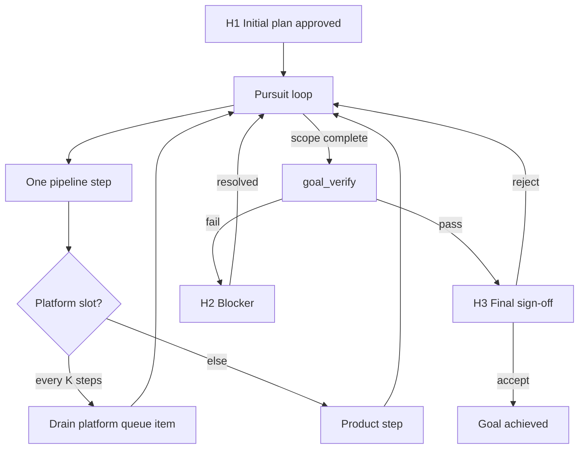

# Full Automation Vision & Implementation Hierarchy

**Status:** Draft — architecture / north star  
**Audience:** Conductor, operators, future implementers  
**Last updated:** 2026-06-28

**North star:** An agent-driven expert system that pursues verified goals autonomously, maintains a parallel platform stack, and scales to full organizational workflows via template-packs—with human involvement limited to initial planning, blocker resolution, and final sign-off.

---

## Related documents (preserve & cross-link)

| Document | Role |
|----------|------|
| [spec-to-artifacts-agent-skills-system.md](spec-to-artifacts-agent-skills-system.md) | v1/v2 harness spec |
| [genius-conductor-tiered-routing.md](genius-conductor-tiered-routing.md) | S0–S4, tier policy, autopilot |
| [plans/v2-full-evolution.md](plans/v2-full-evolution.md) | Shipped v2.4–v2.12 history |
| [.cursor/plans/v2_full_evolution_ced91562.plan.md](../.cursor/plans/v2_full_evolution_ced91562.plan.md) | v2 evolution plan artifact |
| [docs/automation/README.md](../docs/automation/README.md) | Autopilot operator guide (v2.13) |
| [docs/operator/export-contract.md](../docs/operator/export-contract.md) | Headless / SDK contract |
| [docs/playbooks/INDEX.md](../docs/playbooks/INDEX.md) | Repo procedures (to populate) |
| [template-packs/](../template-packs/) | Company / domain template packs (ceiling) |

**Brainstorming lineage:** Dual-stack composition (product + platform), reuse maturity ladder, compose-first execution—captured in §6–§7 below.

---

## 0. Executive summary

Today the system is a **verified delivery harness** (v2.0–v2.13): conductor, state machine, evidence, autopilot-until-blocked, program mode, template-packs. It still **stops and waits** for Continue, treats many gates as permanent human checkpoints, and treats platform building (playbooks, scripts, promotion) as optional.

The target is an **ultimate AI worker**: same reliability expectations as a senior human organization, with AI failure modes neutralized by deterministic verification, composition-from-catalog, and parallel platform evolution—orchestrated at company scale through **template-packs** (the ceiling; no separate org-platform repo required).

**Four structural shifts:**

1. **Pursuit loop** — run until goal verified, not until token burst ends  
2. **Dual-stack with platform queue** — product never waits on distillation; platform never starves  
3. **Template-pack = company** — roles, pipelines, integrations, and artifact graphs compose entire studios / enterprises  
4. **Transistor workflows** — compose generator DAGs from registered blocks before inventing long prose implement chains ([§19](#19-transistor--generator-workflow-model), [SEC-18](plans/full-automation/SEC-18-transistor-model-a-to-z-reference.md))

---

## 1. North star definition

### 1.1 What “100% automation” means (and does not)

| In scope | Out of scope (by policy) |
|----------|--------------------------|
| All SDLC phases after initial plan approved | Initial requirements elicitation without a seed spec |
| Implement, test, refactor, integrate, deploy prep | Irreversible production actions without verify + rollback path |
| Multi-role company workflows via template-packs | Legal/financial actions requiring human authority of record |
| Blocker *detection* and structured escalation | Blocker *resolution* when external creds/access missing |
| Self-improvement of harness (platform queue) | Silent waiver of safety gates |
| Final deliverable + evidence bundle for sign-off | Subjective aesthetic approval unless encoded in acceptance tests |

### 1.2 Human touchpoint contract (minimal HITL)

Only **three** classes of human interaction:

```
H1 — Initial planning gate
      Input:  spec / mega-spec / company charter
      Output: approved plan artifact (HLD or program milestone + manifest)
      Once:   per project, program, or company template instantiation

H2 — Blocker assistance
      Trigger: check-pipeline-blocked OR goal-verify failed OR external dependency
      Output:  answer, credential, access, decision with recorded rationale
      Async:   system pauses, notifies, resumes when unblocked

H3 — Final sign-off
      Trigger: goal_verification.passed == true
      Output:  accept / reject with notes → reject re-enters pursuit loop
      Once:   per goal milestone or release
```

Everything else—including HLD/DD *review*—becomes **agent self-gate** with evidence, unless operator explicitly enables strict HITL mode.

### 1.3 Goal completion criterion

A goal is **achieved** only when **all** hold:

1. **Acceptance artifacts** exist (tests, logs, demos, manifests)  
2. **Automated verification** passes (`goal_verify` suite)  
3. **Staleness / integration graph** is consistent  
4. **No blocking_questions** without `deferred_with_rationale`  
5. **Platform debt** for this goal either promoted or explicitly waived with expiry  

The agent **does not stop** for status updates; it stops only on: H1/H2/H3, unrecoverable failure, or resource budget cap.

---

## 2. Master hierarchy (top level)

```
FULL AUTOMATION SYSTEM
├── A. Pursuit & control plane          (never stop until verified)
├── B. Cognition & routing plane        (S0–S4, genius conductor, workers)
├── C. Product execution plane          (pipelines, tasks, evidence)
├── D. Platform evolution plane         (parallel queue, promotion ladder)
├── E. Knowledge & composition plane    (catalog, playbooks, facts, packs)
├── F. Organization plane               (template-packs = companies)
├── G. Verification & quality plane     (anti-mistake immune system)
├── H. Persistence & state plane        (journal, state, graphs, leases)
├── I. Runtime & integration plane      (IDE, SDK, headless, external tools)
└── J. Governance & operator plane      (policy, waivers, audit, dashboards)
```

Each branch expands in §3–§12.

---

## 3. Branch A — Pursuit & control plane

**Purpose:** Replace “burst → update → wait for Continue” with **goal-directed autonomous loops**.

```
A. Pursuit & control plane
├── A1. Goal model
│   ├── A1.1 goal_id, parent_goal, goal_type (app | feature | milestone | company_ops)
│   ├── A1.2 success_criteria[] (machine-checkable where possible)
│   ├── A1.3 goal_verify_command (meta-test for “are we done?”)
│   ├── A1.4 deadline / budget (steps, tokens, wall clock)
│   └── A1.5 goal_state: pursuing | blocked | verifying | achieved | rejected
│
├── A2. Pursuit loop (always-on)
│   ├── A2.1 preflight: check-pipeline-blocked.py (extended)
│   ├── A2.2 if READY → execute one pipeline step (skill phase)
│   ├── A2.3 post-step: route-tier, dual-write, increment counters
│   ├── A2.4 if goal_scope_complete → run goal_verify (not just task verify)
│   ├── A2.5 if goal_verify pass → transition to H3 pending (final sign-off)
│   ├── A2.6 loop until: blocked | budget | achieved | H3 reject
│   └── A2.7 NO intermediate “waiting for user to say continue”
│
├── A3. Autopilot modes
│   ├── A3.1 session_autopilot (current v2.13 — max_steps_per_session)
│   ├── A3.2 goal_autopilot (run until goal_verify or hard block)
│   ├── A3.3 company_autopilot (multi-goal queue across roles/workstreams)
│   └── A3.4 sdk_daemon (run-local-pipeline.py 24/7 on operator PC)
│
├── A4. Stop reasons (exhaustive taxonomy)
│   ├── A4.1 human: H1 | H2 | H3
│   ├── A4.2 verify: evidence fail | goal_verify fail | regression
│   ├── A4.3 resource: max_steps | max_cost | lease_expired
│   ├── A4.4 integrity: validate-workflow fail | state corrupt
│   └── A4.5 completion: goal achieved | program done
│
├── A5. Continue semantics (redefined)
│   ├── A5.1 “continue” = resume pursuit loop if not blocked
│   ├── A5.2 “continue” ≠ approval (move approvals to self-gate or H1/H3 only)
│   └── A5.3 default after H1: auto-enter goal_autopilot
│
└── A6. Notification (not blocking)
    ├── A6.1 dashboard / STATUS.md / webhook on phase complete
    ├── A6.2 digest on blocker (H2) not on every step
    └── A6.3 operator can observe without unblocking loop
```

**Gap from today:** Autopilot exists but is capped by `max_steps_per_session`, still respects design gates as hard stops, and the default conductor rule is one-step-per-turn unless `autopilot.active`.

**Target changes:**

- Default **goal_autopilot** after H1  
- Collapse mid-pipeline HLD/DD gates into **self-gate + evidence** (optional strict mode)  
- Remove session step cap when `goal_autopilot` and budget allows  
- SDK daemon as first-class operator path  

---

## 4. Branch B — Cognition & routing plane

```
B. Cognition & routing plane
├── B1. Capability classes (S0–S4) — KEEP, extend
│   ├── B1.1 S0 deterministic — mandatory first
│   ├── B1.2 S1 mechanical — economy workers + catalog
│   ├── B1.3 S2 templated artifacts
│   ├── B1.4 S3 architecture / ambiguity
│   └── B1.5 S4 governance / escalation / H2 packaging
│
├── B2. Role model (conductor + workers)
│   ├── B2.1 Conductor (genius): merge, route, platform queue drain policy
│   ├── B2.2 Librarian: allowed_reads + catalog composition
│   ├── B2.3 Phase workers: implement / design / explore
│   ├── B2.4 Verifier / tool-operator: evidence
│   ├── B2.5 Reviewer: bugbot / security on risk triggers
│   └── B2.6 Platform worker: promotion tasks from queue (parallel slot)
│
├── B3. Model policy
│   ├── B3.1 genius = orchestration only (thin turns)
│   ├── B3.2 economy = bulk code/search/shell
│   ├── B3.3 escalation loop on verify fail (existing)
│   └── B3.4 platform turns may use economy + S0 scripts
│
├── B4. Dual-stack cognition (every turn)
│   ├── B4.1 PRODUCT: current next_action / task
│   ├── B4.2 PLATFORM: promotion_queue peek / drain decision
│   ├── B4.3 compose-first: catalog before improvise
│   └── B4.4 divergence log when not composing
│
└── B5. Company role switching (template-pack)
    ├── B5.1 active_role from pack (e.g. technical-artist, build-engineer)
    ├── B5.2 role → pipeline_id + skill set + tool permissions
    ├── B5.3 handoff protocol between roles (manifest + artifact graph)
    └── B5.4 conductor stays; workers swap by role context
```

See [genius-conductor-tiered-routing.md](genius-conductor-tiered-routing.md) for S0–S4 and tier policy (implemented v2.4–v2.13).

---

## 5. Branch C — Product execution plane

```
C. Product execution plane
├── C1. Pipeline registry
│   ├── C1.1 software-greenfield (default)
│   ├── C1.2 iterative_feature
│   ├── C1.3 multi-domain-program
│   └── C1.4 pack-defined pipelines (N per company template)
│
├── C2. Phase chain (composable)
│   ├── C2.1 spec-parser → requirements
│   ├── C2.2 hld-writer → dd-writer → diagrams
│   ├── C2.3 task-breakdown → scaffold → implement loop
│   ├── C2.4 test / refactor / git-workflow
│   └── C2.5 each phase: inputs, outputs, verify, catalog refs
│
├── C3. Task system
│   ├── C3.1 task cards with Components used + Promotion note
│   ├── C3.2 work orders for parallel lanes
│   ├── C3.3 evidence per task (existing)
│   └── C3.4 task → goal rollup (% toward goal_verify)
│
├── C4. Program / parallel execution
│   ├── C4.1 workstreams + lane.json + leases
│   ├── C4.2 orchestrate-program
│   ├── C4.3 integration manifest as cross-stream contract
│   └── C4.4 artifact-graph.json per program + pack
│
└── C5. Feature & app delivery
    ├── C5.1 src/, tests/, e2e
    ├── C5.2 environment setup tasks (ordered first)
    └── C5.3 definition of done = goal slice satisfied
```

---

## 6. Branch D — Platform evolution plane (parallel queue)

**Purpose:** Build the ultimate worker **without slowing product**. Human developers run two projects at once: the current deliverable and the reusable foundation. This branch makes that explicit and scheduled.

```
D. Platform evolution plane
├── D1. Promotion ladder (reuse maturity)
│   ├── D1.1 L0 ephemeral (one-off agent reasoning)
│   ├── D1.2 L1 playbook (docs/playbooks/<slug>.md)
│   ├── D1.3 L2 script — S0 (scripts/<name>.py)
│   ├── D1.4 L3 skill / command (.cursor/skills/, /commands)
│   ├── D1.5 L4 ambient (hooks, CI, scheduled jobs)
│   └── D1.6 L5 template-pack fragment (template-packs/)
│
├── D2. Platform queue (state.platform.promotion_queue[])
│   ├── D2.1 enqueue triggers
│   │   ├── repeated manual command (2×)
│   │   ├── worker flags repetition
│   │   ├── verify pattern in N task cards
│   │   └── conductor post-mortem on escalation
│   ├── D2.2 item schema: { id, source, target_level, priority, effort_class }
│   └── D2.3 dequeue → platform turn (not product turn)
│
├── D3. Scheduling policy (product never blocked)
│   ├── D3.1 default: 1 platform turn per K product turns (e.g. K=5)
│   ├── D3.2 priority boost: queue depth > threshold
│   ├── D3.3 priority cut: product blocked on missing playbook/script
│   ├── D3.4 idle drain: when product waits on external H2
│   └── D3.5 max platform backlog age → force drain
│
├── D4. Platform work types
│   ├── D4.1 playbook-keeper
│   ├── D4.2 script extraction from playbook
│   ├── D4.3 skill/command wrapper
│   ├── D4.4 hook + validate-workflow extension
│   ├── D4.5 catalog/index regeneration
│   └── D4.6 pack fragment export (upward to template-pack)
│
├── D5. Extend vs fork vs configure
│   ├── D5.1 configure: task-level params only
│   ├── D5.2 extend: backwards-compatible tool change + staleness bump
│   └── D5.3 fork: new catalog entry + provenance link
│
└── D6. Platform definition of done
    ├── D6.1 catalog entry exists + INDEX row
    ├── D6.2 verify script for tool (if L2+)
    ├── D6.3 at least one task card references it
    └── D6.4 staleness node wired in graph
```

**Gap from today:** `playbook-keeper` is optional; playbooks INDEX is empty; no `platform` block in state; no scheduled drain.

---

## 7. Branch E — Knowledge & composition plane

```
E. Knowledge & composition plane
├── E1. Catalog (single discovery surface)
│   ├── E1.1 scripts/ manifest (generated)
│   ├── E1.2 docs/playbooks/INDEX.md
│   ├── E1.3 .cursor/skills/ index
│   ├── E1.4 docs/facts/INDEX.md
│   ├── E1.5 docs/manifest/pipelines/
│   ├── E1.6 template-packs/*/README.md
│   └── E1.7 docs/platform/CATALOG.md (generated umbrella)
│
├── E2. Composition protocol (mandatory before S1+)
│   ├── E2.1 resolve capability needed
│   ├── E2.2 query catalog (S0 list-components.py)
│   ├── E2.3 rank hits: script > playbook > skill > facts
│   ├── E2.4 compose plan → task card Components section
│   └── E2.5 if miss → proceed L0 + enqueue promotion
│
├── E3. Facts & decisions
│   ├── E3.1 docs/facts/ (external truth)
│   ├── E3.2 docs/decisions/ (ADR)
│   └── E3.3 remember skill → INDEX (no FTS global memory)
│
├── E4. Context retrieval layers (existing v1)
│   ├── E4.1 always-on rules + AGENTS.md
│   ├── E4.2 hooks inject on continue/start
│   └── E4.3 allowed_reads cap (max 5) — keep
│
└── E5. Staleness & traceability
    ├── E5.1 docs/manifest/staleness.json (design graph)
    ├── E5.2 extend graph: playbooks, scripts, pack nodes
    └── E5.3 reconcile-stale / reconcile-artifact-graph skills
```

---

## 8. Branch F — Organization plane (template-packs = ceiling)

**Purpose:** A pack can describe a **whole company**—roles, departments, pipelines, integrations—not just a single domain stub. **template-packs is the ceiling** for cross-repo reuse; a pack can generate an entire company of workflows (e.g. game studio where the agent jumps role to role).

```
F. Organization plane (template-packs)
├── F1. Pack structure (target schema)
│   ├── F1.1 company.yaml — name, industry, roles[], departments[]
│   ├── F1.2 roles/*.yaml — role_id, pipeline_id, tools, permissions, KPIs
│   ├── F1.3 pipelines/*.yaml — phases, gates, pack_keywords
│   ├── F1.4 manifest.md — integration contracts (internal + external)
│   ├── F1.5 artifact-graph.json — cross-role dependencies
│   ├── F1.6 playbooks/ — role-specific procedures
│   ├── F1.7 template tasks/ — seed task cards per role
│   └── F1.8 verify/ — goal_verify suites per deliverable type
│
├── F2. Company instantiation
│   ├── F2.1 program-scoper reads mega-spec + selects pack
│   ├── F2.2 spawn program with workstream = department or role lane
│   ├── F2.3 active_role rotates by ready work in lane queue
│   └── F2.4 conductor orchestrates handoffs via manifest + graph
│
├── F3. Example: game studio pack (expand current stub)
│   ├── F3.1 roles: designer, TA, animator, programmer, QA, build, release
│   ├── F3.2 pipelines: concept → mesh → rig → anim → UE import → QA → build
│   ├── F3.3 external tools: Blender, UE, Perforce/Git, CI
│   └── F3.4 goal_verify: asset in engine + tests + performance budget
│
├── F4. Example: data platform pack (expand stub)
│   ├── F4.1 roles: analyst, engineer, DBA, SRE, governance
│   └── F4.2 pipelines: ingest → model → deploy → monitor
│
├── F5. Cross-pack composition
│   ├── F5.1 pack imports (studio pack imports generic HR/onboarding micro-pack)
│   ├── F5.2 shared generic packs library under template-packs/_shared/
│   └── F5.3 no repo outside template-packs ceiling
│
└── F6. Role → agent mapping
    ├── F6.1 same conductor; context switch = state.company.active_role
    ├── F6.2 allowed_reads scoped to role playbooks + lane tasks
    ├── F6.3 tool permissions per role (MCP, CLI allowlist)
    └── F6.4 evidence requirements per role output type
```

**Gap from today:** Two stub packs (`game-asset-pipeline`, `data-platform`); program mode serial foundation; roles not first-class in state.

---

## 9. Branch G — Verification & quality plane (anti-mistake)

**Purpose:** AI mistakes neutralized by **layers**, not hope.

```
G. Verification & quality plane
├── G1. Evidence gates (existing)
│   ├── G1.1 task-level verify-router / verifier
│   ├── G1.2 evidence_required in state
│   └── G1.3 last_verify before advance
│
├── G2. Goal-level verification (NEW)
│   ├── G2.1 goal_verify_command in state / pack
│   ├── G2.2 aggregates unit + integration + e2e + tool outputs
│   ├── G2.3 blocks H3 until pass
│   └── G2.4 regression suite on every implement batch
│
├── G3. Conformance & workflow
│   ├── G3.1 validate-workflow.py (CI + pre-push)
│   ├── G3.2 route-tier --check
│   └── G3.3 check-pipeline-blocked extended for goal_autopilot
│
├── G4. Review triggers (automated, not human)
│   ├── G4.1 security-review on touch paths / deps
│   ├── G4.2 bugbot on large diffs
│   ├── G4.3 escalation S4 on repeated verify fail
│   └── G4.4 staleness reconciliation before merge
│
├── G5. Mistake class → control mapping
│   ├── G5.1 hallucinated done → evidence gate
│   ├── G5.2 scope creep → allowed_reads + task card
│   ├── G5.3 wrong architecture → self-gate checklist + goal_verify
│   ├── G5.4 skipped tests → verify-router mandatory
│   ├── G5.5 stale design → staleness graph + reconcile
│   ├── G5.6 duplicate tooling → platform queue + catalog compose-first
│   └── G5.7 unsafe command → preToolUse hooks + tool allowlist per role
│
└── G6. Rollback & recovery
    ├── G6.1 git branch per goal slice
    ├── G6.2 journal last_failure + structured blocker for H2
    └── G6.3 autopilot resume from last good state.json snapshot (preCompact)
```

---

## 10. Branch H — Persistence & state plane

```
H. Persistence & state plane
├── H1. journal/state.json (v2, additive fields)
│   ├── H1.1 existing: next_action, program, autopilot, evidence, tier
│   ├── H1.2 goal: { id, type, success_criteria, verify_command, state }
│   ├── H1.3 platform: { promotion_queue, composition, divergence_log }
│   ├── H1.4 pursuit: { mode, steps, budget, stopped_reason }
│   ├── H1.5 hitl: { pending: H1|H2|H3|null, since, payload }
│   └── H1.6 company: { pack_id, active_role, role_queue[] }
│
├── H2. journal/progress.md — human mirror + session summary
├── H3. Artifact graphs — design + program + platform staleness
├── H4. evidence/ — immutable logs per verify
├── H5. worker-runs.jsonl — audit subagent usage
└── H6. Snapshots — preCompact hook, state repair via sync-state.py
```

---

## 11. Branch I — Runtime & integration plane

```
I. Runtime & integration plane
├── I1. In-IDE (Cursor)
│   ├── I1.1 genius conductor session
│   ├── I1.2 local subagents (economy)
│   ├── I1.3 /autopilot, /continue, /lane, /verify commands
│   └── I1.4 hooks: beforeSubmitPrompt, subagentStart, preToolUse, preCompact
│
├── I2. Local SDK daemon
│   ├── I2.1 run-local-pipeline.py — goal_autopilot loop
│   ├── I2.2 CURSOR_API_KEY + AUTOPILOT_MODEL
│   └── I2.3 operator PC as worker server
│
├── I3. Headless / scheduled
│   ├── I3.1 headless-verify.py
│   ├── I3.2 GitHub Actions validate + verify
│   └── I3.3 pull-ready-work-orders / complete-work-order (external lanes)
│
├── I4. External tools (per pack)
│   ├── I4.1 MCP servers (browser, DCC, cloud APIs)
│   ├── I4.2 tool-operator skill + Tool command on task cards
│   └── I4.3 evidence-types for non-pytest outputs
│
└── I5. Notifications
    ├── I5.1 STATUS.md / dashboard.md generation
    └── I5.2 optional webhook/email on H2/H3 only
```

See [docs/automation/README.md](../docs/automation/README.md) and [export-contract.md](../docs/operator/export-contract.md).

---

## 12. Branch J — Governance & operator plane

```
J. Governance & operator plane
├── J1. model-policy.json — tiers, autopilot defaults
├── J2. automation-waivers.md — template self-build only
├── J3. strict_hitl mode flag (optional override of self-gates)
├── J4. audit: who waived what, when
├── J5. export-contract for external orchestrators
└── J6. release-queue.json — harness evolution (separate from consumer goals)
```

---

## 13. End-to-end pursuit flow (target)



---

## 14. Gap analysis: today → target

| Area | Today (v2.13) | Target | Primary bridge |
|------|---------------|--------|----------------|
| Loop | Autopilot max 25 steps; default 1 step/turn | goal_autopilot until verified | §3 A2, A3; state.goal |
| Human gates | HLD/DD/manifest approvals block | H1 + H3 only; self-gate middle | §3 A5; J3 strict mode |
| Platform | Optional playbook-keeper | Parallel promotion_queue + scheduler | §6 D2–D3 |
| Catalog | Scattered | Generated CATALOG + compose-first | §7 E1–E2 |
| Transistor workflows | Prose skills only; no typed I/O graphs | L6 registry + generator DAG + one-node-per-turn | §19; E6–E7; C6; v2.24–v2.28 |
| Company | 2 stub packs | Full role/pipeline pack schema | §8 F1–F6 |
| Done | Task evidence | goal_verify + H3 | §9 G2 |
| Roles | Workstreams only | active_role from pack | §8 F6; §10 H1.6 |
| Stop reason | User must Continue | Only H1/H2/H3/budget/fail | §3 A2, A4 |

---

## 15. Implementation roadmap (additive v2 releases)

Schema stays `state.json.version === 2` unless a future major version is explicitly approved.

| Release | Scope |
|---------|--------|
| **v2.14** | Goal model + goal_verify: `state.goal`, extended check-pipeline-blocked, goal-keeper skill |
| **v2.15** | Pursuit loop hardening: goal_autopilot, uncapped session option, self-gate for HLD/DD (`strict_hitl=false` default) |
| **v2.16** | Platform queue: `state.platform.promotion_queue`, scheduler in autopilot (1 per K), task card Components/Promotion note |
| **v2.17** | Catalog & compose-first: `list-components.py` → `docs/platform/CATALOG.md`, librarian `suggested_components`, compose-first rule |
| **v2.18** | Staleness graph extension for platform nodes |
| **v2.19** | Company pack schema v1: `company.yaml`, `roles/*.yaml`, `state.company.active_role` |
| **v2.20** | Game studio pack reference implementation + end-to-end demo (H1/H3 only) |
| **v2.21** | Data platform pack reference implementation |
| **v2.22** | Cross-pack `template-packs/_shared/` library |
| **v2.23** | Operator polish: H2 notifications, self-gate audit, dashboard goal + queue depth |
| **v2.24** | Transistor schema, registry, `list-transistors.py`, L6 promotion, bootstrap transistors |
| **v2.25** | Workflow DAG schema, `validate-workflow-dag.py`, workflow-compose phase (C6.1) |
| **v2.26** | workflow-composer skill, `active_workflow` state, one-node-per-turn execution |
| **v2.27** | Pack workflow templates, `_shared` transistors, parallel workflow branches |
| **v2.28** | Transistor maturity dashboard, fuzzy-chain metrics, optional DAG viewer |

Each release: update plans, journal template, validate-workflow checks, unit tests for new scripts.

See [SEC-18 transistor A–Z](plans/full-automation/SEC-18-transistor-model-a-to-z-reference.md) for v2.24+ detail.

---

## 16. Document preservation index

| Document | Role |
|----------|------|
| **This file** | Master hierarchy & north star |
| `spec-to-artifacts-agent-skills-system.md` | v1/v2 harness spec |
| `genius-conductor-tiered-routing.md` | S0–S4, tier policy |
| `plans/v2-full-evolution.md` | Shipped v2.4–v2.12 history |
| `.cursor/plans/v2_full_evolution_ced91562.plan.md` | v2 evolution plan |
| `docs/automation/README.md` | Autopilot operator guide |
| `docs/operator/export-contract.md` | Headless contract |
| `docs/playbooks/INDEX.md` | Repo procedures |
| `docs/platform/CATALOG.md` | *(future)* generated catalog |
| `docs/platform/transistors/` | Transistor manifests (v2.24+) |
| `docs/platform/TRANSISTORS.md` | Generated transistor INDEX |
| `docs/workflows/` | Generator workflow DAG JSON |
| [plans/full-automation/SEC-18-transistor-model-a-to-z-reference.md](plans/full-automation/SEC-18-transistor-model-a-to-z-reference.md) | Transistor A–Z authority |
| `docs/decisions/*.md` | ADRs including automation-waivers |
| `template-packs/*/README.md` | Pack-specific company slices |
| `documents/notes/` | *(future)* dated brainstorming fragments with back-link here |
| [documents/plans/full-automation/](../plans/full-automation/) | **Expanded** deep plan (242 leaves, 53 branch indexes) |
| [.cursor/skills/hierarchy-expander/](../.cursor/skills/hierarchy-expander/SKILL.md) | Reusable skill: queue + `/loop` expansion |

**Convention:** New brainstorming → appendix in this doc or `documents/notes/YYYY-MM-DD-topic.md` with entry in this index. For systematic deep expansion use [vision-expansion-README.md](../docs/automation/vision-expansion-README.md).

---

## 17. Open design decisions

1. **Self-gate rigor:** Checklist only vs. automated LLM reviewer vs. second economy reviewer?  
2. **H3 scope:** Per task, per milestone, per release, per company goal?  
3. **Platform K ratio:** Fixed 1:5 vs. adaptive by queue depth?  
4. **Budget caps:** Unlimited goal_autopilot vs. daily token/step budget with checkpoint?  
5. **Pack authority:** Can a pack define legal/finance roles as fully automated or mark them H2-always?  
6. **Multi-goal:** Single pursuit stack vs. company_autopilot with prioritized goal queue?
7. ~~**Transistor granularity**~~ → **Resolved:** one verify boundary per block ([SEC-17-7](plans/full-automation/SEC-17-7-decision-transistor-granularity-one-verify-boundary.md))
8. ~~**Composer placement**~~ → **Resolved:** S3 workflow-composer skill ([SEC-17-8](plans/full-automation/SEC-17-8-decision-composer-s3-skill-not-conductor-inline.md))
9. ~~**Visual vs JSON workflow**~~ → **Resolved:** JSON authoritative ([SEC-17-9](plans/full-automation/SEC-17-9-decision-json-dag-authoritative-visual-editor-optional.md))
10. ~~**Transistor library scope**~~ → **Resolved:** `_shared` + pack overlay ([SEC-17-10](plans/full-automation/SEC-17-10-decision-global--shared-transistors-plus-pack-overlay.md))

---

## 18. Appendix A — Full human job taxonomy (automation target checklist)

Use as pack authoring guide—every leaf should map to pipeline + verify + playbook.

```
WORK (all automatable in principle via packs)
├── Discover & plan
│   ├── requirements elicitation (H1 assist)
│   ├── market / tech research
│   ├── architecture & tradeoffs
│   └── estimation & milestone planning
├── Design
│   ├── UX/UI, API, data model
│   ├── integration design
│   └── security & compliance design
├── Build
│   ├── scaffold & implement
│   ├── content creation (code, assets, docs)
│   ├── integration & migration
│   └── refactor / debt paydown
├── Verify
│   ├── unit / integration / e2e / performance
│   ├── security scan / review
│   └── acceptance vs goal_verify
├── Release & operate
│   ├── CI/CD, deploy, monitor
│   ├── incident response (runbooks)
│   └── cost / capacity tuning
├── Organize (company)
│   ├── role workflows & handoffs
│   ├── QA gates between departments
│   ├── asset / knowledge management
│   └── reporting & status (automated dashboards)
└── Improve (platform)
    ├── distill playbooks
    ├── promote scripts/skills
    └── evolve template-packs
```

---

## 19. Transistor & generator workflow model

**Purpose:** Replace long fuzzy implement chains with **composed generator workflows** built from **transistors**—registered blocks with typed I/O, executors, and per-block verify. Extends compose-first (§7) from *single component selection* to *full DAG planning and execution*.

**Authority:** [SEC-18 transistor A–Z reference](plans/full-automation/SEC-18-transistor-model-a-to-z-reference.md) · [INTRO-2 north star](plans/full-automation/INTRO-2-transistor-building-blocks-north-star.md)

```
19. Transistor & generator workflow model
├── B6. Workflow composer routing (S3)
│   ├── B6.1 workflow-composer skill
│   ├── B6.2 conductor approves DAG at H1
│   ├── B6.3 one workflow node per product turn
│   └── B6.4 gate transistor pass/fail edges
├── C6. Generator workflow execution
│   ├── C6.1 phase workflow-compose (mandatory before implement)
│   ├── C6.2 workflow DAG JSON schema
│   ├── C6.3 task card workflow_node_id
│   ├── C6.4 parallel branches via work orders
│   └── C6.5 workflow rollup → goal_verify
├── D1.7 L6 transistor (promotion capstone)
├── D4.7 platform work: transistor extraction
├── E6. Transistor registry
│   ├── E6.1 docs/platform/transistors/
│   ├── E6.2 transistor.v1.json schema
│   ├── E6.3 classes: hard | soft | gate
│   ├── E6.4 list-transistors.py
│   └── E6.5 rank: hard_transistor > script > soft > …
├── E7. Generator workflow composition
│   ├── E7.1 deliverable → pack template
│   ├── E7.2 stitch transistors into DAG
│   ├── E7.3 validate-workflow-dag.py
│   ├── E7.4 miss → promotion enqueue
│   └── E7.5 pack templates inherit
├── E5.4 staleness: workflow + transistor nodes
├── F1.9 pack transistors & workflows
├── F5.4 _shared transistors library
├── G2.5 per-node evidence rollup
├── G5.8 fuzzy-chain → workflow control
├── G6.4 checkpoint replay from failed node
├── H1.7 state.pursuit.active_workflow
└── I4.4 executor boundary (script/tool/MCP)
```

**Ranking (extends E2.3):** `hard_transistor > script > soft_transistor > playbook > skill > facts`

**Maturity target:** ~70% hard, ~20% soft, ~10% gate transistors at pack steady state.

**Releases:** v2.24–v2.28 (§15 roadmap).

---

## 20. Appendix B — state.json sketch (additive)

```json
{
  "version": 2,
  "goal": {
    "id": "goal-001",
    "type": "program",
    "verify_command": "python scripts/goal-verify.py",
    "state": "pursuing"
  },
  "pursuit": {
    "mode": "goal_autopilot",
    "steps_total": 0,
    "budget": { "max_steps": null, "max_wall_hours": 48 },
    "active_workflow": {
      "workflow_id": "wf-goal-001",
      "path": "docs/workflows/goal-001.json",
      "current_node_id": "n2",
      "completed_nodes": [],
      "validation_hash": null
    }
  },
  "platform": {
    "promotion_queue": [],
    "drain_policy": { "product_steps_per_platform_turn": 5 }
  },
  "company": {
    "pack_id": "game-asset-pipeline",
    "active_role": "technical-artist"
  },
  "hitl": {
    "pending": null
  },
  "autopilot": {
    "active": true,
    "max_steps_per_session": null
  }
}
```

---

## 21. One-sentence model of mind

> **The conductor is a tech lead who composes generator workflows from proven transistors, executes one verified block per turn, and maintains an internal platform—promoting yesterday’s improvisation into tomorrow’s L6 catalog entry unless a logged divergence says otherwise—until goal_verify passes and only H3 remains for the human.**

---

*End of document.*
