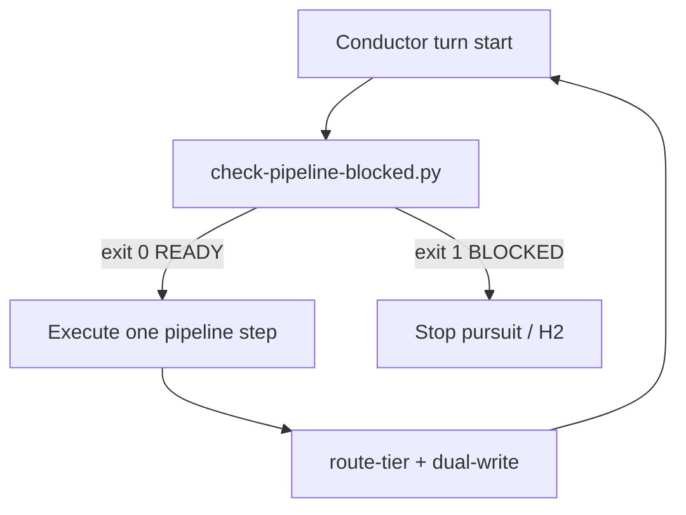

<!-- Complete pass 3 2026-06-28 A2.1 -->

# A2.1: preflight check-pipeline-blocked extended

**Parent:** [A2-index](A2-index.md) · **Branch A** · **Vision §3** · **Release:** v2.15

## Reader narrative
<!-- prose-source: agent pilot 2026-06-28 -->

Every pursuit turn starts with a question: is it safe to act? This capability extends preflight via `check-pipeline-blocked.py` so the conductor never executes a pipeline step while gates, blockers, budgets, or missing evidence would make that step invalid.

Exit code semantics are strict: READY (0) means exactly one skill phase may run; BLOCKED (1) means stop, dual-write a structured H2 or stop reason, and do not advance next_action. Preflight is S0—deterministic, cheap, and mandatory before any model-heavy work ([B1.1 S0 rule](../full-automation/B1.1-s0-deterministic-mandatory-first.md)).

Skipping preflight is how autonomous systems waste tokens on work that cannot commit. This step is the first node in the A2 pursuit loop and re-runs after every completed turn.

## Purpose

A2.1 defines preflight check pipeline blocked extended for the agent-driven expert system. Pursuit & control plane — autonomous loops until goal verified.
## Scope

- Owns `A2.1` only; siblings under `A2` must not duplicate this spec.
- Aligns with minimal HITL: H1 plan, H2 blocker, H3 sign-off ([INTRO-1.2](INTRO-1.2-human-touchpoint-contract-h1-h2-h3.md)).
- Conflicts resolve in favor of [Vision §3 — Branch A — Pursuit & control plane](../../full-automation-vision-and-hierarchy.md#3-branch-a-pursuit-control-plane).

```
│   ├── A2.1 preflight: check-pipeline-blocked.py (extended)
```
## Behavior / step logic
<!-- timeline-source: agent cursor-agent 2026-06-28 -->

1. Every pursuit wake—session autopilot, goal_autopilot, or SDK daemon—starts with the conductor running `python scripts/automation/check-pipeline-blocked.py` (S0) against journal and state.json before any skill phase or worker spawn.
2. Exit code READY (0) authorizes exactly one pipeline phase via [A2.2](A2.2-if-ready-execute-one-pipeline-step.md); BLOCKED (1) halts the turn, dual-writes a structured stop reason, and leaves next_action unchanged.
3. Preflight tests gates_pending, blocking_questions, [A1.4](A1.4-deadline-budget-steps-tokens-wall-clock.md) budget caps, evidence_required gaps, and [A1.5](A1.5-goal-state-enum-pursuing-blocked-verifying-achieved-rejected.md) goal.state so model-heavy work never starts when the step cannot commit.
4. Per [B1.1](B1.1-s0-deterministic-mandatory-first.md), routing and worker spawns never precede this S0 check; [A2.3](A2.3-post-step-route-tier-dual-write-increment.md) re-invokes preflight on the next wake after each completed phase.
5. If BLOCKED fires for corrupt state, unresolved gates, or stale evidence, pursuit routes to H2 and goal.state becomes blocked until the operator or journal-keeper reconciles journal and state.json.



## JSON example

```json
{
  "node": "A2.1",
  "description": "preflight check pipeline blocked extended",
  "state": { "ref": "APP-B-state-json-sketch.md" },
  "implemented_in_release": "v2.14+"
}
```


## Repo artifacts (this branch)

- `journal/state.json `goal`, `pursuit`, `hitl``
- `scripts/automation/check-pipeline-blocked.py`
- `scripts/automation/run-local-pipeline.py`
- `.cursor/skills/autopilot/`

## Edge cases

- Operator closes laptop mid-loop — state.json must resume from last good dual-write.
- Concurrent manual edit to queue JSON — conductor reloads queue each wake; last writer wins with journal note.
- goal_verify passes but H3 rejected — goal.state returns to pursuing with rejection notes.
- Edge case `A2.1` variant 4: verify state dual-write before continuing pursuit.
- Pass 3: add regression test or evidence path specific to `A2.1`.
- Pass 3: cross-link related nodes in same branch index.

## Failure modes

- **Silent stop:** Agent ends turn without updating queue → mitigated by /loop + check-hierarchy-queue.py EMPTY gate.
- **False complete:** Item marked done without artifact → audit-hierarchy-depth.py re-enqueues deepen pass.
- **Scope bleed:** Worker edits journal/state during planning-only expansion → forbidden in vision-expansion-prompt.
- **Stale design:** Upstream vision § changes → reconcile-stale adds deepen items for affected ids.

## Concrete implementation

1. Add `goal` block to state template and journal-keeper dual-write (v2.14).
2. Extend `check-pipeline-blocked.py` with goal_autopilot stop reasons.
3. Implement `scripts/goal-verify.py` stub aggregating task evidence paths.
4. Add `.cursor/skills/goal-keeper/SKILL.md` for conductor H1→pursuit transition.
5. Document `A2.1` in parent index with verify command and release tag.
6. Add checklist row in SEC-15 release doc for `A2.1`.

## Verification

| Check | Command |
|-------|---------|
| Completeness | `python scripts/automation/audit-hierarchy-depth.py --strict --ids A2.1` |
| Conformance | `python scripts/validate-workflow.py` |
| Task evidence | `python scripts/verify-router.py` when implement task exists |

## Dependencies

| Link | Why |
|------|-----|
| [full-automation-vision-and-hierarchy.md](../../full-automation-vision-and-hierarchy.md) §3 | Master hierarchy |
| [A2-index](A2-index.md) | Parent grouping |
| [genius-conductor-tiered-routing.md](../../genius-conductor-tiered-routing.md) | S0–S4 routing |

## Acceptance criteria

- [ ] `python scripts/automation/audit-hierarchy-depth.py --strict --ids A2.1` passes
- [ ] Named script, skill, or test path exists or is listed in SEC-15 release row
- [ ] Linked from [A2-index](A2-index.md)
- [ ] `python scripts/validate-workflow.py` passes after implement

## Cross-links

- [hierarchy-expander SKILL](../../../.cursor/skills/hierarchy-expander/SKILL.md)
