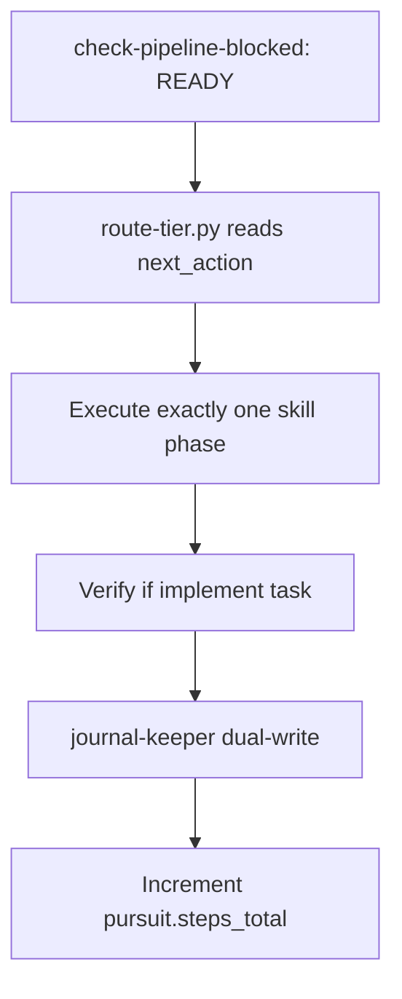

<!-- Complete pass 3 2026-06-28 A2.2 -->

# A2.2: if READY execute one pipeline step

**Parent:** [A2-index](A2-index.md) · **Branch A** · **Vision §3** · **Release:** v2.15

## Reader narrative
<!-- prose-source: agent pilot 2026-06-28 -->

When preflight reports READY, the system executes exactly one pipeline skill phase—never a batch of design, implement, and verify in a single turn. This capability encodes that discipline so evidence, routing, and journal entries stay aligned with a single next_action.

One step per turn preserves auditability: each wake cycle produces one ledger entry, one evidence slot, and one dual-write. It also prevents partial state where implement ran but verify did not. The conductor reads next_action from state.json, invokes the matching skill, and stops.

This is the operational heart of “continue means one step,” redefined in Plane A. Violating one-step semantics breaks autopilot loops and makes H2 recovery ambiguous.

## Purpose

A2.2 defines if ready execute one pipeline step for the agent-driven expert system. Pursuit & control plane — autonomous loops until goal verified.
## Scope

- Owns `A2.2` only; siblings under `A2` must not duplicate this spec.
- Aligns with minimal HITL: H1 plan, H2 blocker, H3 sign-off ([INTRO-1.2](INTRO-1.2-human-touchpoint-contract-h1-h2-h3.md)).
- Conflicts resolve in favor of [Vision §3 — Branch A — Pursuit & control plane](../../full-automation-vision-and-hierarchy.md#3-branch-a-pursuit-control-plane).

```
│   ├── A2.2 if READY → execute one pipeline step (skill phase)
```
## Behavior / step logic
<!-- timeline-source: agent cursor-agent 2026-06-28 -->

1. When [A2.1](A2.1-preflight-check-pipeline-blocked-extended.md) reports READY, the conductor reads next_action from state.json and invokes exactly one matching skill phase—implement-feature, dd-writer, or continue—never batching design, implement, and verify in a single wake.
2. Each wake produces one ledger entry, one evidence slot, and one dual-write boundary so pursuit audit trails stay aligned with a single next_action transition per [A2.7](A2.7-no-intermediate-wait-for-continue.md).
3. Economy workers run only when spawn_workers is true and [B2.2](B2.2-librarian-allowed-reads-catalog-composition.md) allowed_reads constrain scope; the conductor does not chain additional phases before post-step housekeeping.
4. When the skill phase completes, control passes to [A2.3](A2.3-post-step-route-tier-dual-write-increment.md) for route-tier, journal-keeper dual-write, and counter increment before the next preflight cycle.
5. Violating one-step semantics—or executing when preflight was BLOCKED—halts pursuit at H2 because partial state makes resume ambiguous after crash, laptop sleep, or operator interrupt.



## JSON example

```json
{
  "node": "A2.2",
  "description": "if ready execute one pipeline step",
  "state": { "ref": "APP-B-state-json-sketch.md" },
  "implemented_in_release": "v2.14+"
}
```


## Repo artifacts (this branch)

- `journal/state.json `goal`, `pursuit`, `hitl``
- `scripts/automation/check-pipeline-blocked.py`
- `scripts/automation/run-local-pipeline.py`
- `.cursor/skills/autopilot/`

## Edge cases

- Operator closes laptop mid-loop — state.json must resume from last good dual-write.
- Concurrent manual edit to queue JSON — conductor reloads queue each wake; last writer wins with journal note.
- goal_verify passes but H3 rejected — goal.state returns to pursuing with rejection notes.
- Edge case `A2.2` variant 4: verify state dual-write before continuing pursuit.
- Pass 3: add regression test or evidence path specific to `A2.2`.
- Pass 3: cross-link related nodes in same branch index.

## Failure modes

- **Silent stop:** Agent ends turn without updating queue → mitigated by /loop + check-hierarchy-queue.py EMPTY gate.
- **False complete:** Item marked done without artifact → audit-hierarchy-depth.py re-enqueues deepen pass.
- **Scope bleed:** Worker edits journal/state during planning-only expansion → forbidden in vision-expansion-prompt.
- **Stale design:** Upstream vision § changes → reconcile-stale adds deepen items for affected ids.

## Concrete implementation

1. Add `goal` block to state template and journal-keeper dual-write (v2.14).
2. Extend `check-pipeline-blocked.py` with goal_autopilot stop reasons.
3. Implement `scripts/goal-verify.py` stub aggregating task evidence paths.
4. Add `.cursor/skills/goal-keeper/SKILL.md` for conductor H1→pursuit transition.
5. Document `A2.2` in parent index with verify command and release tag.
6. Add checklist row in SEC-15 release doc for `A2.2`.

## Verification

| Check | Command |
|-------|---------|
| Completeness | `python scripts/automation/audit-hierarchy-depth.py --strict --ids A2.2` |
| Conformance | `python scripts/validate-workflow.py` |
| Task evidence | `python scripts/verify-router.py` when implement task exists |

## Dependencies

| Link | Why |
|------|-----|
| [full-automation-vision-and-hierarchy.md](../../full-automation-vision-and-hierarchy.md) §3 | Master hierarchy |
| [A2-index](A2-index.md) | Parent grouping |
| [genius-conductor-tiered-routing.md](../../genius-conductor-tiered-routing.md) | S0–S4 routing |

## Acceptance criteria

- [ ] `python scripts/automation/audit-hierarchy-depth.py --strict --ids A2.2` passes
- [ ] Named script, skill, or test path exists or is listed in SEC-15 release row
- [ ] Linked from [A2-index](A2-index.md)
- [ ] `python scripts/validate-workflow.py` passes after implement

## Cross-links

- [hierarchy-expander SKILL](../../../.cursor/skills/hierarchy-expander/SKILL.md)
