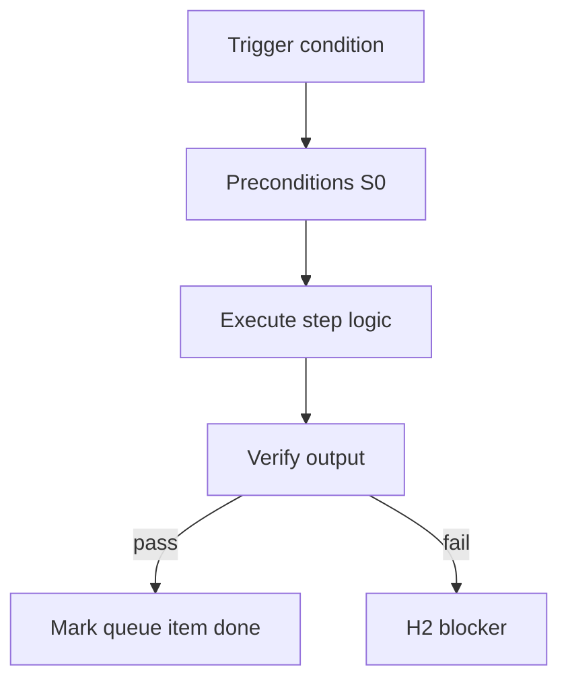

<!-- Complete pass 3 2026-06-28 APP-A -->

# APP-A: build work taxonomy build

**Parent:** — · **Branch APP** · **Vision §3** · **Release:** v2.19

## Reader narrative
<!-- prose-source: agent meta 2026-06-28 -->

Build work is implement, integrate, and refactor—the core product execution surface Plane C owns. Tasks must carry evidence commands; pursuit continues only when verify passes or structured H2 fires.

Build roles in packs should default to S0/S1-heavy routing with conductor merge at S3 boundaries.

## Purpose

APP-A-build defines work taxonomy build for the agent-driven expert system. Human job taxonomy → pack workflows.
## Scope

- Owns `APP-A-build` only; siblings under `—` must not duplicate this spec.
- Aligns with minimal HITL: H1 plan, H2 blocker, H3 sign-off ([INTRO-1.2](INTRO-1.2-human-touchpoint-contract-h1-h2-h3.md)).
- Conflicts resolve in favor of [Vision §3 — Branch A — Pursuit & control plane](../../full-automation-vision-and-hierarchy.md#3-branch-a-pursuit-control-plane).

```
APP-A-build work taxonomy build
```
## Behavior / step logic
<!-- timeline-source: agent cursor-agent 2026-06-28 -->

1. When the active goal's work taxonomy class is Build, [B2.1](B2.1-conductor-genius-merge-route-platform-drain.md) routes implement and integrate phases to [C2.3](C2.3-phase-task-breakdown-scaffold-implement.md) task cards with mandatory evidence commands per [C3.3](C3.3-evidence-per-task.md).
2. Build turns default to S0/S1-heavy execution—[B1.1](B1.1-s0-deterministic-mandatory-first.md) scripts and economy implement workers—reserving genius-tier conductor merge for S3 architecture boundaries only.
3. After each implement batch, [G1.1](G1.1-task-verify-router-verifier.md) runs verify-router or verifier workers; pursuit advances only when evidence passes or records structured H2.
4. Refactor work under the Build taxonomy follows [C2.4](C2.4-phase-test-refactor-git-workflow.md) phase ordering—tests green before routing marks the slice complete toward [C3.4](C3.4-task-to-goal-rollup-percent-goal-verify.md) goal rollup.
5. If build tasks lack evidence commands or verify fails without H2 packaging, [A2.1](A2.1-preflight-check-pipeline-blocked-extended.md) blocks further implement turns until task cards and state.json reconcile.



## JSON example

```json
{
  "node": "APP-A-build",
  "description": "work taxonomy build",
  "state": { "ref": "APP-B-state-json-sketch.md" },
  "implemented_in_release": "v2.14+"
}
```


## Repo artifacts (this branch)


## Edge cases

- Operator closes laptop mid-loop — state.json must resume from last good dual-write.
- Concurrent manual edit to queue JSON — conductor reloads queue each wake; last writer wins with journal note.
- Edge case `APP-A-build` variant 3: verify state dual-write before continuing pursuit.
- Edge case `APP-A-build` variant 4: verify state dual-write before continuing pursuit.
- Pass 3: add regression test or evidence path specific to `APP-A-build`.
- Pass 3: cross-link related nodes in same branch index.

## Failure modes

- **Silent stop:** Agent ends turn without updating queue → mitigated by /loop + check-hierarchy-queue.py EMPTY gate.
- **False complete:** Item marked done without artifact → audit-hierarchy-depth.py re-enqueues deepen pass.
- **Scope bleed:** Worker edits journal/state during planning-only expansion → forbidden in vision-expansion-prompt.
- **Stale design:** Upstream vision § changes → reconcile-stale adds deepen items for affected ids.

## Concrete implementation

1. Map `APP-A-build` to v2.14–v2.23 release row in SEC-15-index.md.
2. Create or extend S0 script if behavior is file-derived.
3. Add unit test under tests/unit/test_app-a-build.py when script exists.
4. Validate `APP-A-build` against SEC-15 release checklist and parent index links.
5. Document `APP-A-build` in parent index with verify command and release tag.
6. Add checklist row in SEC-15 release doc for `APP-A-build`.

## Verification

| Check | Command |
|-------|---------|
| Completeness | `python scripts/automation/audit-hierarchy-depth.py --strict --ids APP-A-build` |
| Conformance | `python scripts/validate-workflow.py` |
| Task evidence | `python scripts/verify-router.py` when implement task exists |

## Dependencies

| Link | Why |
|------|-----|
| [full-automation-vision-and-hierarchy.md](../../full-automation-vision-and-hierarchy.md) §3 | Master hierarchy |
| [—-index](—-index.md) | Parent grouping |
| [genius-conductor-tiered-routing.md](../../genius-conductor-tiered-routing.md) | S0–S4 routing |

## Acceptance criteria

- [ ] `python scripts/automation/audit-hierarchy-depth.py --strict --ids APP-A-build` passes
- [ ] Named script, skill, or test path exists or is listed in SEC-15 release row
- [ ] Linked from [—-index](—-index.md)
- [ ] `python scripts/validate-workflow.py` passes after implement

## Cross-links

- [hierarchy-expander SKILL](../../../.cursor/skills/hierarchy-expander/SKILL.md)
