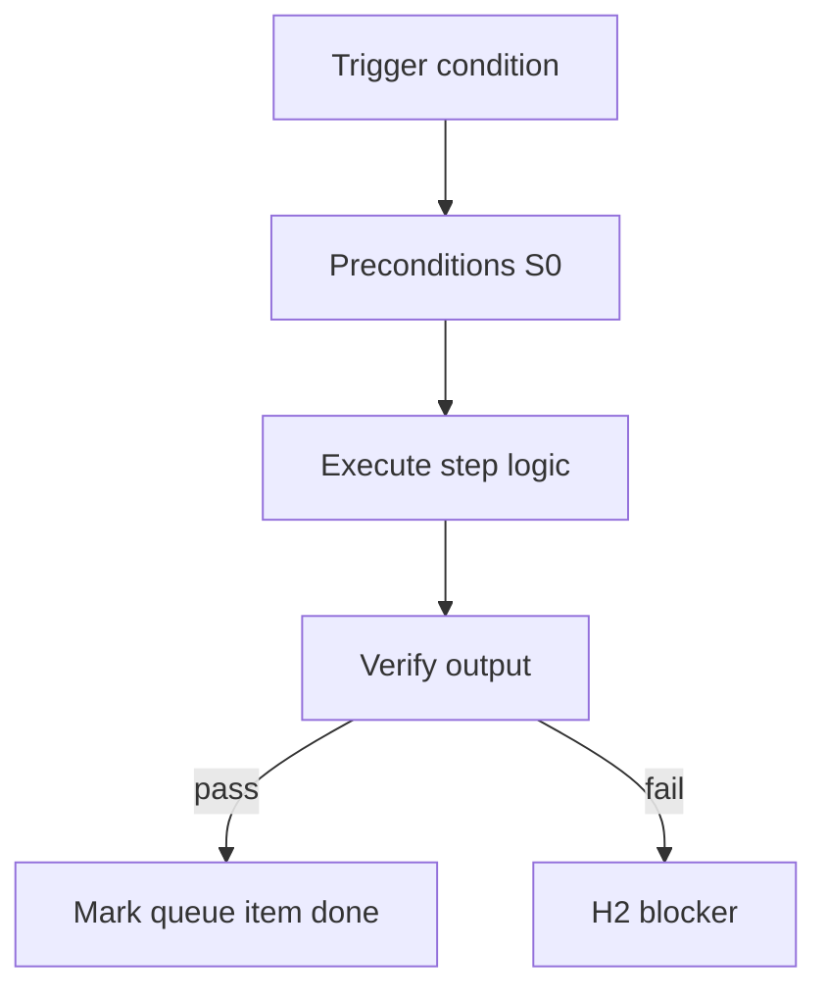

<!-- Complete pass 3 2026-06-28 APP-A -->

# APP-A: design work taxonomy design

**Parent:** — · **Branch APP** · **Vision §3** · **Release:** v2.19

## Reader narrative
<!-- prose-source: agent meta 2026-06-28 -->

Design work spans UX/UI, API and data models, integration design, and security/compliance design. Autonomous execution still requires machine-checkable outputs: diagrams, schemas, and review triggers—not prose-only decisions.

Every design artifact should link forward to task cards and backward to catalog components where reuse applies.

## Purpose

APP-A-design defines work taxonomy design for the agent-driven expert system. Human job taxonomy → pack workflows.
## Scope

- Owns `APP-A-design` only; siblings under `—` must not duplicate this spec.
- Aligns with minimal HITL: H1 plan, H2 blocker, H3 sign-off ([INTRO-1.2](INTRO-1.2-human-touchpoint-contract-h1-h2-h3.md)).
- Conflicts resolve in favor of [Vision §3 — Branch A — Pursuit & control plane](../../full-automation-vision-and-hierarchy.md#3-branch-a-pursuit-control-plane).

```
APP-A-design work taxonomy design
```
## Behavior / step logic
<!-- timeline-source: agent cursor-agent 2026-06-28 -->

1. When `next_action` enters design phases (`run hld-writer`, `run dd-writer`, `diagram-generator`), the conductor classifies work under the APP-A design taxonomy—UX/UI, API and data models, integration boundaries, and security/compliance—and routes each slice through the matching S2 skill instead of prose-only decisions.
2. Each design turn must emit machine-checkable artifacts—diagram files, schemas, structured review triggers—in `docs/design/` and `docs/diagrams/` so [A1.2](A1.2-success-criteria-machine-checkable.md) criteria and verifiers can judge completion without subjective review.
3. After every design write, the conductor links artifacts forward to forthcoming task cards and backward to catalog components via [B4.3](B4.3-compose-first-catalog-before-improvise.md), then dual-writes journal and state.json before advancing `next_action`.
4. HLD and DD gates per [INTRO-1.2](INTRO-1.2-human-touchpoint-contract-h1-h2-h3.md) block implement until H1 approval or explicit waiver—[A5.2](A5.2-continue-not-approval-self-gate-h1-h3-only.md) prevents Continue from clearing design approval on its own.
5. If diagrams, schemas, catalog backlinks, or staleness registration are missing, pursuit stops at H2 until the design skill re-runs and reconcile-stale clears dependent nodes.



## JSON example

```json
{
  "node": "APP-A-design",
  "description": "work taxonomy design",
  "state": { "ref": "APP-B-state-json-sketch.md" },
  "implemented_in_release": "v2.14+"
}
```


## Repo artifacts (this branch)


## Edge cases

- Operator closes laptop mid-loop — state.json must resume from last good dual-write.
- Concurrent manual edit to queue JSON — conductor reloads queue each wake; last writer wins with journal note.
- Edge case `APP-A-design` variant 3: verify state dual-write before continuing pursuit.
- Edge case `APP-A-design` variant 4: verify state dual-write before continuing pursuit.
- Pass 3: add regression test or evidence path specific to `APP-A-design`.
- Pass 3: cross-link related nodes in same branch index.

## Failure modes

- **Silent stop:** Agent ends turn without updating queue → mitigated by /loop + check-hierarchy-queue.py EMPTY gate.
- **False complete:** Item marked done without artifact → audit-hierarchy-depth.py re-enqueues deepen pass.
- **Scope bleed:** Worker edits journal/state during planning-only expansion → forbidden in vision-expansion-prompt.
- **Stale design:** Upstream vision § changes → reconcile-stale adds deepen items for affected ids.

## Concrete implementation

1. Map `APP-A-design` to v2.14–v2.23 release row in SEC-15-index.md.
2. Create or extend S0 script if behavior is file-derived.
3. Add unit test under tests/unit/test_app-a-design.py when script exists.
4. Validate `APP-A-design` against SEC-15 release checklist and parent index links.
5. Document `APP-A-design` in parent index with verify command and release tag.
6. Add checklist row in SEC-15 release doc for `APP-A-design`.

## Verification

| Check | Command |
|-------|---------|
| Completeness | `python scripts/automation/audit-hierarchy-depth.py --strict --ids APP-A-design` |
| Conformance | `python scripts/validate-workflow.py` |
| Task evidence | `python scripts/verify-router.py` when implement task exists |

## Dependencies

| Link | Why |
|------|-----|
| [full-automation-vision-and-hierarchy.md](../../full-automation-vision-and-hierarchy.md) §3 | Master hierarchy |
| [—-index](—-index.md) | Parent grouping |
| [genius-conductor-tiered-routing.md](../../genius-conductor-tiered-routing.md) | S0–S4 routing |

## Acceptance criteria

- [ ] `python scripts/automation/audit-hierarchy-depth.py --strict --ids APP-A-design` passes
- [ ] Named script, skill, or test path exists or is listed in SEC-15 release row
- [ ] Linked from [—-index](—-index.md)
- [ ] `python scripts/validate-workflow.py` passes after implement

## Cross-links

- [hierarchy-expander SKILL](../../../.cursor/skills/hierarchy-expander/SKILL.md)
