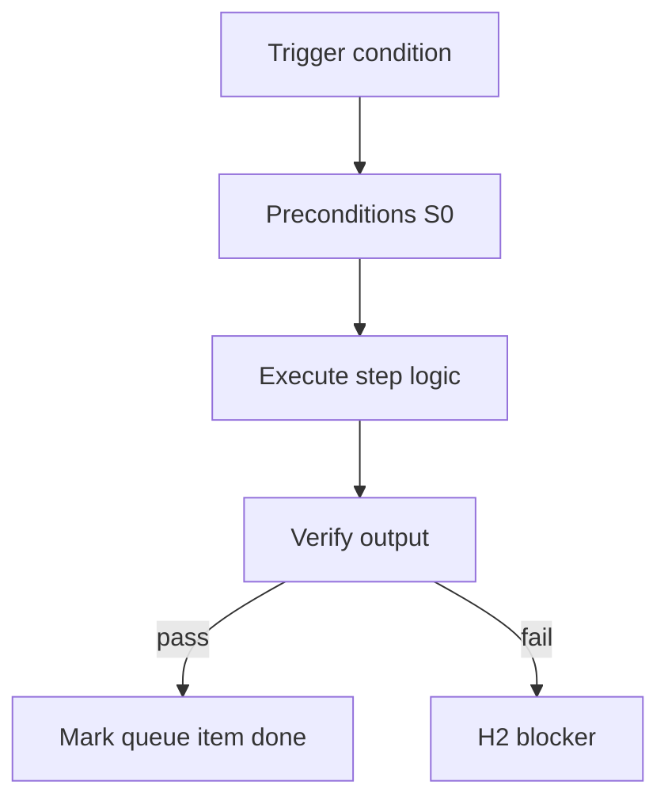

<!-- Complete pass 3 2026-06-28 APP-A -->

# APP-A: discover work taxonomy discover and plan

**Parent:** — · **Branch APP** · **Vision §3** · **Release:** v2.19

## Reader narrative
<!-- prose-source: agent meta 2026-06-28 -->

Discover and plan work covers requirements elicitation (with H1 assist), research, architecture tradeoffs, and milestone planning. In a template-pack, each leaf maps to pipeline phases, verification commands, and playbooks—not informal chat.

Pack authors use this taxonomy slice to ensure planning roles produce approved artifacts the pursuit loop can consume without re-asking baseline questions.

## Purpose

APP-A-discover defines work taxonomy discover and plan for the agent-driven expert system. Human job taxonomy → pack workflows.
## Scope

- Owns `APP-A-discover` only; siblings under `—` must not duplicate this spec.
- Aligns with minimal HITL: H1 plan, H2 blocker, H3 sign-off ([INTRO-1.2](INTRO-1.2-human-touchpoint-contract-h1-h2-h3.md)).
- Conflicts resolve in favor of [Vision §3 — Branch A — Pursuit & control plane](../../full-automation-vision-and-hierarchy.md#3-branch-a-pursuit-control-plane).

```
APP-A-discover work taxonomy discover and plan
```
## Behavior / step logic
<!-- timeline-source: agent cursor-agent 2026-06-28 -->

1. When `next_action` targets discover or plan phases (`run spec-parser`, `program-scoper`, requirements research), the conductor invokes the matching S2 skill with librarian-bounded `allowed_reads` per [E4.3](E4.3-context-allowed-reads-cap-max-5.md) instead of ad hoc repo exploration.
2. Elicitation and research turns produce machine-checkable artifacts—parsed requirements, open-question lists, tradeoff notes, and milestone sketches—that dual-write to journal and state.json for H1 review before design or implement phases start.
3. At H1 the operator approves or amends the plan; journal-keeper records resolved Q&A, clears blocking questions, and sets `next_action` so [A5.3](A5.3-default-after-h1-auto-enter-goal-autopilot.md) can enter goal autopilot without re-asking baseline discovery.
4. Template-pack authors map this taxonomy slice to pipeline phases, verification commands, and playbooks in pack YAML so company autopilot spawns discover roles with the correct skills and catalog paths per [F1.3](F1.3-pack-pipelines---yaml.md).
5. If discovery ends with prose-only chat, unresolved blocking questions, or no approved plan artifacts, pursuit fails closed at H2—never advance to HLD, DD, or implement until machine-checkable outputs exist.



## JSON example

```json
{
  "node": "APP-A-discover",
  "description": "work taxonomy discover and plan",
  "state": { "ref": "APP-B-state-json-sketch.md" },
  "implemented_in_release": "v2.14+"
}
```


## Repo artifacts (this branch)


## Edge cases

- Operator closes laptop mid-loop — state.json must resume from last good dual-write.
- Concurrent manual edit to queue JSON — conductor reloads queue each wake; last writer wins with journal note.
- Edge case `APP-A-discover` variant 3: verify state dual-write before continuing pursuit.
- Edge case `APP-A-discover` variant 4: verify state dual-write before continuing pursuit.
- Pass 3: add regression test or evidence path specific to `APP-A-discover`.
- Pass 3: cross-link related nodes in same branch index.

## Failure modes

- **Silent stop:** Agent ends turn without updating queue → mitigated by /loop + check-hierarchy-queue.py EMPTY gate.
- **False complete:** Item marked done without artifact → audit-hierarchy-depth.py re-enqueues deepen pass.
- **Scope bleed:** Worker edits journal/state during planning-only expansion → forbidden in vision-expansion-prompt.
- **Stale design:** Upstream vision § changes → reconcile-stale adds deepen items for affected ids.

## Concrete implementation

1. Map `APP-A-discover` to v2.14–v2.23 release row in SEC-15-index.md.
2. Create or extend S0 script if behavior is file-derived.
3. Add unit test under tests/unit/test_app-a-discover.py when script exists.
4. Validate `APP-A-discover` against SEC-15 release checklist and parent index links.
5. Document `APP-A-discover` in parent index with verify command and release tag.
6. Add checklist row in SEC-15 release doc for `APP-A-discover`.

## Verification

| Check | Command |
|-------|---------|
| Completeness | `python scripts/automation/audit-hierarchy-depth.py --strict --ids APP-A-discover` |
| Conformance | `python scripts/validate-workflow.py` |
| Task evidence | `python scripts/verify-router.py` when implement task exists |

## Dependencies

| Link | Why |
|------|-----|
| [full-automation-vision-and-hierarchy.md](../../full-automation-vision-and-hierarchy.md) §3 | Master hierarchy |
| [—-index](—-index.md) | Parent grouping |
| [genius-conductor-tiered-routing.md](../../genius-conductor-tiered-routing.md) | S0–S4 routing |

## Acceptance criteria

- [ ] `python scripts/automation/audit-hierarchy-depth.py --strict --ids APP-A-discover` passes
- [ ] Named script, skill, or test path exists or is listed in SEC-15 release row
- [ ] Linked from [—-index](—-index.md)
- [ ] `python scripts/validate-workflow.py` passes after implement

## Cross-links

- [hierarchy-expander SKILL](../../../.cursor/skills/hierarchy-expander/SKILL.md)
