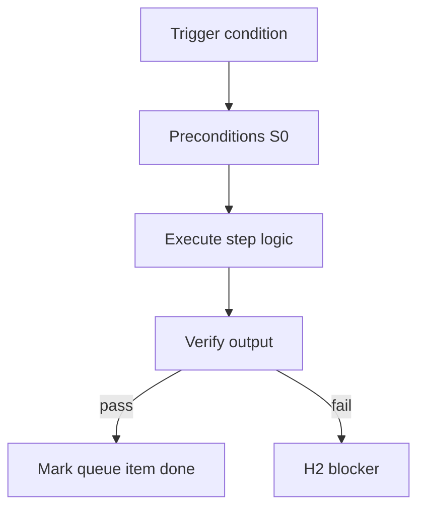

<!-- Complete pass 3 2026-06-28 APP-A -->

# APP-A: improve work taxonomy improve platform

**Parent:** — · **Branch APP** · **Vision §3** · **Release:** v2.19

## Reader narrative
<!-- prose-source: agent meta 2026-06-28 -->

Improve platform work is promotion, turning repeated patterns into playbooks, script extraction, and catalog curation—Plane D and E activities that run alongside product pursuits via the platform queue.

Without this slice in packs, organizations revert to one-off heroics instead of maturing reuse.

## Purpose

APP-A-improve defines work taxonomy improve platform for the agent-driven expert system. Human job taxonomy → pack workflows.
## Scope

- Owns `APP-A-improve` only; siblings under `—` must not duplicate this spec.
- Aligns with minimal HITL: H1 plan, H2 blocker, H3 sign-off ([INTRO-1.2](INTRO-1.2-human-touchpoint-contract-h1-h2-h3.md)).
- Conflicts resolve in favor of [Vision §3 — Branch A — Pursuit & control plane](../../full-automation-vision-and-hierarchy.md#3-branch-a-pursuit-control-plane).

```
APP-A-improve work taxonomy improve platform
```
## Behavior / step logic
<!-- timeline-source: agent cursor-agent 2026-06-28 -->

1. When pursuit surfaces repeated improvisation, divergence logs, or compose misses, the conductor classifies the work as improve-platform and enqueues promotion items on the platform queue via [E2.5](E2.5-compose-miss-l0-enqueue-promotion.md) instead of folding reuse debt into the active product step.
2. Product turns continue under goal autopilot; platform turns drain one promotion item per [D2.3](D2.3-dequeue-platform-turn-not-product.md) and [B4.2](B4.2-platform-promotion-queue-peek-drain.md) so playbook extraction and catalog curation run alongside—not instead of—active goals.
3. Promotion workers distill captured patterns into L1 playbooks, L2 S0 scripts, or catalog fragments per the [D1.2](D1.2-l1-playbook-docs-playbooks.md)–[D1.4](D1.4-l3-skill-command-cursor-skills.md) ladder, dual-writing artifacts and updating compose-first bindings for future turns.
4. Template-pack authors map this APP-A slice to platform-queue enqueue rules, promotion-ladder targets, and verify commands so company autopilot spawns improve roles with the correct skills—not ad hoc heroics each sprint.
5. If platform reuse is claimed without playbook artifacts, catalog entries, or queue-drain evidence, pursuit fails closed at H2 rather than marking promotion complete or advancing product scope silently.



## JSON example

```json
{
  "node": "APP-A-improve",
  "description": "work taxonomy improve platform",
  "state": { "ref": "APP-B-state-json-sketch.md" },
  "implemented_in_release": "v2.14+"
}
```


## Repo artifacts (this branch)


## Edge cases

- Operator closes laptop mid-loop — state.json must resume from last good dual-write.
- Concurrent manual edit to queue JSON — conductor reloads queue each wake; last writer wins with journal note.
- Edge case `APP-A-improve` variant 3: verify state dual-write before continuing pursuit.
- Edge case `APP-A-improve` variant 4: verify state dual-write before continuing pursuit.
- Pass 3: add regression test or evidence path specific to `APP-A-improve`.
- Pass 3: cross-link related nodes in same branch index.

## Failure modes

- **Silent stop:** Agent ends turn without updating queue → mitigated by /loop + check-hierarchy-queue.py EMPTY gate.
- **False complete:** Item marked done without artifact → audit-hierarchy-depth.py re-enqueues deepen pass.
- **Scope bleed:** Worker edits journal/state during planning-only expansion → forbidden in vision-expansion-prompt.
- **Stale design:** Upstream vision § changes → reconcile-stale adds deepen items for affected ids.

## Concrete implementation

1. Map `APP-A-improve` to v2.14–v2.23 release row in SEC-15-index.md.
2. Create or extend S0 script if behavior is file-derived.
3. Add unit test under tests/unit/test_app-a-improve.py when script exists.
4. Validate `APP-A-improve` against SEC-15 release checklist and parent index links.
5. Document `APP-A-improve` in parent index with verify command and release tag.
6. Add checklist row in SEC-15 release doc for `APP-A-improve`.

## Verification

| Check | Command |
|-------|---------|
| Completeness | `python scripts/automation/audit-hierarchy-depth.py --strict --ids APP-A-improve` |
| Conformance | `python scripts/validate-workflow.py` |
| Task evidence | `python scripts/verify-router.py` when implement task exists |

## Dependencies

| Link | Why |
|------|-----|
| [full-automation-vision-and-hierarchy.md](../../full-automation-vision-and-hierarchy.md) §3 | Master hierarchy |
| [—-index](—-index.md) | Parent grouping |
| [genius-conductor-tiered-routing.md](../../genius-conductor-tiered-routing.md) | S0–S4 routing |

## Acceptance criteria

- [ ] `python scripts/automation/audit-hierarchy-depth.py --strict --ids APP-A-improve` passes
- [ ] Named script, skill, or test path exists or is listed in SEC-15 release row
- [ ] Linked from [—-index](—-index.md)
- [ ] `python scripts/validate-workflow.py` passes after implement

## Cross-links

- [hierarchy-expander SKILL](../../../.cursor/skills/hierarchy-expander/SKILL.md)
