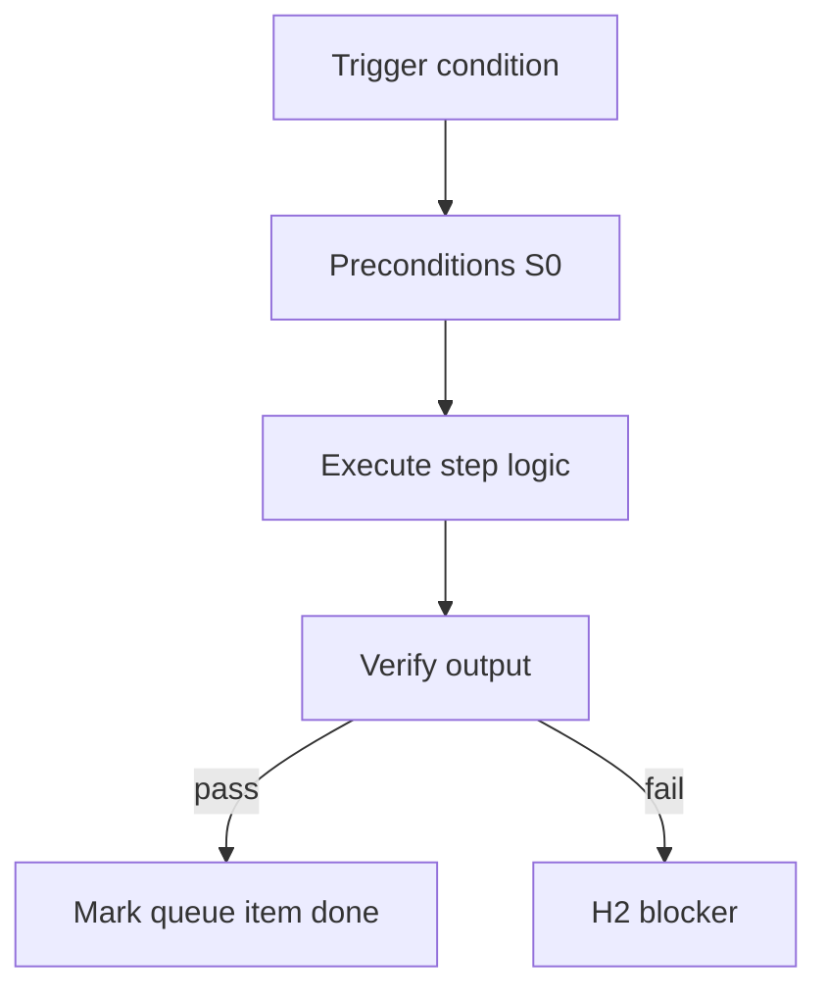

<!-- Complete pass 3 2026-06-28 APP-A -->

# APP-A: organize work taxonomy organize company

**Parent:** — · **Branch APP** · **Vision §3** · **Release:** v2.19

## Reader narrative
<!-- prose-source: agent meta 2026-06-28 -->

Organize company work covers pack instantiation, role queues, active_role switching, and cross-team coordination inside template-packs. It is how a single harness pretends to be an org chart without forking state per employee.

company.yaml and roles/*.yaml from Plane F are the primary artifacts here.

## Purpose

APP-A-organize defines work taxonomy organize company for the agent-driven expert system. Human job taxonomy → pack workflows.
## Scope

- Owns `APP-A-organize` only; siblings under `—` must not duplicate this spec.
- Aligns with minimal HITL: H1 plan, H2 blocker, H3 sign-off ([INTRO-1.2](INTRO-1.2-human-touchpoint-contract-h1-h2-h3.md)).
- Conflicts resolve in favor of [Vision §3 — Branch A — Pursuit & control plane](../../full-automation-vision-and-hierarchy.md#3-branch-a-pursuit-control-plane).

```
APP-A-organize work taxonomy organize company
```
## Behavior / step logic
<!-- timeline-source: agent cursor-agent 2026-06-28 -->

1. At H1 or company-goal instantiation, [F2.1](F2.1-company-instantiate-program-scoper-pack-select.md) loads `company.yaml` and `roles/*.yaml` from the active template-pack, dual-writing `company.pack_id`, `company.active_role`, and program workstreams into state.json without forking a separate harness per employee.
2. The conductor selects `active_role` from the pack per [B5.1](B5.1-active-role-from-template-pack.md), binding pipeline id, skills, and tool permissions via [B5.2](B5.2-role-to-pipeline-id-skills-tool-permissions.md) so each department turn runs under the correct org-chart context.
3. When parallel lanes are ready, [F2.2](F2.2-company-spawn-workstream-department-role-lane.md) spawns workstreams with lane leases while [F2.3](F2.3-company-active-role-rotates-ready-work.md) rotates `active_role` across departments that have ready queue items—coordinating cross-team handoffs through the integration manifest, not ad-hoc journal edits.
4. Under [A3.3](A3.3-company-autopilot-multi-goal-role-workstreams.md) company autopilot, pursuit continues across role and workstream switches until each nested goal reaches goal_verify or a hard block fires; roll-up status stays on parent goals in state.json.
5. If pack instantiation fails, role bindings conflict, or lane leases collide, pursuit stops with a structured H2 blocker rather than silently running product work under the wrong role context.



## JSON example

```json
{
  "node": "APP-A-organize",
  "description": "work taxonomy organize company",
  "state": { "ref": "APP-B-state-json-sketch.md" },
  "implemented_in_release": "v2.14+"
}
```


## Repo artifacts (this branch)


## Edge cases

- Operator closes laptop mid-loop — state.json must resume from last good dual-write.
- Concurrent manual edit to queue JSON — conductor reloads queue each wake; last writer wins with journal note.
- Edge case `APP-A-organize` variant 3: verify state dual-write before continuing pursuit.
- Edge case `APP-A-organize` variant 4: verify state dual-write before continuing pursuit.
- Pass 3: add regression test or evidence path specific to `APP-A-organize`.
- Pass 3: cross-link related nodes in same branch index.

## Failure modes

- **Silent stop:** Agent ends turn without updating queue → mitigated by /loop + check-hierarchy-queue.py EMPTY gate.
- **False complete:** Item marked done without artifact → audit-hierarchy-depth.py re-enqueues deepen pass.
- **Scope bleed:** Worker edits journal/state during planning-only expansion → forbidden in vision-expansion-prompt.
- **Stale design:** Upstream vision § changes → reconcile-stale adds deepen items for affected ids.

## Concrete implementation

1. Map `APP-A-organize` to v2.14–v2.23 release row in SEC-15-index.md.
2. Create or extend S0 script if behavior is file-derived.
3. Add unit test under tests/unit/test_app-a-organize.py when script exists.
4. Validate `APP-A-organize` against SEC-15 release checklist and parent index links.
5. Document `APP-A-organize` in parent index with verify command and release tag.
6. Add checklist row in SEC-15 release doc for `APP-A-organize`.

## Verification

| Check | Command |
|-------|---------|
| Completeness | `python scripts/automation/audit-hierarchy-depth.py --strict --ids APP-A-organize` |
| Conformance | `python scripts/validate-workflow.py` |
| Task evidence | `python scripts/verify-router.py` when implement task exists |

## Dependencies

| Link | Why |
|------|-----|
| [full-automation-vision-and-hierarchy.md](../../full-automation-vision-and-hierarchy.md) §3 | Master hierarchy |
| [—-index](—-index.md) | Parent grouping |
| [genius-conductor-tiered-routing.md](../../genius-conductor-tiered-routing.md) | S0–S4 routing |

## Acceptance criteria

- [ ] `python scripts/automation/audit-hierarchy-depth.py --strict --ids APP-A-organize` passes
- [ ] Named script, skill, or test path exists or is listed in SEC-15 release row
- [ ] Linked from [—-index](—-index.md)
- [ ] `python scripts/validate-workflow.py` passes after implement

## Cross-links

- [hierarchy-expander SKILL](../../../.cursor/skills/hierarchy-expander/SKILL.md)
