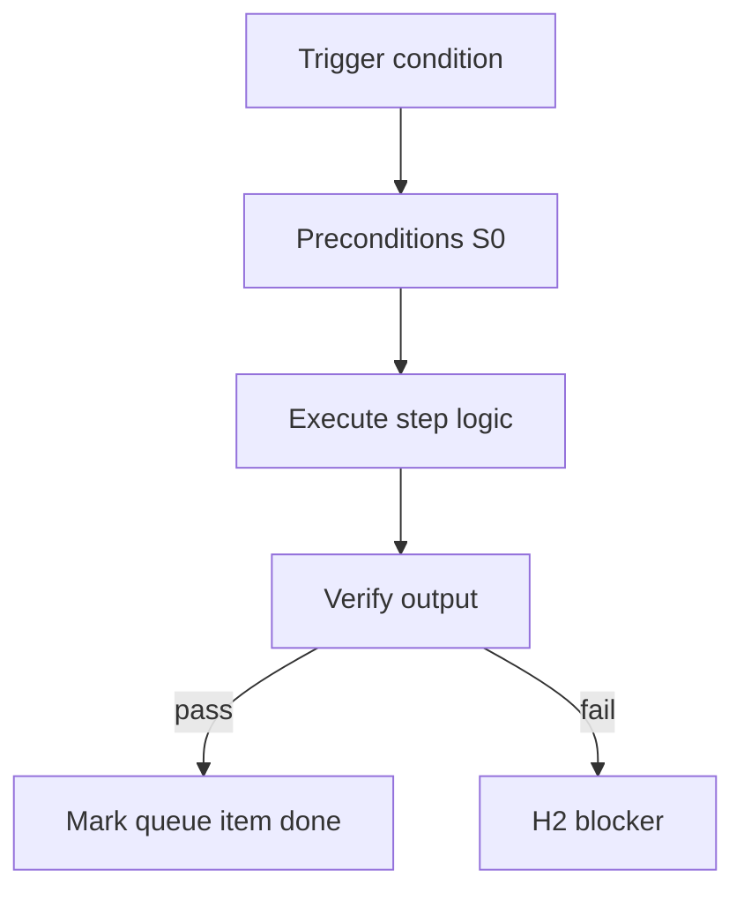

<!-- Complete pass 3 2026-06-28 APP-A -->

# APP-A: release work taxonomy release and operate

**Parent:** — · **Branch APP** · **Vision §3** · **Release:** v2.19

## Reader narrative
<!-- prose-source: agent meta 2026-06-28 -->

Release and operate covers deploy preparation, release queues, operator dashboards, and production-adjacent automation with rollback paths. Irreversible production actions remain out of scope unless verify and rollback are defined.

This slice connects Plane I runtime integrations to Plane G rollback policies.

## Purpose

APP-A-release defines work taxonomy release and operate for the agent-driven expert system. Human job taxonomy → pack workflows.
## Scope

- Owns `APP-A-release` only; siblings under `—` must not duplicate this spec.
- Aligns with minimal HITL: H1 plan, H2 blocker, H3 sign-off ([INTRO-1.2](INTRO-1.2-human-touchpoint-contract-h1-h2-h3.md)).
- Conflicts resolve in favor of [Vision §3 — Branch A — Pursuit & control plane](../../full-automation-vision-and-hierarchy.md#3-branch-a-pursuit-control-plane).

```
APP-A-release work taxonomy release and operate
```
## Behavior / step logic
<!-- timeline-source: agent cursor-agent 2026-06-28 -->

1. When `next_action` targets release or operate phases, the conductor routes through git-workflow, release-queue, and dashboard skills only after verify commands and rollback paths are bound in the task card and active pack per [J6](J6-release-queue.md).
2. Pack authors map APP-A-release to pipeline phases, [F1.8](F1.8-pack-verify-goal-verify-suites.md) verify suites, and playbooks so deploy preparation produces machine-checkable evidence—not subjective "shipped" chat.
3. Plane I runtime integrations ([I3.2](I3.2-runtime-headless-github-actions-validate-verify.md), [I5.1](I5.1-runtime-notify-status-dashboard-generation.md)) run validate-workflow and verify-router in headless or CI context before H3 release sign-off is requested.
4. Operator dashboards and digest notifications surface release-queue status and H2 blockers per [A6.1](A6.1-notify-dashboard-status-webhook-phase-complete.md) and [A6.2](A6.2-notify-digest-on-h2-blocker-not-every-step.md) without unblocking pursuit loops.
5. Irreversible production actions without defined verify and rollback paths fail closed at H2 under Plane G rollback policy—never set goal.state to achieved on undeployable or unrollbackable changes.



## JSON example

```json
{
  "node": "APP-A-release",
  "description": "work taxonomy release and operate",
  "state": { "ref": "APP-B-state-json-sketch.md" },
  "implemented_in_release": "v2.14+"
}
```


## Repo artifacts (this branch)


## Edge cases

- Operator closes laptop mid-loop — state.json must resume from last good dual-write.
- Concurrent manual edit to queue JSON — conductor reloads queue each wake; last writer wins with journal note.
- Edge case `APP-A-release` variant 3: verify state dual-write before continuing pursuit.
- Edge case `APP-A-release` variant 4: verify state dual-write before continuing pursuit.
- Pass 3: add regression test or evidence path specific to `APP-A-release`.
- Pass 3: cross-link related nodes in same branch index.

## Failure modes

- **Silent stop:** Agent ends turn without updating queue → mitigated by /loop + check-hierarchy-queue.py EMPTY gate.
- **False complete:** Item marked done without artifact → audit-hierarchy-depth.py re-enqueues deepen pass.
- **Scope bleed:** Worker edits journal/state during planning-only expansion → forbidden in vision-expansion-prompt.
- **Stale design:** Upstream vision § changes → reconcile-stale adds deepen items for affected ids.

## Concrete implementation

1. Map `APP-A-release` to v2.14–v2.23 release row in SEC-15-index.md.
2. Create or extend S0 script if behavior is file-derived.
3. Add unit test under tests/unit/test_app-a-release.py when script exists.
4. Validate `APP-A-release` against SEC-15 release checklist and parent index links.
5. Document `APP-A-release` in parent index with verify command and release tag.
6. Add checklist row in SEC-15 release doc for `APP-A-release`.

## Verification

| Check | Command |
|-------|---------|
| Completeness | `python scripts/automation/audit-hierarchy-depth.py --strict --ids APP-A-release` |
| Conformance | `python scripts/validate-workflow.py` |
| Task evidence | `python scripts/verify-router.py` when implement task exists |

## Dependencies

| Link | Why |
|------|-----|
| [full-automation-vision-and-hierarchy.md](../../full-automation-vision-and-hierarchy.md) §3 | Master hierarchy |
| [—-index](—-index.md) | Parent grouping |
| [genius-conductor-tiered-routing.md](../../genius-conductor-tiered-routing.md) | S0–S4 routing |

## Acceptance criteria

- [ ] `python scripts/automation/audit-hierarchy-depth.py --strict --ids APP-A-release` passes
- [ ] Named script, skill, or test path exists or is listed in SEC-15 release row
- [ ] Linked from [—-index](—-index.md)
- [ ] `python scripts/validate-workflow.py` passes after implement

## Cross-links

- [hierarchy-expander SKILL](../../../.cursor/skills/hierarchy-expander/SKILL.md)
