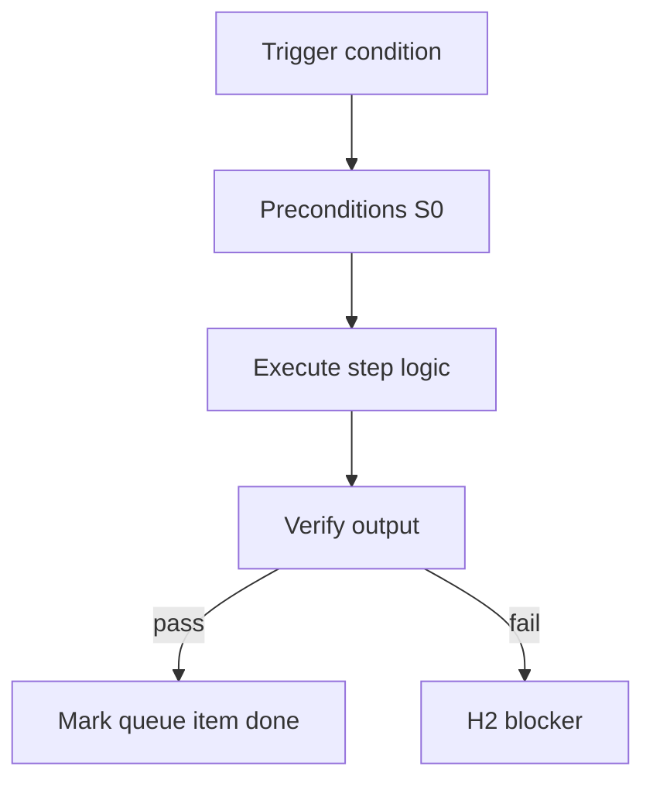

<!-- Complete pass 3 2026-06-28 APP-A -->

# APP-A: verify work taxonomy verify

**Parent:** — · **Branch APP** · **Vision §3** · **Release:** v2.19

## Reader narrative
<!-- prose-source: agent meta 2026-06-28 -->

Verify work spans unit, integration, E2E, tool outputs, goal_verify, and conformance scripts. Verification is not a phase humans optionally trigger—it is the gate that separates pursuing from achieved.

Pack workflows must name verify commands explicitly so goal_verify can aggregate them.

## Purpose

APP-A-verify defines work taxonomy verify for the agent-driven expert system. Human job taxonomy → pack workflows.
## Scope

- Owns `APP-A-verify` only; siblings under `—` must not duplicate this spec.
- Aligns with minimal HITL: H1 plan, H2 blocker, H3 sign-off ([INTRO-1.2](INTRO-1.2-human-touchpoint-contract-h1-h2-h3.md)).
- Conflicts resolve in favor of [Vision §3 — Branch A — Pursuit & control plane](../../full-automation-vision-and-hierarchy.md#3-branch-a-pursuit-control-plane).

```
APP-A-verify work taxonomy verify
```
## Behavior / step logic
<!-- timeline-source: agent cursor-agent 2026-06-28 -->

1. Pack workflows bind each verify slice to explicit unit, integration, E2E, tool-operator, or conformance commands so [G2.1](G2.1-goal-verify-command-state-pack.md) goal_verify can aggregate them mechanically—never subjective "looks good" gates.
2. When `evidence_required` is true, the conductor spawns Verifier or tool-operator workers via [G1.1](G1.1-task-verify-router-verifier.md) and verify-router.py with the task card's literal Test or Tool command block rather than improvising checks.
3. Shell workers write logs under `evidence/` per docs/operator/evidence-types.md and return paths; the conductor dual-writes `evidence_files` and sets `last_verify` to passed before advancing `next_action` or marking implement tasks complete.
4. Conformance scripts ([G3.1](G3.1-conformance-validate-workflow-ci.md), route-tier checks) run at pursuit boundaries so goal.state cannot move from pursuing to achieved without aggregated proof across named commands.
5. On verify failure, missing evidence, or goal_verify aggregation gaps, pursuit fails closed at H2—[G1.3](G1.3-last-verify-before-advance.md) blocks advance and [B3.3](B3.3-escalation-loop-on-verify-fail.md) may escalate without clearing gates.



## JSON example

```json
{
  "node": "APP-A-verify",
  "description": "work taxonomy verify",
  "state": { "ref": "APP-B-state-json-sketch.md" },
  "implemented_in_release": "v2.14+"
}
```


## Repo artifacts (this branch)


## Edge cases

- Operator closes laptop mid-loop — state.json must resume from last good dual-write.
- Concurrent manual edit to queue JSON — conductor reloads queue each wake; last writer wins with journal note.
- Edge case `APP-A-verify` variant 3: verify state dual-write before continuing pursuit.
- Edge case `APP-A-verify` variant 4: verify state dual-write before continuing pursuit.
- Pass 3: add regression test or evidence path specific to `APP-A-verify`.
- Pass 3: cross-link related nodes in same branch index.

## Failure modes

- **Silent stop:** Agent ends turn without updating queue → mitigated by /loop + check-hierarchy-queue.py EMPTY gate.
- **False complete:** Item marked done without artifact → audit-hierarchy-depth.py re-enqueues deepen pass.
- **Scope bleed:** Worker edits journal/state during planning-only expansion → forbidden in vision-expansion-prompt.
- **Stale design:** Upstream vision § changes → reconcile-stale adds deepen items for affected ids.

## Concrete implementation

1. Map `APP-A-verify` to v2.14–v2.23 release row in SEC-15-index.md.
2. Create or extend S0 script if behavior is file-derived.
3. Add unit test under tests/unit/test_app-a-verify.py when script exists.
4. Validate `APP-A-verify` against SEC-15 release checklist and parent index links.
5. Document `APP-A-verify` in parent index with verify command and release tag.
6. Add checklist row in SEC-15 release doc for `APP-A-verify`.

## Verification

| Check | Command |
|-------|---------|
| Completeness | `python scripts/automation/audit-hierarchy-depth.py --strict --ids APP-A-verify` |
| Conformance | `python scripts/validate-workflow.py` |
| Task evidence | `python scripts/verify-router.py` when implement task exists |

## Dependencies

| Link | Why |
|------|-----|
| [full-automation-vision-and-hierarchy.md](../../full-automation-vision-and-hierarchy.md) §3 | Master hierarchy |
| [—-index](—-index.md) | Parent grouping |
| [genius-conductor-tiered-routing.md](../../genius-conductor-tiered-routing.md) | S0–S4 routing |

## Acceptance criteria

- [ ] `python scripts/automation/audit-hierarchy-depth.py --strict --ids APP-A-verify` passes
- [ ] Named script, skill, or test path exists or is listed in SEC-15 release row
- [ ] Linked from [—-index](—-index.md)
- [ ] `python scripts/validate-workflow.py` passes after implement

## Cross-links

- [hierarchy-expander SKILL](../../../.cursor/skills/hierarchy-expander/SKILL.md)
