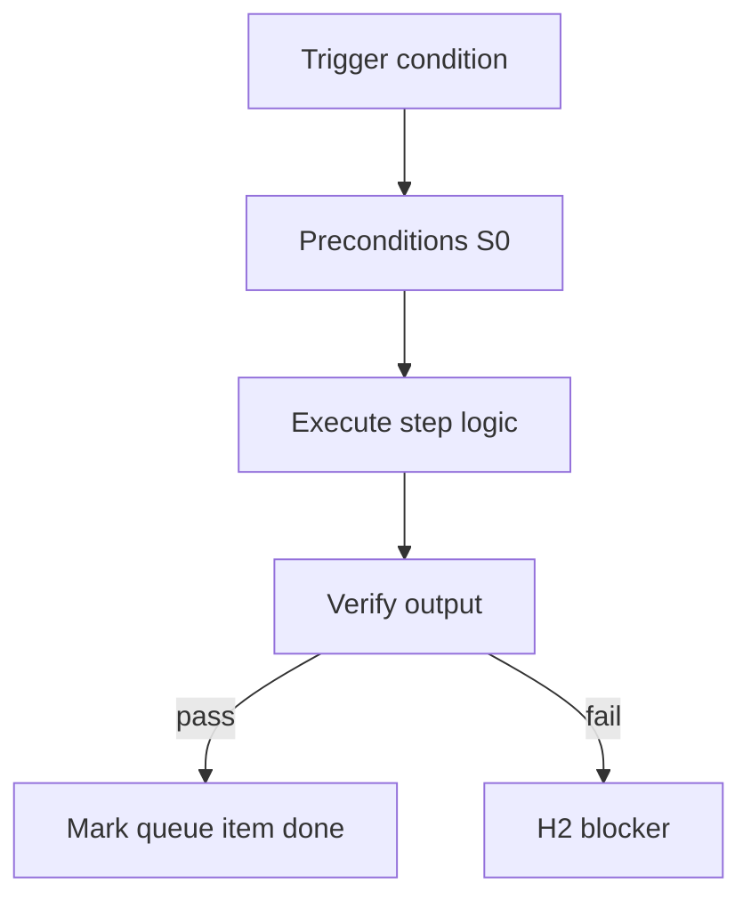

<!-- Complete pass 3 2026-06-28 APP-B -->

# APP-B: state json sketch

**Parent:** — · **Branch SEC** · **Vision §3** · **Release:** v2.14

## Reader narrative
<!-- prose-source: agent meta 2026-06-28 -->

This appendix sketches additive state.json fields for v2 goals, platform queues, pursuit counters, HITL pending markers, and company context—without breaking state.json version 2 compatibility. Implementers use it as a map when reading Plane H specs.

The sketch is not a substitute for validate-workflow.py and schema tests; it orients readers before they open individual H1.x field specs.

## Purpose

APP-B defines state json sketch for the agent-driven expert system. Roadmap, gap analysis, pursuit flow, decisions.
## Scope

- Owns `APP-B` only; siblings under `—` must not duplicate this spec.
- Aligns with minimal HITL: H1 plan, H2 blocker, H3 sign-off ([INTRO-1.2](INTRO-1.2-human-touchpoint-contract-h1-h2-h3.md)).
- Conflicts resolve in favor of [Vision §3 — Branch A — Pursuit & control plane](../../full-automation-vision-and-hierarchy.md#3-branch-a-pursuit-control-plane).

```
APP-B state json sketch
```
## Behavior / step logic
<!-- timeline-source: agent cursor-agent 2026-06-28 -->

1. At each pursuit wake, S0 scripts and the conductor read legacy v2 router keys in `journal/state.json` first, then additive goal, platform, pursuit, hitl, and company blocks sketched here before any LLM interprets progress.
2. New fields are additive only—sync-state.py and journal-keeper dual-write journal and state atomically so existing consumers of `next_action`, `autopilot`, and `evidence_required` keep working across restarts.
3. Platform queue shape ([H1.3](H1.3-state-platform-block.md)), pursuit counters ([H1.4](H1.4-state-pursuit-block.md)), HITL pending markers ([H1.5](H1.5-state-hitl-block.md)), and company context ([H1.6](H1.6-state-company-block.md)) cross-reference Plane H field specs rather than duplicating them in this appendix.
4. validate-workflow.py enforces schema conformance on read; corrupt or partial JSON triggers [A4.4](A4.4-stop-integrity-validate-workflow-state-corrupt.md) stop before goal autopilot resumes.
5. If a proposed state shape lacks schema tests or validate-workflow coverage, pursuit fails closed at H2—never write ambiguous fields that break resume from the last good dual-write.



## JSON example

```json
{
  "node": "APP-B",
  "description": "state json sketch",
  "state": { "ref": "APP-B-state-json-sketch.md" },
  "implemented_in_release": "v2.14+"
}
```


## Repo artifacts (this branch)


## Edge cases

- Operator closes laptop mid-loop — state.json must resume from last good dual-write.
- Concurrent manual edit to queue JSON — conductor reloads queue each wake; last writer wins with journal note.
- Edge case `APP-B` variant 3: verify state dual-write before continuing pursuit.
- Edge case `APP-B` variant 4: verify state dual-write before continuing pursuit.
- Pass 3: add regression test or evidence path specific to `APP-B`.
- Pass 3: cross-link related nodes in same branch index.

## Failure modes

- **Silent stop:** Agent ends turn without updating queue → mitigated by /loop + check-hierarchy-queue.py EMPTY gate.
- **False complete:** Item marked done without artifact → audit-hierarchy-depth.py re-enqueues deepen pass.
- **Scope bleed:** Worker edits journal/state during planning-only expansion → forbidden in vision-expansion-prompt.
- **Stale design:** Upstream vision § changes → reconcile-stale adds deepen items for affected ids.

## Concrete implementation

1. Map `APP-B` to v2.14–v2.23 release row in SEC-15-index.md.
2. Create or extend S0 script if behavior is file-derived.
3. Add unit test under tests/unit/test_app-b.py when script exists.
4. Validate `APP-B` against SEC-15 release checklist and parent index links.
5. Document `APP-B` in parent index with verify command and release tag.
6. Add checklist row in SEC-15 release doc for `APP-B`.

## Verification

| Check | Command |
|-------|---------|
| Completeness | `python scripts/automation/audit-hierarchy-depth.py --strict --ids APP-B` |
| Conformance | `python scripts/validate-workflow.py` |
| Task evidence | `python scripts/verify-router.py` when implement task exists |

## Dependencies

| Link | Why |
|------|-----|
| [full-automation-vision-and-hierarchy.md](../../full-automation-vision-and-hierarchy.md) §3 | Master hierarchy |
| [—-index](—-index.md) | Parent grouping |
| [genius-conductor-tiered-routing.md](../../genius-conductor-tiered-routing.md) | S0–S4 routing |

## Acceptance criteria

- [ ] `python scripts/automation/audit-hierarchy-depth.py --strict --ids APP-B` passes
- [ ] Named script, skill, or test path exists or is listed in SEC-15 release row
- [ ] Linked from [—-index](—-index.md)
- [ ] `python scripts/validate-workflow.py` passes after implement

## Cross-links

- [hierarchy-expander SKILL](../../../.cursor/skills/hierarchy-expander/SKILL.md)
