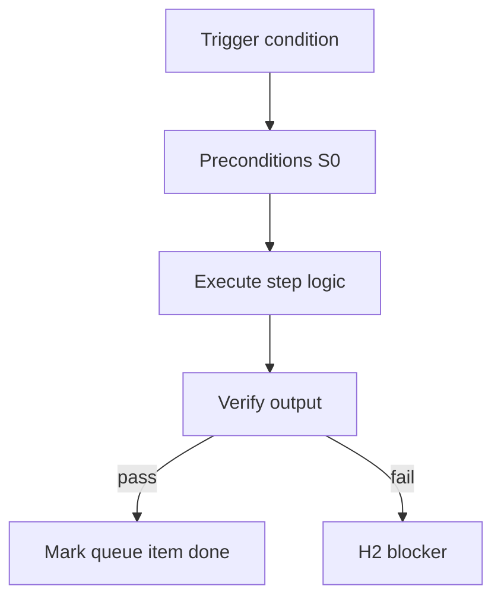

<!-- Complete pass 3 2026-06-28 B4.3 -->

# B4.3: compose-first catalog before improvise

**Parent:** [B4-index](B4-index.md) · **Branch B** · **Vision §4** · **Release:** v2.17

## Reader narrative
<!-- prose-source: agent plane-b 2026-06-28 -->

Compose-first requires catalog search before inventing new patterns: INDEX.md, playbooks, existing pack components, and facts files must be consulted and bound in the task or design record. Improvisation without catalog search is a divergence logged in Plane E.

This capability implements the expert-system reuse ladder—ephemeral reasoning should shrink over time as S0 scripts and pack fragments absorb repeated patterns. See [MASTER-E](../full-automation/MASTER-E-branch-e---knowledge---composition-plane.md).

## Purpose

B4.3 defines compose first catalog before improvise for the agent-driven expert system. Cognition & routing — [S0](B1.1-s0-deterministic-mandatory-first.md)–S4, conductor, workers, dual-stack.
## Scope

- Owns `B4.3` only; siblings under `B4` must not duplicate this spec.
- Aligns with minimal HITL: H1 plan, H2 blocker, H3 sign-off ([INTRO-1.2](INTRO-1.2-human-touchpoint-contract-h1-h2-h3.md)).
- Conflicts resolve in favor of [Vision §4 — Branch B — Cognition & routing plane](../../full-automation-vision-and-hierarchy.md#4-branch-b-cognition-routing-plane).

```
│   ├── B4.3 compose-first: catalog before improvise
```
## Behavior / step logic
<!-- timeline-source: agent cursor-agent 2026-06-28 -->

1. Before inventing new patterns, the conductor or S2 phase skills run compose-first catalog search—INDEX.md, playbooks, pack components, and facts files—and bind hits in the task or design record.
2. [B2.2](B2.2-librarian-allowed-reads-catalog-composition.md) Librarian briefings narrow reads; Plane E compose resolves capability_needed before improvisation.
3. Improvisation without catalog search is logged as divergence per [B4.4](B4.4-divergence-log-when-not-composing.md) and may enqueue platform promotion instead of silent one-off chat logic.
4. This implements the reuse ladder—ephemeral reasoning shrinks as S0 scripts and pack fragments absorb repeated patterns per [MASTER-E](MASTER-E-branch-e---knowledge---composition-plane.md).
5. If catalog refs in the task card disagree with files on disk, pursuit blocks at H2 until staleness reconcile or S3 updates the binding.



## JSON example

```json
{
  "node": "B4.3",
  "description": "compose first catalog before improvise",
  "state": { "ref": "APP-B-state-json-sketch.md" },
  "implemented_in_release": "v2.14+"
}
```


## Repo artifacts (this branch)

- `docs/operator/model-policy.json`
- `scripts/route-tier.py`
- `.cursor/skills/librarian/`
- `.cursor/rules/genius-conductor.mdc`

## Edge cases

- Operator closes laptop mid-loop — state.json must resume from last good dual-write.
- Concurrent manual edit to queue JSON — conductor reloads queue each wake; last writer wins with journal note.
- Edge case `B4.3` variant 3: verify state dual-write before continuing pursuit.
- Edge case `B4.3` variant 4: verify state dual-write before continuing pursuit.
- Pass 3: add regression test or evidence path specific to `B4.3`.
- Pass 3: cross-link related nodes in same branch index.

## Failure modes

- **Silent stop:** Agent ends turn without updating queue → mitigated by /loop + check-hierarchy-queue.py EMPTY gate.
- **False complete:** Item marked done without artifact → audit-hierarchy-depth.py re-enqueues deepen pass.
- **Scope bleed:** Worker edits journal/state during planning-only expansion → forbidden in vision-expansion-prompt.
- **Stale design:** Upstream vision § changes → reconcile-stale adds deepen items for affected ids.

## Concrete implementation

1. Map `B4.3` to v2.14–v2.23 release row in SEC-15-index.md.
2. Create or extend S0 script if behavior is file-derived.
3. Add unit test under tests/unit/test_b4_3.py when script exists.
4. Validate `B4.3` against SEC-15 release checklist and parent index links.
5. Document `B4.3` in parent index with verify command and release tag.
6. Add checklist row in SEC-15 release doc for `B4.3`.

## Verification

| Check | Command |
|-------|---------|
| Completeness | `python scripts/automation/audit-hierarchy-depth.py --strict --ids B4.3` |
| Conformance | `python scripts/validate-workflow.py` |
| Task evidence | `python scripts/verify-router.py` when implement task exists |

## Dependencies

| Link | Why |
|------|-----|
| [full-automation-vision-and-hierarchy.md](../../full-automation-vision-and-hierarchy.md) §4 | Master hierarchy |
| [B4-index](B4-index.md) | Parent grouping |
| [genius-conductor-tiered-routing.md](../../genius-conductor-tiered-routing.md) | S0–S4 routing |

## Acceptance criteria

- [ ] `python scripts/automation/audit-hierarchy-depth.py --strict --ids B4.3` passes
- [ ] Named script, skill, or test path exists or is listed in SEC-15 release row
- [ ] Linked from [B4-index](B4-index.md)
- [ ] `python scripts/validate-workflow.py` passes after implement

## Cross-links

- [hierarchy-expander SKILL](../../../.cursor/skills/hierarchy-expander/SKILL.md)
