<!-- Complete pass 3 2026-06-28 C1.2 -->

# C1.2: pipeline iterative_feature

**Parent:** [C1-index](C1-index.md) · **Branch C** · **Vision §5** · **Release:** exists

## Reader narrative
<!-- prose-source: agent plane-c 2026-06-28 -->

Iterative feature pipeline continues development after initial delivery: gather requirements, research, feature design, approval (or self-gate), branch, implement, test, commit/PR/push. It avoids re-running full greenfield when the repo and harness already exist.

Feature design approval can self-gate when encoded in pack policy; otherwise H1-class approval applies once per feature charter. Evidence and verify-router discipline match greenfield implement phases. Use iterative-feature skill as the conductor entry point.

## Purpose

C1.2 defines pipeline iterative feature for the agent-driven expert system. Product execution — pipelines, tasks, program, delivery.
## Scope

- Owns `C1.2` only; siblings under `C1` must not duplicate this spec.
- Aligns with minimal HITL: H1 plan, H2 blocker, H3 sign-off ([INTRO-1.2](INTRO-1.2-human-touchpoint-contract-h1-h2-h3.md)).
- Conflicts resolve in favor of [Vision §5 — Branch C — Product execution plane](../../full-automation-vision-and-hierarchy.md#5-branch-c-product-execution-plane).

```
│   ├── C1.2 iterative_feature
```
## Behavior / step logic
<!-- timeline-source: agent cursor-agent 2026-06-28 -->

1. When route-tier or program-scoper detects an existing delivery baseline and a feature-scoped goal, it sets `pipeline_id` to `iterative_feature` and seeds `next_action` to the iterative-feature gather phase instead of restarting greenfield skills.
2. Each pursuit turn runs [A2.1](A2.1-preflight-check-pipeline-blocked-extended.md) preflight then exactly one iterative phase per [A2.2](A2.2-if-ready-execute-one-pipeline-step.md)—requirements → research → feature design → branch → implement → test → git-workflow—skipping phases the journal already marks complete.
3. Feature design gating follows active pack policy: self-gate when encoded in the template-pack, otherwise H1 approval blocks implement until the feature charter is dual-written to journal and state.json.
4. Implement and test phases bind task cards with verify-router evidence matching [C1.1](C1.1-pipeline-software-greenfield.md) discipline; `last_verify=passed` is required before advancing past implement tasks or opening PR/push steps.
5. If routing selects greenfield for a feature delta, feature design lacks machine-checkable outputs, or branch/git-workflow runs without required approval, pursuit halts at H2 until the conductor corrects `pipeline_id`, gates, and dual-write sequencing.

```mermaid
flowchart TD
  entry[Entry: spec or feature request] --> pick{pipeline_id}
  pick -->|greenfield| gf[spec-parser → HLD → DD → tasks]
  pick -->|iterative_feature| it[iterative-feature → design gate]
  pick -->|program| pr[program-scoper → manifest gate]
  pick -->|pack| pk[company pack pipelines.yaml]
```



## JSON example

```json
{
  "node": "C1.2",
  "description": "pipeline iterative feature",
  "state": { "ref": "APP-B-state-json-sketch.md" },
  "implemented_in_release": "v2.14+"
}
```


## Repo artifacts (this branch)

- `docs/tasks/`
- `docs/manifest/pipelines/`
- `.cursor/skills/implement-feature/`
- `program/workstreams/`

## Edge cases

- Operator closes laptop mid-loop — state.json must resume from last good dual-write.
- Concurrent manual edit to queue JSON — conductor reloads queue each wake; last writer wins with journal note.
- Edge case `C1.2` variant 3: verify state dual-write before continuing pursuit.
- Edge case `C1.2` variant 4: verify state dual-write before continuing pursuit.
- Pass 3: add regression test or evidence path specific to `C1.2`.
- Pass 3: cross-link related nodes in same branch index.

## Failure modes

- **Silent stop:** Agent ends turn without updating queue → mitigated by /loop + check-hierarchy-queue.py EMPTY gate.
- **False complete:** Item marked done without artifact → audit-hierarchy-depth.py re-enqueues deepen pass.
- **Scope bleed:** Worker edits journal/state during planning-only expansion → forbidden in vision-expansion-prompt.
- **Stale design:** Upstream vision § changes → reconcile-stale adds deepen items for affected ids.

## Concrete implementation

1. Map `C1.2` to v2.14–v2.23 release row in SEC-15-index.md.
2. Create or extend S0 script if behavior is file-derived.
3. Add unit test under tests/unit/test_c1_2.py when script exists.
4. Validate `C1.2` against SEC-15 release checklist and parent index links.
5. Document `C1.2` in parent index with verify command and release tag.
6. Add checklist row in SEC-15 release doc for `C1.2`.

## Verification

| Check | Command |
|-------|---------|
| Completeness | `python scripts/automation/audit-hierarchy-depth.py --strict --ids C1.2` |
| Conformance | `python scripts/validate-workflow.py` |
| Task evidence | `python scripts/verify-router.py` when implement task exists |

## Dependencies

| Link | Why |
|------|-----|
| [full-automation-vision-and-hierarchy.md](../../full-automation-vision-and-hierarchy.md) §5 | Master hierarchy |
| [C1-index](C1-index.md) | Parent grouping |
| [genius-conductor-tiered-routing.md](../../genius-conductor-tiered-routing.md) | S0–S4 routing |

## Acceptance criteria

- [ ] `python scripts/automation/audit-hierarchy-depth.py --strict --ids C1.2` passes
- [ ] Named script, skill, or test path exists or is listed in SEC-15 release row
- [ ] Linked from [C1-index](C1-index.md)
- [ ] `python scripts/validate-workflow.py` passes after implement

## Cross-links

- [hierarchy-expander SKILL](../../../.cursor/skills/hierarchy-expander/SKILL.md)
