<!-- Complete pass 3 2026-06-28 C1.3 -->

# C1.3: pipeline multi-domain-program

**Parent:** [C1-index](C1-index.md) · **Branch C** · **Vision §5** · **Release:** exists

## Reader narrative
<!-- prose-source: agent plane-c 2026-06-28 -->

Multi-domain program pipeline decomposes mega-specs into milestones, workstreams, integration manifest, and parallel lanes—program-scoper first, manifest human gate, then orchestrate-program when lanes are unblocked.

Each stream runs its own phase progression under manifest dependencies; company-level goal_verify rolls up stream completion. This pipeline_id activates when spec size or cross-team coupling exceeds single-stream greenfield assumptions.

## Purpose

C1.3 defines pipeline multi domain program for the agent-driven expert system. Product execution — pipelines, tasks, program, delivery.
## Scope

- Owns `C1.3` only; siblings under `C1` must not duplicate this spec.
- Aligns with minimal HITL: H1 plan, H2 blocker, H3 sign-off ([INTRO-1.2](INTRO-1.2-human-touchpoint-contract-h1-h2-h3.md)).
- Conflicts resolve in favor of [Vision §5 — Branch C — Product execution plane](../../full-automation-vision-and-hierarchy.md#5-branch-c-product-execution-plane).

```
│   ├── C1.3 multi-domain-program
```
## Behavior / step logic
<!-- timeline-source: agent cli-composer-2.5 2026-06-28 -->

1. Each autopilot turn, S0 reads `state.platform.promotion_queue` depth and compares it to `drain_policy.depth_threshold` beside K in state.json or the active pack.
2. When depth exceeds the threshold, the scheduler elevates platform drain priority—an extra platform turn before the next K product steps or boosted head priority on the promotion queue—without replacing D3.1 interleaving as the default cadence.
3. The conductor dual-writes current depth and boost state to state.json after each drain so the operator dashboard and SEC-15 audit rows show backlog pressure in real time.
4. If `next_action` is evidence-blocked on the active product goal, D3.3 suspends boost so enqueue-and-drain of the missing artifact class takes precedence over accelerated platform work.
5. If boost would defer a verified product step, depth falls below threshold, or drain_policy is corrupt, pursuit stops at H2 rather than draining with wrong priority.

```mermaid
flowchart TD
  entry[Entry: spec or feature request] --> pick{pipeline_id}
  pick -->|greenfield| gf[spec-parser → HLD → DD → tasks]
  pick -->|iterative_feature| it[iterative-feature → design gate]
  pick -->|program| pr[program-scoper → manifest gate]
  pick -->|pack| pk[company pack pipelines.yaml]
```



## JSON example

```json
{
  "node": "C1.3",
  "description": "pipeline multi domain program",
  "state": { "ref": "APP-B-state-json-sketch.md" },
  "implemented_in_release": "v2.14+"
}
```


## Repo artifacts (this branch)

- `docs/tasks/`
- `docs/manifest/pipelines/`
- `.cursor/skills/implement-feature/`
- `program/workstreams/`

## Edge cases

- Operator closes laptop mid-loop — state.json must resume from last good dual-write.
- Concurrent manual edit to queue JSON — conductor reloads queue each wake; last writer wins with journal note.
- Edge case `C1.3` variant 3: verify state dual-write before continuing pursuit.
- Edge case `C1.3` variant 4: verify state dual-write before continuing pursuit.
- Pass 3: add regression test or evidence path specific to `C1.3`.
- Pass 3: cross-link related nodes in same branch index.

## Failure modes

- **Silent stop:** Agent ends turn without updating queue → mitigated by /loop + check-hierarchy-queue.py EMPTY gate.
- **False complete:** Item marked done without artifact → audit-hierarchy-depth.py re-enqueues deepen pass.
- **Scope bleed:** Worker edits journal/state during planning-only expansion → forbidden in vision-expansion-prompt.
- **Stale design:** Upstream vision § changes → reconcile-stale adds deepen items for affected ids.

## Concrete implementation

1. Map `C1.3` to v2.14–v2.23 release row in SEC-15-index.md.
2. Create or extend S0 script if behavior is file-derived.
3. Add unit test under tests/unit/test_c1_3.py when script exists.
4. Validate `C1.3` against SEC-15 release checklist and parent index links.
5. Document `C1.3` in parent index with verify command and release tag.
6. Add checklist row in SEC-15 release doc for `C1.3`.

## Verification

| Check | Command |
|-------|---------|
| Completeness | `python scripts/automation/audit-hierarchy-depth.py --strict --ids C1.3` |
| Conformance | `python scripts/validate-workflow.py` |
| Task evidence | `python scripts/verify-router.py` when implement task exists |

## Dependencies

| Link | Why |
|------|-----|
| [full-automation-vision-and-hierarchy.md](../../full-automation-vision-and-hierarchy.md) §5 | Master hierarchy |
| [C1-index](C1-index.md) | Parent grouping |
| [genius-conductor-tiered-routing.md](../../genius-conductor-tiered-routing.md) | S0–S4 routing |

## Acceptance criteria

- [ ] `python scripts/automation/audit-hierarchy-depth.py --strict --ids C1.3` passes
- [ ] Named script, skill, or test path exists or is listed in SEC-15 release row
- [ ] Linked from [C1-index](C1-index.md)
- [ ] `python scripts/validate-workflow.py` passes after implement

## Cross-links

- [hierarchy-expander SKILL](../../../.cursor/skills/hierarchy-expander/SKILL.md)
