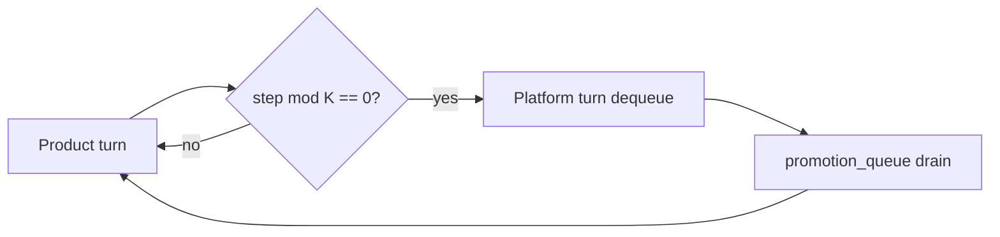

<!-- Complete pass 3 2026-06-28 D2.1.1 -->

# D2.1.1: enqueue repeated manual command 2x

**Parent:** [D2.1-index](D2.1-index.md) · **Branch D** · **Vision §6** · **Release:** v2.16

## Reader narrative
<!-- prose-source: agent plane-d 2026-06-28 -->

When an operator or agent runs the same manual shell command twice in pursuit—pytest with identical flags, a export script, a validate call—the system enqueues a promotion candidate instead of tolerating endless repetition. The trigger is observation of duplicated manual invocation, not a guess after one run.

Enqueue attaches source task or journal context, suggested target_level (often L2 script), and priority per [D2.2](D2.2-platform-queue-item-schema.md). Processing happens on platform turns ([D2.3](D2.3-dequeue-platform-turn-not-product.md)) under [D3.1](D3.1-1-platform-turn-per-k-product-turns.md) scheduling—the project schedule does not defer all delivery until every improvement is finished unless [D3.3](D3.3-priority-cut-product-blocked-missing-tool.md) inverts priority.

## Purpose

D2.1.1 defines enqueue repeated manual command 2x for the agent-driven expert system. Platform evolution — promotion ladder, parallel queue, reuse.
## Scope

- Owns `D2.1.1` only; siblings under `D2.1` must not duplicate this spec.
- Aligns with minimal HITL: H1 plan, H2 blocker, H3 sign-off ([INTRO-1.2](INTRO-1.2-human-touchpoint-contract-h1-h2-h3.md)).
- Conflicts resolve in favor of [Vision §6 — Branch D — Platform evolution plane (parallel queue)](../../full-automation-vision-and-hierarchy.md#6-branch-d-platform-evolution-plane-parallel-queue).

```
D2.1.1 enqueue repeated manual command 2x
```
## Behavior / step logic
<!-- timeline-source: agent cli-composer-2.5 2026-06-28 -->

1. Whenever the conductor dual-writes a new `next_action`, [A2.3](A2.3-post-step-route-tier-dual-write-increment.md) invokes `python scripts/route-tier.py --apply` per [B1.1](B1.1-s0-deterministic-mandatory-first.md) so `capability_class`, `spawn_workers`, and model tier align with the selected pursuit step.
2. [G3.1](G3.1-conformance-validate-workflow-ci.md) validate-workflow cross-checks route-tier output against `state.json`—`next_action`, tier fields, and pack role bindings from [B5.2](B5.2-role-to-pipeline-id-skills-tool-permissions.md) must match expected patterns.
3. Implement-phase task cards that declare `spawn_workers` must not run with genius-tier inline work when route-tier says workers are required—a mis-route is a conformance failure, not a soft warning.
4. Preflight and journal-keeper runs re-validate tier alignment after manual edits to state or model policy so drift cannot accumulate across [A3.2](A3.2-goal-autopilot-until-goal-verify-or-hard-block.md) turns.
5. If route-tier or validate-workflow detect a tier mismatch, pursuit blocks continue/autopilot until the conductor repairs state or records an operator exception—fail closed at H2 rather than improvising routing.



## JSON example

```json
{
  "platform": {
    "promotion_queue": [
      {
        "id": "promo-001",
        "source": "task-012",
        "target_level": "L2",
        "priority": 50,
        "reason": "repeated manual pytest invocation"
      }
    ],
    "drain_policy": { "product_steps_per_platform_turn": 5 }
  }
}
```


## State / data fields

| Field | Type | Description |
|-------|------|-------------|
| `platform.promotion_queue` | array | Promotion items FIFO with priority overrides |

## Repo artifacts (this branch)

- `docs/playbooks/`
- `scripts/`
- `.cursor/skills/playbook-keeper/`
- `state.platform.promotion_queue`

## Edge cases

- Operator closes laptop mid-loop — state.json must resume from last good dual-write.
- Concurrent manual edit to queue JSON — conductor reloads queue each wake; last writer wins with journal note.
- Platform queue depth 0 but product blocked on missing playbook — D3.3 priority cut skips platform drain.
- Edge case `D2.1.1` variant 4: verify state dual-write before continuing pursuit.
- Pass 3: add regression test or evidence path specific to `D2.1.1`.
- Pass 3: cross-link related nodes in same branch index.

## Failure modes

- **Silent stop:** Agent ends turn without updating queue → mitigated by /loop + check-hierarchy-queue.py EMPTY gate.
- **False complete:** Item marked done without artifact → audit-hierarchy-depth.py re-enqueues deepen pass.
- **Scope bleed:** Worker edits journal/state during planning-only expansion → forbidden in vision-expansion-prompt.
- **Stale design:** Upstream vision § changes → reconcile-stale adds deepen items for affected ids.

## Concrete implementation

1. Add `platform.promotion_queue[]` to state.json schema.
2. Scheduler in autopilot workflow: `(steps_total % K) == 0` → platform turn.
3. playbook-keeper + script extraction skills dequeue promotion items.
4. Validate `D2.1.1` against SEC-15 release checklist and parent index links.
5. Document `D2.1.1` in parent index with verify command and release tag.
6. Add checklist row in SEC-15 release doc for `D2.1.1`.

## Verification

| Check | Command |
|-------|---------|
| Completeness | `python scripts/automation/audit-hierarchy-depth.py --strict --ids D2.1.1` |
| Conformance | `python scripts/validate-workflow.py` |
| Task evidence | `python scripts/verify-router.py` when implement task exists |

## Dependencies

| Link | Why |
|------|-----|
| [full-automation-vision-and-hierarchy.md](../../full-automation-vision-and-hierarchy.md) §6 | Master hierarchy |
| [D2.1-index](D2.1-index.md) | Parent grouping |
| [genius-conductor-tiered-routing.md](../../genius-conductor-tiered-routing.md) | S0–S4 routing |

## Acceptance criteria

- [ ] `python scripts/automation/audit-hierarchy-depth.py --strict --ids D2.1.1` passes
- [ ] Named script, skill, or test path exists or is listed in SEC-15 release row
- [ ] Linked from [D2.1-index](D2.1-index.md)
- [ ] `python scripts/validate-workflow.py` passes after implement

## Cross-links

- [hierarchy-expander SKILL](../../../.cursor/skills/hierarchy-expander/SKILL.md)
