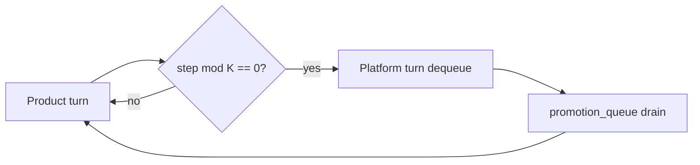

<!-- Complete pass 3 2026-06-28 D2.1.2 -->

# D2.1.2: enqueue worker flags repetition

**Parent:** [D2.1-index](D2.1-index.md) · **Branch D** · **Vision §6** · **Release:** v2.16

## Reader narrative
<!-- prose-source: agent plane-d 2026-06-28 -->

Economy workers can flag repetition: when implement or verify subagents detect the same file pattern, test fix, or catalog miss across turns, they emit a promotion signal to the conductor—workers do not write queue JSON directly. The conductor merges flags, deduplicates by fingerprint, and enqueues one item per pattern.

This trigger catches repetition invisible to shell history—structural rework, not just duplicate commands. Pair with [B4.4](B4.4-divergence-log-when-not-composing.md) divergence logs when compose-first failed before invention. False positives defer enqueue until a second independent flag or manual 2× command ([D2.1.1](D2.1.1-enqueue-repeated-manual-command-2x.md)) confirms the pattern.

## Purpose

D2.1.2 defines enqueue worker flags repetition for the agent-driven expert system. Platform evolution — promotion ladder, parallel queue, reuse.
## Scope

- Owns `D2.1.2` only; siblings under `D2.1` must not duplicate this spec.
- Aligns with minimal HITL: H1 plan, H2 blocker, H3 sign-off ([INTRO-1.2](INTRO-1.2-human-touchpoint-contract-h1-h2-h3.md)).
- Conflicts resolve in favor of [Vision §6 — Branch D — Platform evolution plane (parallel queue)](../../full-automation-vision-and-hierarchy.md#6-branch-d-platform-evolution-plane-parallel-queue).

```
D2.1.2 enqueue worker flags repetition
```
## Behavior / step logic
<!-- timeline-source: agent cli-composer-2.5 2026-06-28 -->

1. When program-scoper binds a pack at H1, it materializes `artifact-graph.json` into program state and dual-writes cross-role node refs so reconcile-artifact-graph can track which design artifacts, task templates, and verify suites each role requires before downstream work proceeds.
2. Before orchestrate-program dispatches parallel lanes, S0 runs reconcile-artifact-graph against the pack graph—blocking spawn until prerequisite nodes report fresh and present per graph edges paired with the human-readable contract in [F1.4](F1.4-pack-manifest-md-integration-contracts.md).
3. During program pursuit, lane work orders consult graph dependencies so [C4.2](C4.2-orchestrate-program.md) only releases leases to roles whose upstream nodes are satisfied, preventing silent parallel spawn before prerequisites exist.
4. When pack fragments or upstream design change, reconcile-artifact-graph marks stale nodes and the conductor pauses affected lanes until reconcile-stale or operator confirmation refreshes the graph binding in state.json.
5. If graph edges are missing, prerequisite nodes are unresolved, or parallel lanes spawn before reconcile passes, pursuit halts at H2 until the pack graph is reloaded and dual-written—never advance orchestrate-program on an incomplete dependency graph.



## JSON example

```json
{
  "platform": {
    "promotion_queue": [
      {
        "id": "promo-001",
        "source": "task-012",
        "target_level": "L2",
        "priority": 50,
        "reason": "repeated manual pytest invocation"
      }
    ],
    "drain_policy": { "product_steps_per_platform_turn": 5 }
  }
}
```


## State / data fields

| Field | Type | Description |
|-------|------|-------------|
| `platform.promotion_queue` | array | Promotion items FIFO with priority overrides |

## Repo artifacts (this branch)

- `docs/playbooks/`
- `scripts/`
- `.cursor/skills/playbook-keeper/`
- `state.platform.promotion_queue`

## Edge cases

- Operator closes laptop mid-loop — state.json must resume from last good dual-write.
- Concurrent manual edit to queue JSON — conductor reloads queue each wake; last writer wins with journal note.
- Platform queue depth 0 but product blocked on missing playbook — D3.3 priority cut skips platform drain.
- Edge case `D2.1.2` variant 4: verify state dual-write before continuing pursuit.
- Pass 3: add regression test or evidence path specific to `D2.1.2`.
- Pass 3: cross-link related nodes in same branch index.

## Failure modes

- **Silent stop:** Agent ends turn without updating queue → mitigated by /loop + check-hierarchy-queue.py EMPTY gate.
- **False complete:** Item marked done without artifact → audit-hierarchy-depth.py re-enqueues deepen pass.
- **Scope bleed:** Worker edits journal/state during planning-only expansion → forbidden in vision-expansion-prompt.
- **Stale design:** Upstream vision § changes → reconcile-stale adds deepen items for affected ids.

## Concrete implementation

1. Add `platform.promotion_queue[]` to state.json schema.
2. Scheduler in autopilot workflow: `(steps_total % K) == 0` → platform turn.
3. playbook-keeper + script extraction skills dequeue promotion items.
4. Validate `D2.1.2` against SEC-15 release checklist and parent index links.
5. Document `D2.1.2` in parent index with verify command and release tag.
6. Add checklist row in SEC-15 release doc for `D2.1.2`.

## Verification

| Check | Command |
|-------|---------|
| Completeness | `python scripts/automation/audit-hierarchy-depth.py --strict --ids D2.1.2` |
| Conformance | `python scripts/validate-workflow.py` |
| Task evidence | `python scripts/verify-router.py` when implement task exists |

## Dependencies

| Link | Why |
|------|-----|
| [full-automation-vision-and-hierarchy.md](../../full-automation-vision-and-hierarchy.md) §6 | Master hierarchy |
| [D2.1-index](D2.1-index.md) | Parent grouping |
| [genius-conductor-tiered-routing.md](../../genius-conductor-tiered-routing.md) | S0–S4 routing |

## Acceptance criteria

- [ ] `python scripts/automation/audit-hierarchy-depth.py --strict --ids D2.1.2` passes
- [ ] Named script, skill, or test path exists or is listed in SEC-15 release row
- [ ] Linked from [D2.1-index](D2.1-index.md)
- [ ] `python scripts/validate-workflow.py` passes after implement

## Cross-links

- [hierarchy-expander SKILL](../../../.cursor/skills/hierarchy-expander/SKILL.md)
