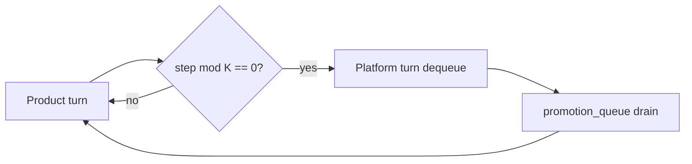

<!-- Complete pass 3 2026-06-28 D2.1.3 -->

# D2.1.3: enqueue verify pattern N task cards

**Parent:** [D2.1-index](D2.1-index.md) · **Branch D** · **Vision §6** · **Release:** v2.16

## Reader narrative
<!-- prose-source: agent plane-d 2026-06-28 -->

If the same verify or test command shape appears on N task cards—default N from pack policy—the pattern is mature enough for script or playbook promotion without waiting for manual duplication. Task-breakdown and verify-router logs supply evidence: identical command blocks, same failure class, same evidence path template.

Enqueue records N, sample task ids, and target_level. Platform drain executes script extraction or playbook-keeper per target level ([D4.2](D4.2-platform-work-script-extraction.md), [D4.1](D4.1-platform-work-playbook-keeper.md)). Premature enqueue (N too low) wastes platform slots; pack authors tune N in template-pack drain policy alongside K product steps.

## Purpose

D2.1.3 defines enqueue verify pattern n task cards for the agent-driven expert system. Platform evolution — promotion ladder, parallel queue, reuse.
## Scope

- Owns `D2.1.3` only; siblings under `D2.1` must not duplicate this spec.
- Aligns with minimal HITL: H1 plan, H2 blocker, H3 sign-off ([INTRO-1.2](INTRO-1.2-human-touchpoint-contract-h1-h2-h3.md)).
- Conflicts resolve in favor of [Vision §6 — Branch D — Platform evolution plane (parallel queue)](../../full-automation-vision-and-hierarchy.md#6-branch-d-platform-evolution-plane-parallel-queue).

```
D2.1.3 enqueue verify pattern n task cards
```
## Behavior / step logic
<!-- timeline-source: agent cursor-agent 2026-06-28 -->

1. During pursuit, verify-router and task-breakdown logs accumulate identical Test command blocks across task cards; when repetition reaches pack policy threshold N, S0 enqueue scripts file a platform promotion item instead of waiting for manual duplication.
2. Each enqueue record captures N, representative task ids, and target_level (script L2 or playbook L1) so platform drain knows whether to run [D4.2](D4.2-platform-work-script-extraction.md) or [D4.1](D4.1-platform-work-playbook-keeper.md).
3. After every K product turns, the conductor peeks the platform promotion queue and drains eligible verify-pattern items during economy platform slots without blocking the active product next_action.
4. Pack authors tune N in template-pack drain_policy alongside K so premature enqueue does not waste platform turns on immature patterns.
5. If N is below threshold or enqueue lacks sample task evidence, platform promotion stays deferred; forcing drain without proof fails closed at H2 until verify-router logs justify the pattern.



## JSON example

```json
{
  "platform": {
    "promotion_queue": [
      {
        "id": "promo-001",
        "source": "task-012",
        "target_level": "L2",
        "priority": 50,
        "reason": "repeated manual pytest invocation"
      }
    ],
    "drain_policy": { "product_steps_per_platform_turn": 5 }
  }
}
```


## State / data fields

| Field | Type | Description |
|-------|------|-------------|
| `platform.promotion_queue` | array | Promotion items FIFO with priority overrides |

## Repo artifacts (this branch)

- `docs/playbooks/`
- `scripts/`
- `.cursor/skills/playbook-keeper/`
- `state.platform.promotion_queue`

## Edge cases

- Operator closes laptop mid-loop — state.json must resume from last good dual-write.
- Concurrent manual edit to queue JSON — conductor reloads queue each wake; last writer wins with journal note.
- Platform queue depth 0 but product blocked on missing playbook — D3.3 priority cut skips platform drain.
- Edge case `D2.1.3` variant 4: verify state dual-write before continuing pursuit.
- Pass 3: add regression test or evidence path specific to `D2.1.3`.
- Pass 3: cross-link related nodes in same branch index.

## Failure modes

- **Silent stop:** Agent ends turn without updating queue → mitigated by /loop + check-hierarchy-queue.py EMPTY gate.
- **False complete:** Item marked done without artifact → audit-hierarchy-depth.py re-enqueues deepen pass.
- **Scope bleed:** Worker edits journal/state during planning-only expansion → forbidden in vision-expansion-prompt.
- **Stale design:** Upstream vision § changes → reconcile-stale adds deepen items for affected ids.

## Concrete implementation

1. Add `platform.promotion_queue[]` to state.json schema.
2. Scheduler in autopilot workflow: `(steps_total % K) == 0` → platform turn.
3. playbook-keeper + script extraction skills dequeue promotion items.
4. Validate `D2.1.3` against SEC-15 release checklist and parent index links.
5. Document `D2.1.3` in parent index with verify command and release tag.
6. Add checklist row in SEC-15 release doc for `D2.1.3`.

## Verification

| Check | Command |
|-------|---------|
| Completeness | `python scripts/automation/audit-hierarchy-depth.py --strict --ids D2.1.3` |
| Conformance | `python scripts/validate-workflow.py` |
| Task evidence | `python scripts/verify-router.py` when implement task exists |

## Dependencies

| Link | Why |
|------|-----|
| [full-automation-vision-and-hierarchy.md](../../full-automation-vision-and-hierarchy.md) §6 | Master hierarchy |
| [D2.1-index](D2.1-index.md) | Parent grouping |
| [genius-conductor-tiered-routing.md](../../genius-conductor-tiered-routing.md) | S0–S4 routing |

## Acceptance criteria

- [ ] `python scripts/automation/audit-hierarchy-depth.py --strict --ids D2.1.3` passes
- [ ] Named script, skill, or test path exists or is listed in SEC-15 release row
- [ ] Linked from [D2.1-index](D2.1-index.md)
- [ ] `python scripts/validate-workflow.py` passes after implement

## Cross-links

- [hierarchy-expander SKILL](../../../.cursor/skills/hierarchy-expander/SKILL.md)
