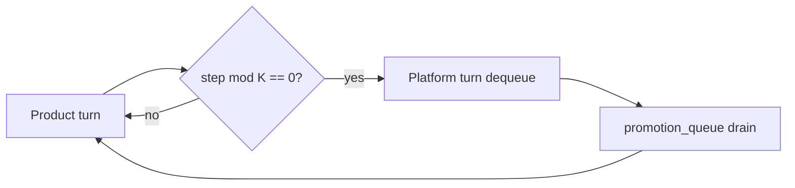

<!-- Complete pass 3 2026-06-28 D2.1.4 -->

# D2.1.4: enqueue conductor post-mortem escalation

**Parent:** [D2.1-index](D2.1-index.md) · **Branch D** · **Vision §6** · **Release:** v2.16

## Reader narrative
<!-- prose-source: agent plane-d 2026-06-28 -->

After S3 merge or S4 H2 escalation, the conductor runs a short post-mortem: what repeated, what was improvised, what catalog entry was missing. Concrete improvement candidates from that review go on the promotion queue—especially when escalation root cause was absent playbook, script, or skill.

Post-mortem enqueue is conductor-only; it captures institutional learning from failure, not happy-path optimization. Items may target L1 playbook first even when L2 script is eventual goal. Scheduling still follows platform turns; urgent product blockers on missing artifacts can raise priority via [D3.3](D3.3-priority-cut-product-blocked-missing-tool.md) without skipping H2 resolution.

## Purpose

D2.1.4 defines enqueue conductor post mortem escalation for the agent-driven expert system. Platform evolution — promotion ladder, parallel queue, reuse.
## Scope

- Owns `D2.1.4` only; siblings under `D2.1` must not duplicate this spec.
- Aligns with minimal HITL: H1 plan, H2 blocker, H3 sign-off ([INTRO-1.2](INTRO-1.2-human-touchpoint-contract-h1-h2-h3.md)).
- Conflicts resolve in favor of [Vision §6 — Branch D — Platform evolution plane (parallel queue)](../../full-automation-vision-and-hierarchy.md#6-branch-d-platform-evolution-plane-parallel-queue).

```
D2.1.4 enqueue conductor post mortem escalation
```
## Behavior / step logic
<!-- timeline-source: agent cli-composer-2.5 2026-06-28 -->

1. At pack instantiation, program-scoper copies or references pack `playbooks/` fragments into the consumer catalog so [E1.2](E1.2-catalog-playbooks-index.md) indexes role-specific procedures alongside repo playbooks.
2. During implement turns, compose-first ([B4.3](B4.3-compose-first-catalog-before-improvise.md)) searches pack playbooks through role-scoped `allowed_reads` from [F6.2](F6.2-role-allowed-reads-scoped-playbooks-lane-tasks.md) before workers improvise steps.
3. Spawned workers receive playbook paths in their allowed_reads when the active role's pack binding lists industry procedures—game QA checks, data deploy runbooks, onboarding flows—for that template.
4. When repeated pursuit patterns qualify for promotion, playbook-keeper enqueues Plane D work to lift fragments back into the pack via the platform queue—not ad hoc consumer-repo edits per [F5.3](F5.3-no-repo-outside-template-packs-ceiling.md).
5. If role-scoped playbook paths are missing, allowed_reads reference stale pack fragments, or workers improvise without catalog hits, pursuit stops at H2 until pack playbook bindings are reconciled and dual-written.



## JSON example

```json
{
  "platform": {
    "promotion_queue": [
      {
        "id": "promo-001",
        "source": "task-012",
        "target_level": "L2",
        "priority": 50,
        "reason": "repeated manual pytest invocation"
      }
    ],
    "drain_policy": { "product_steps_per_platform_turn": 5 }
  }
}
```


## State / data fields

| Field | Type | Description |
|-------|------|-------------|
| `platform.promotion_queue` | array | Promotion items FIFO with priority overrides |

## Repo artifacts (this branch)

- `docs/playbooks/`
- `scripts/`
- `.cursor/skills/playbook-keeper/`
- `state.platform.promotion_queue`

## Edge cases

- Operator closes laptop mid-loop — state.json must resume from last good dual-write.
- Concurrent manual edit to queue JSON — conductor reloads queue each wake; last writer wins with journal note.
- Platform queue depth 0 but product blocked on missing playbook — D3.3 priority cut skips platform drain.
- Edge case `D2.1.4` variant 4: verify state dual-write before continuing pursuit.
- Pass 3: add regression test or evidence path specific to `D2.1.4`.
- Pass 3: cross-link related nodes in same branch index.

## Failure modes

- **Silent stop:** Agent ends turn without updating queue → mitigated by /loop + check-hierarchy-queue.py EMPTY gate.
- **False complete:** Item marked done without artifact → audit-hierarchy-depth.py re-enqueues deepen pass.
- **Scope bleed:** Worker edits journal/state during planning-only expansion → forbidden in vision-expansion-prompt.
- **Stale design:** Upstream vision § changes → reconcile-stale adds deepen items for affected ids.

## Concrete implementation

1. Add `platform.promotion_queue[]` to state.json schema.
2. Scheduler in autopilot workflow: `(steps_total % K) == 0` → platform turn.
3. playbook-keeper + script extraction skills dequeue promotion items.
4. Validate `D2.1.4` against SEC-15 release checklist and parent index links.
5. Document `D2.1.4` in parent index with verify command and release tag.
6. Add checklist row in SEC-15 release doc for `D2.1.4`.

## Verification

| Check | Command |
|-------|---------|
| Completeness | `python scripts/automation/audit-hierarchy-depth.py --strict --ids D2.1.4` |
| Conformance | `python scripts/validate-workflow.py` |
| Task evidence | `python scripts/verify-router.py` when implement task exists |

## Dependencies

| Link | Why |
|------|-----|
| [full-automation-vision-and-hierarchy.md](../../full-automation-vision-and-hierarchy.md) §6 | Master hierarchy |
| [D2.1-index](D2.1-index.md) | Parent grouping |
| [genius-conductor-tiered-routing.md](../../genius-conductor-tiered-routing.md) | S0–S4 routing |

## Acceptance criteria

- [ ] `python scripts/automation/audit-hierarchy-depth.py --strict --ids D2.1.4` passes
- [ ] Named script, skill, or test path exists or is listed in SEC-15 release row
- [ ] Linked from [D2.1-index](D2.1-index.md)
- [ ] `python scripts/validate-workflow.py` passes after implement

## Cross-links

- [hierarchy-expander SKILL](../../../.cursor/skills/hierarchy-expander/SKILL.md)
