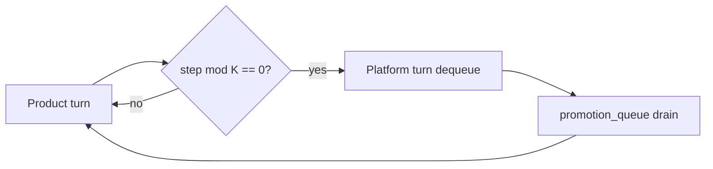

<!-- Complete pass 3 2026-06-28 D2.2 -->

# D2.2: platform queue item schema

**Parent:** [D2-index](D2-index.md) · **Branch D** · **Vision §6** · **Release:** v2.16

## Reader narrative
<!-- prose-source: agent plane-d 2026-06-28 -->

Each `platform.promotion_queue[]` entry follows a strict schema: `id`, `source` (task, divergence log, or post-mortem ref), `target_level` (L1–L5), `priority`, and `effort_class` so schedulers and workers estimate drain cost. Optional fields capture reason text, fingerprint, and partial promotion state.

Schema conformance is S0-validatable; malformed items must not dequeue. Priority overrides FIFO when [D3.2](D3.2-priority-boost-queue-depth-threshold.md) or [D3.5](D3.5-max-platform-backlog-age-force-drain.md) fire. The conductor is sole writer—concurrent manual JSON edits reload each wake with a journal note. See [APP-B-state-json-sketch](APP-B-state-json-sketch.md) for platform block shape.

## Purpose

D2.2 defines platform queue item schema for the agent-driven expert system. Platform evolution — promotion ladder, parallel queue, reuse.
## Scope

- Owns `D2.2` only; siblings under `D2` must not duplicate this spec.
- Aligns with minimal HITL: H1 plan, H2 blocker, H3 sign-off ([INTRO-1.2](INTRO-1.2-human-touchpoint-contract-h1-h2-h3.md)).
- Conflicts resolve in favor of [Vision §6 — Branch D — Platform evolution plane (parallel queue)](../../full-automation-vision-and-hierarchy.md#6-branch-d-platform-evolution-plane-parallel-queue).

```
│   ├── D2.2 item schema: { id, source, target_level, priority, effort_class }
```
## Behavior / step logic
<!-- timeline-source: agent cli-composer-2.5 2026-06-28 -->

1. When product `next_action` is blocked because compose or implement needs a missing playbook, script, or catalog entry, preflight flags the missing artifact class and applies priority cut—platform drain items targeting that class jump ahead of routine [D3.1](D3.1-1-platform-turn-per-k-product-turns.md) K-step interleaving.
2. The product goal remains blocked on internal wait or H2 until the promoted artifact exists at the required maturity tier or an operator waives at H1/H2; priority cut reprioritizes platform work only—it does not clear human gates.
3. During the blocked window, [D2.1](D2.1-index.md) enqueue triggers may fire for the same missing capability; the conductor merges enqueue-and-drain so the promotion queue head targets the artifact class that unblocks product.
4. Priority cut temporarily suspends [D3.2](D3.2-priority-boost-queue-depth-threshold.md) boost when evidence-blocked product work must not defer behind accelerated platform drains unrelated to the missing tool.
5. Before marking promotion done, [D6](D6-index.md) checklist verification must pass; if the artifact is still missing, queue depth is zero with cut active, or dual-write drifts, pursuit stops at H2—never run implement turns while the needed playbook sits queued at low priority.



## JSON example

```json
{
  "platform": {
    "promotion_queue": [
      {
        "id": "promo-001",
        "source": "task-012",
        "target_level": "L2",
        "priority": 50,
        "reason": "repeated manual pytest invocation"
      }
    ],
    "drain_policy": { "product_steps_per_platform_turn": 5 }
  }
}
```


## State / data fields

| Field | Type | Description |
|-------|------|-------------|
| `platform.promotion_queue` | array | Promotion items FIFO with priority overrides |

## Repo artifacts (this branch)

- `docs/playbooks/`
- `scripts/`
- `.cursor/skills/playbook-keeper/`
- `state.platform.promotion_queue`

## Edge cases

- Operator closes laptop mid-loop — state.json must resume from last good dual-write.
- Concurrent manual edit to queue JSON — conductor reloads queue each wake; last writer wins with journal note.
- Platform queue depth 0 but product blocked on missing playbook — D3.3 priority cut skips platform drain.
- Edge case `D2.2` variant 4: verify state dual-write before continuing pursuit.
- Pass 3: add regression test or evidence path specific to `D2.2`.
- Pass 3: cross-link related nodes in same branch index.

## Failure modes

- **Silent stop:** Agent ends turn without updating queue → mitigated by /loop + check-hierarchy-queue.py EMPTY gate.
- **False complete:** Item marked done without artifact → audit-hierarchy-depth.py re-enqueues deepen pass.
- **Scope bleed:** Worker edits journal/state during planning-only expansion → forbidden in vision-expansion-prompt.
- **Stale design:** Upstream vision § changes → reconcile-stale adds deepen items for affected ids.

## Concrete implementation

1. Add `platform.promotion_queue[]` to state.json schema.
2. Scheduler in autopilot workflow: `(steps_total % K) == 0` → platform turn.
3. playbook-keeper + script extraction skills dequeue promotion items.
4. Validate `D2.2` against SEC-15 release checklist and parent index links.
5. Document `D2.2` in parent index with verify command and release tag.
6. Add checklist row in SEC-15 release doc for `D2.2`.

## Verification

| Check | Command |
|-------|---------|
| Completeness | `python scripts/automation/audit-hierarchy-depth.py --strict --ids D2.2` |
| Conformance | `python scripts/validate-workflow.py` |
| Task evidence | `python scripts/verify-router.py` when implement task exists |

## Dependencies

| Link | Why |
|------|-----|
| [full-automation-vision-and-hierarchy.md](../../full-automation-vision-and-hierarchy.md) §6 | Master hierarchy |
| [D2-index](D2-index.md) | Parent grouping |
| [genius-conductor-tiered-routing.md](../../genius-conductor-tiered-routing.md) | S0–S4 routing |

## Acceptance criteria

- [ ] `python scripts/automation/audit-hierarchy-depth.py --strict --ids D2.2` passes
- [ ] Named script, skill, or test path exists or is listed in SEC-15 release row
- [ ] Linked from [D2-index](D2-index.md)
- [ ] `python scripts/validate-workflow.py` passes after implement

## Cross-links

- [hierarchy-expander SKILL](../../../.cursor/skills/hierarchy-expander/SKILL.md)
