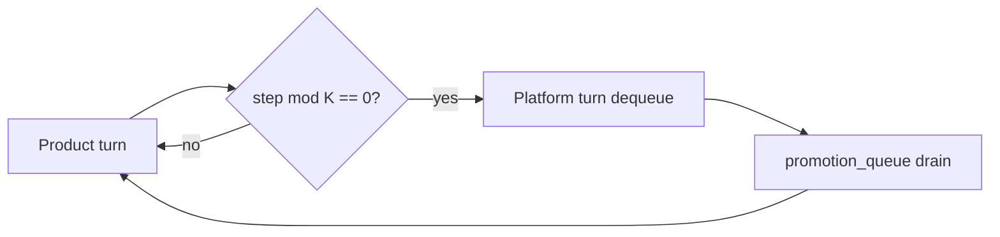

<!-- Complete pass 3 2026-06-28 D2.3 -->

# D2.3: dequeue platform turn not product

**Parent:** [D2-index](D2-index.md) · **Branch D** · **Vision §6** · **Release:** v2.16

## Reader narrative
<!-- prose-source: agent plane-d 2026-06-28 -->

Dequeue consumes the queue head on a platform turn, not a product turn: `next_action` for consumer goals is untouched while platform workers run playbook-keeper, script extraction, or catalog regeneration. One platform item per platform turn preserves auditability unless parallel platform slots are explicitly enabled in policy.

After drain, dual-write marks item done only when [D6 definition of done](D6-index.md) passes—catalog row, verify script if L2+, task reference, staleness node. Partial work re-enqueues with updated state rather than false completion. Product pursuit resumes on the following turn unless scheduler inserted platform turn mid-autopilot ([D3.1](D3.1-1-platform-turn-per-k-product-turns.md)).

## Purpose

D2.3 defines dequeue platform turn not product for the agent-driven expert system. Platform evolution — promotion ladder, parallel queue, reuse.
## Scope

- Owns `D2.3` only; siblings under `D2` must not duplicate this spec.
- Aligns with minimal HITL: H1 plan, H2 blocker, H3 sign-off ([INTRO-1.2](INTRO-1.2-human-touchpoint-contract-h1-h2-h3.md)).
- Conflicts resolve in favor of [Vision §6 — Branch D — Platform evolution plane (parallel queue)](../../full-automation-vision-and-hierarchy.md#6-branch-d-platform-evolution-plane-parallel-queue).

```
│   └── D2.3 dequeue → platform turn (not product turn)
```
## Behavior / step logic
<!-- timeline-source: agent cli-composer-2.5 2026-06-28 -->

1. After [E2.3](E2.3-compose-rank-script-playbook-skill-facts.md) ranking completes, the conductor or task-breakdown writes explicit catalog refs—script path, playbook id, skill name—into the task card **Components used** section before any implement worker spawns.
2. **Components used** is auditable evidence that compose-first ran; workers inherit listed paths as `allowed_reads` per [E4.3](E4.3-context-allowed-reads-cap-max-5.md) in the spawn briefing.
3. When the catalog returned matches but **Components used** is empty or incomplete, conformance checks fail and pursuit stops at H2—never mark implement complete without bound components.
4. When no catalog match existed, the plan pairs with [E2.5](E2.5-compose-miss-l0-enqueue-promotion.md) L0 proceed and promotion enqueue instead of omitting the Components section.
5. If a worker improvises outside listed components, the conductor records divergence per [B4.4](B4.4-divergence-log-when-not-composing.md) and halts advancement until dual-write and evidence explain the override.



## JSON example

```json
{
  "platform": {
    "promotion_queue": [
      {
        "id": "promo-001",
        "source": "task-012",
        "target_level": "L2",
        "priority": 50,
        "reason": "repeated manual pytest invocation"
      }
    ],
    "drain_policy": { "product_steps_per_platform_turn": 5 }
  }
}
```


## State / data fields

| Field | Type | Description |
|-------|------|-------------|
| `platform.promotion_queue` | array | Promotion items FIFO with priority overrides |

## Repo artifacts (this branch)

- `docs/playbooks/`
- `scripts/`
- `.cursor/skills/playbook-keeper/`
- `state.platform.promotion_queue`

## Edge cases

- Operator closes laptop mid-loop — state.json must resume from last good dual-write.
- Concurrent manual edit to queue JSON — conductor reloads queue each wake; last writer wins with journal note.
- Platform queue depth 0 but product blocked on missing playbook — D3.3 priority cut skips platform drain.
- Edge case `D2.3` variant 4: verify state dual-write before continuing pursuit.
- Pass 3: add regression test or evidence path specific to `D2.3`.
- Pass 3: cross-link related nodes in same branch index.

## Failure modes

- **Silent stop:** Agent ends turn without updating queue → mitigated by /loop + check-hierarchy-queue.py EMPTY gate.
- **False complete:** Item marked done without artifact → audit-hierarchy-depth.py re-enqueues deepen pass.
- **Scope bleed:** Worker edits journal/state during planning-only expansion → forbidden in vision-expansion-prompt.
- **Stale design:** Upstream vision § changes → reconcile-stale adds deepen items for affected ids.

## Concrete implementation

1. Add `platform.promotion_queue[]` to state.json schema.
2. Scheduler in autopilot workflow: `(steps_total % K) == 0` → platform turn.
3. playbook-keeper + script extraction skills dequeue promotion items.
4. Validate `D2.3` against SEC-15 release checklist and parent index links.
5. Document `D2.3` in parent index with verify command and release tag.
6. Add checklist row in SEC-15 release doc for `D2.3`.

## Verification

| Check | Command |
|-------|---------|
| Completeness | `python scripts/automation/audit-hierarchy-depth.py --strict --ids D2.3` |
| Conformance | `python scripts/validate-workflow.py` |
| Task evidence | `python scripts/verify-router.py` when implement task exists |

## Dependencies

| Link | Why |
|------|-----|
| [full-automation-vision-and-hierarchy.md](../../full-automation-vision-and-hierarchy.md) §6 | Master hierarchy |
| [D2-index](D2-index.md) | Parent grouping |
| [genius-conductor-tiered-routing.md](../../genius-conductor-tiered-routing.md) | S0–S4 routing |

## Acceptance criteria

- [ ] `python scripts/automation/audit-hierarchy-depth.py --strict --ids D2.3` passes
- [ ] Named script, skill, or test path exists or is listed in SEC-15 release row
- [ ] Linked from [D2-index](D2-index.md)
- [ ] `python scripts/validate-workflow.py` passes after implement

## Cross-links

- [hierarchy-expander SKILL](../../../.cursor/skills/hierarchy-expander/SKILL.md)
