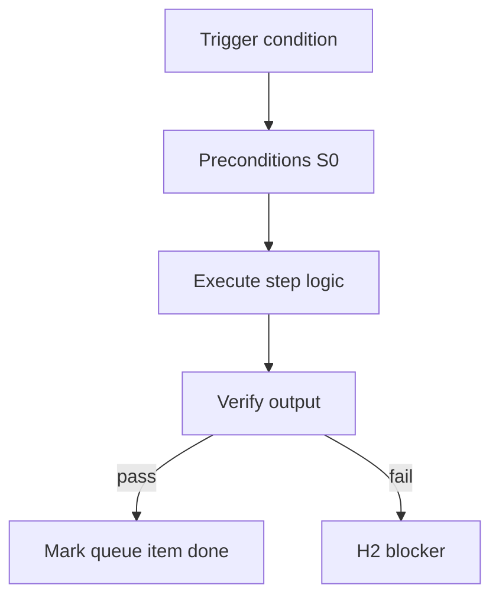

<!-- Complete pass 3 2026-06-28 E2.1 -->

# E2.1: compose resolve capability needed

**Parent:** [E2-index](E2-index.md) · **Branch E** · **Vision §7** · **Release:** v2.17

## Reader narrative
<!-- prose-source: agent plane-e 2026-06-28 -->

Before any S1+ work, compose must resolve which capability the turn needs: routing, implement, verify, design artifact, platform promotion. Resolution names the capability id and target catalog slice—not a vague "figure it out" prompt.

Librarian and conductor share this step; output drives [E2.2](E2.2-compose-query-catalog-list-components.md) query and [E2.3](E2.3-compose-rank-script-playbook-skill-facts.md) ranking. Unresolved capability blocks spawn until catalog search completes. This implements mandatory compose-before-invent from [B4.3](B4.3-compose-first-catalog-before-improvise.md) at the Plane E protocol layer.

## Purpose

E2.1 defines compose resolve capability needed for the agent-driven expert system. Knowledge & composition — catalog, compose-first, staleness.
## Scope

- Owns `E2.1` only; siblings under `E2` must not duplicate this spec.
- Aligns with minimal HITL: H1 plan, H2 blocker, H3 sign-off ([INTRO-1.2](INTRO-1.2-human-touchpoint-contract-h1-h2-h3.md)).
- Conflicts resolve in favor of [Vision §7 — Branch E — Knowledge & composition plane](../../full-automation-vision-and-hierarchy.md#7-branch-e-knowledge-composition-plane).

```
│   ├── E2.1 resolve capability needed
```
## Behavior / step logic
<!-- timeline-source: agent cli-composer-2.5 2026-06-28 -->

1. After implement diffs land, S0 touch-path detection compares task card declared files and diff stats against pack-flagged risk surfaces—auth, crypto, credentials paths, and dependency manifests—not conductor memory.
2. When paths match risk triggers per [B2.5](B2.5-reviewer-bugbot-security-risk-triggers.md), the conductor spawns a readonly security-review subagent; findings merge through the conductor, not direct journal writes.
3. Strict packs may require security-review pass before git-workflow advances; default self-gate records waivable findings with expiry when automated checks pass.
4. Blocking security findings hold pursuit at H2 until remediated, waived with evidence, or escalated per pack policy.
5. If security-review is skipped while touch paths matched, preflight fails closed rather than pushing unreviewed risk surfaces.



## JSON example

```json
{
  "node": "E2.1",
  "description": "compose resolve capability needed",
  "state": { "ref": "APP-B-state-json-sketch.md" },
  "implemented_in_release": "v2.14+"
}
```


## Repo artifacts (this branch)

- `docs/facts/INDEX.md`
- `docs/playbooks/INDEX.md`
- `docs/manifest/staleness.json`
- `allowed_reads`

## Edge cases

- Operator closes laptop mid-loop — state.json must resume from last good dual-write.
- Concurrent manual edit to queue JSON — conductor reloads queue each wake; last writer wins with journal note.
- Edge case `E2.1` variant 3: verify state dual-write before continuing pursuit.
- Edge case `E2.1` variant 4: verify state dual-write before continuing pursuit.
- Pass 3: add regression test or evidence path specific to `E2.1`.
- Pass 3: cross-link related nodes in same branch index.

## Failure modes

- **Silent stop:** Agent ends turn without updating queue → mitigated by /loop + check-hierarchy-queue.py EMPTY gate.
- **False complete:** Item marked done without artifact → audit-hierarchy-depth.py re-enqueues deepen pass.
- **Scope bleed:** Worker edits journal/state during planning-only expansion → forbidden in vision-expansion-prompt.
- **Stale design:** Upstream vision § changes → reconcile-stale adds deepen items for affected ids.

## Concrete implementation

1. Map `E2.1` to v2.14–v2.23 release row in SEC-15-index.md.
2. Create or extend S0 script if behavior is file-derived.
3. Add unit test under tests/unit/test_e2_1.py when script exists.
4. Validate `E2.1` against SEC-15 release checklist and parent index links.
5. Document `E2.1` in parent index with verify command and release tag.
6. Add checklist row in SEC-15 release doc for `E2.1`.

## Verification

| Check | Command |
|-------|---------|
| Completeness | `python scripts/automation/audit-hierarchy-depth.py --strict --ids E2.1` |
| Conformance | `python scripts/validate-workflow.py` |
| Task evidence | `python scripts/verify-router.py` when implement task exists |

## Dependencies

| Link | Why |
|------|-----|
| [full-automation-vision-and-hierarchy.md](../../full-automation-vision-and-hierarchy.md) §7 | Master hierarchy |
| [E2-index](E2-index.md) | Parent grouping |
| [genius-conductor-tiered-routing.md](../../genius-conductor-tiered-routing.md) | S0–S4 routing |

## Acceptance criteria

- [ ] `python scripts/automation/audit-hierarchy-depth.py --strict --ids E2.1` passes
- [ ] Named script, skill, or test path exists or is listed in SEC-15 release row
- [ ] Linked from [E2-index](E2-index.md)
- [ ] `python scripts/validate-workflow.py` passes after implement

## Cross-links

- [hierarchy-expander SKILL](../../../.cursor/skills/hierarchy-expander/SKILL.md)
