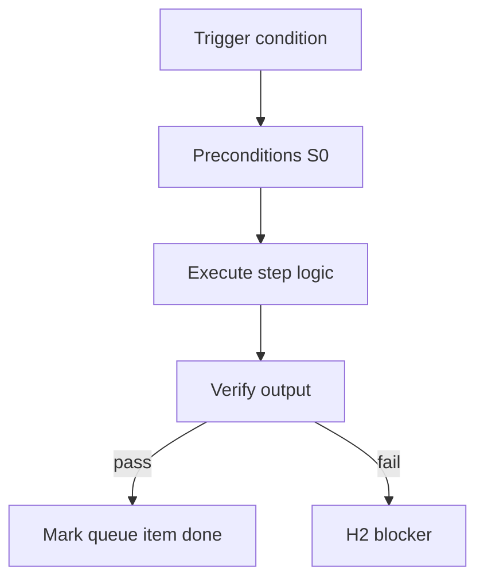

<!-- Complete pass 3 2026-06-28 E2.2 -->

# E2.2: compose query catalog list-components

**Parent:** [E2-index](E2-index.md) · **Branch E** · **Vision §7** · **Release:** v2.17

## Reader narrative
<!-- prose-source: agent plane-e 2026-06-28 -->

Catalog query runs through S0 `list-components.py` (or successor) against the umbrella and child INDEX manifests—returning candidate paths, maturity tier, and component type. Queries are deterministic; conductors use output rather than re-deriving hits in chat.

Input is the resolved capability from [E2.1](E2.1-compose-resolve-capability-needed.md); output feeds [E2.3](E2.3-compose-rank-script-playbook-skill-facts.md) ranking and task card Components ([E2.4](E2.4-compose-plan-task-card-components.md)). Empty results trigger [E2.5](E2.5-compose-miss-l0-enqueue-promotion.md) L0 proceed plus promotion enqueue—not silent invention.

## Purpose

E2.2 defines compose query catalog list components for the agent-driven expert system. Knowledge & composition — catalog, compose-first, staleness.
## Scope

- Owns `E2.2` only; siblings under `E2` must not duplicate this spec.
- Aligns with minimal HITL: H1 plan, H2 blocker, H3 sign-off ([INTRO-1.2](INTRO-1.2-human-touchpoint-contract-h1-h2-h3.md)).
- Conflicts resolve in favor of [Vision §7 — Branch E — Knowledge & composition plane](../../full-automation-vision-and-hierarchy.md#7-branch-e-knowledge-composition-plane).

```
│   ├── E2.2 query catalog (S0 list-components.py)
```
## Behavior / step logic
<!-- timeline-source: agent cli-composer-2.5 2026-06-28 -->

1. At the start of each continue, autopilot, and run-local-pipeline iteration, [A2.1](A2.1-preflight-check-pipeline-blocked-extended.md) runs `scripts/automation/check-pipeline-blocked.py` with goal_autopilot semantics instead of inferring stop conditions in chat.
2. The script encodes hard stops from [A4](A4-index.md): human gates (H1/H2/H3), budget exhaustion from [A1.4](A1.4-deadline-budget-steps-tokens-wall-clock.md), corrupt state per [A4.4](A4.4-stop-integrity-validate-workflow-state-corrupt.md), and verify regressions.
3. [A3.2](A3.2-goal-autopilot-until-goal-verify-or-hard-block.md) goal autopilot consults check-pipeline-blocked each wake per [A2.6](A2.6-loop-until-blocked-budget-achieved-h3-reject.md)—conformance means autopilot cannot override a would-stop result.
4. While `gates_pending`, blocking_questions, or hard-block stops remain, state preserves those fields until explicit operator approval or waiver—autopilot does not clear them by continuing turns.
5. If check-pipeline-blocked would stop but pursuit advances anyway, preflight fails closed at H2 with the script output attached rather than stacking another pipeline step.



## JSON example

```json
{
  "node": "E2.2",
  "description": "compose query catalog list components",
  "state": { "ref": "APP-B-state-json-sketch.md" },
  "implemented_in_release": "v2.14+"
}
```


## Repo artifacts (this branch)

- `docs/facts/INDEX.md`
- `docs/playbooks/INDEX.md`
- `docs/manifest/staleness.json`
- `allowed_reads`

## Edge cases

- Operator closes laptop mid-loop — state.json must resume from last good dual-write.
- Concurrent manual edit to queue JSON — conductor reloads queue each wake; last writer wins with journal note.
- Edge case `E2.2` variant 3: verify state dual-write before continuing pursuit.
- Edge case `E2.2` variant 4: verify state dual-write before continuing pursuit.
- Pass 3: add regression test or evidence path specific to `E2.2`.
- Pass 3: cross-link related nodes in same branch index.

## Failure modes

- **Silent stop:** Agent ends turn without updating queue → mitigated by /loop + check-hierarchy-queue.py EMPTY gate.
- **False complete:** Item marked done without artifact → audit-hierarchy-depth.py re-enqueues deepen pass.
- **Scope bleed:** Worker edits journal/state during planning-only expansion → forbidden in vision-expansion-prompt.
- **Stale design:** Upstream vision § changes → reconcile-stale adds deepen items for affected ids.

## Concrete implementation

1. Map `E2.2` to v2.14–v2.23 release row in SEC-15-index.md.
2. Create or extend S0 script if behavior is file-derived.
3. Add unit test under tests/unit/test_e2_2.py when script exists.
4. Validate `E2.2` against SEC-15 release checklist and parent index links.
5. Document `E2.2` in parent index with verify command and release tag.
6. Add checklist row in SEC-15 release doc for `E2.2`.

## Verification

| Check | Command |
|-------|---------|
| Completeness | `python scripts/automation/audit-hierarchy-depth.py --strict --ids E2.2` |
| Conformance | `python scripts/validate-workflow.py` |
| Task evidence | `python scripts/verify-router.py` when implement task exists |

## Dependencies

| Link | Why |
|------|-----|
| [full-automation-vision-and-hierarchy.md](../../full-automation-vision-and-hierarchy.md) §7 | Master hierarchy |
| [E2-index](E2-index.md) | Parent grouping |
| [genius-conductor-tiered-routing.md](../../genius-conductor-tiered-routing.md) | S0–S4 routing |

## Acceptance criteria

- [ ] `python scripts/automation/audit-hierarchy-depth.py --strict --ids E2.2` passes
- [ ] Named script, skill, or test path exists or is listed in SEC-15 release row
- [ ] Linked from [E2-index](E2-index.md)
- [ ] `python scripts/validate-workflow.py` passes after implement

## Cross-links

- [hierarchy-expander SKILL](../../../.cursor/skills/hierarchy-expander/SKILL.md)
