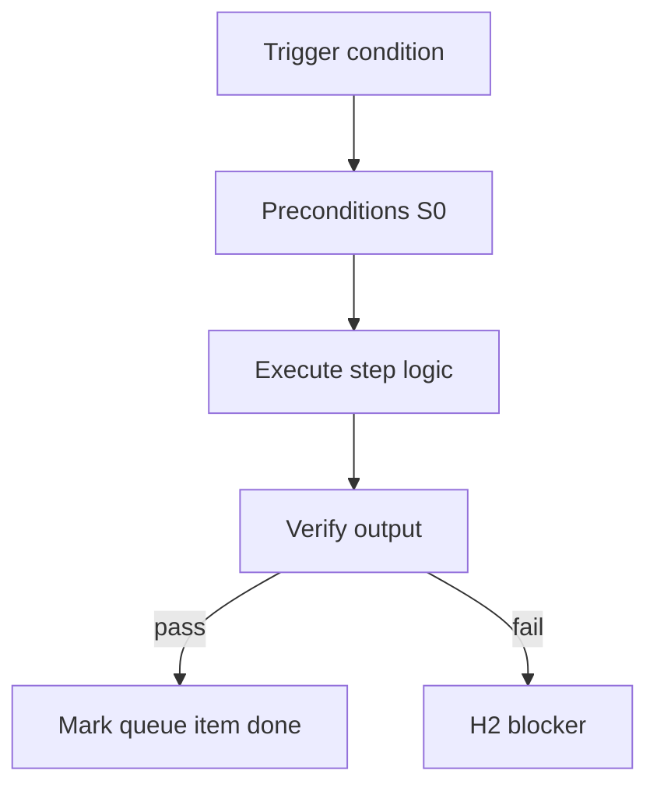

<!-- Complete pass 3 2026-06-28 E2.3 -->

# E2.3: compose rank script playbook skill facts

**Parent:** [E2-index](E2-index.md) · **Branch E** · **Vision §7** · **Release:** v2.17

## Reader narrative
<!-- prose-source: agent plane-e 2026-06-28 -->

Compose ranking orders catalog hits: script (S0) first, then playbook, then skill, then facts. **v2.24+ extends this via [E6.5](E6.5-compose-rank-hard-transistor-script-soft.md):** hard_transistor > script > soft_transistor > playbook > skill > facts.

Ranking applies after [E2.2](E2.2-compose-query-catalog-list-components.md) list-components returns hits. Ties break toward higher maturity and pack-authored fragments. Divergence from ranked choice requires [B4.4](B4.4-divergence-log-when-not-composing.md) log entry. Ranking aligns with capability_class S0–S4 in Plane B.

## Purpose

E2.3 defines compose rank script playbook skill facts for the agent-driven expert system. Knowledge & composition — catalog, compose-first, staleness.
## Scope

- Owns `E2.3` only; siblings under `E2` must not duplicate this spec.
- Aligns with minimal HITL: H1 plan, H2 blocker, H3 sign-off ([INTRO-1.2](INTRO-1.2-human-touchpoint-contract-h1-h2-h3.md)).
- Conflicts resolve in favor of [Vision §7 — Branch E — Knowledge & composition plane](../../full-automation-vision-and-hierarchy.md#7-branch-e-knowledge-composition-plane).

```
│   ├── E2.3 rank hits: script > playbook > skill > facts
```
## Behavior / step logic
<!-- timeline-source: agent cursor-agent 2026-06-28 -->

1. After [E2.2](E2.2-compose-query-catalog-list-components.md) list-components returns hits, compose ranks them script (S0) first, then playbook, then skill, then facts—maximizing determinism before any worker improvises procedure.
2. Ties break toward higher catalog maturity and pack-authored fragments so template-pack reuse wins over ad-hoc L0 reasoning per company policy.
3. The conductor or librarian loads the top-ranked component path into worker allowed_reads; invoking a skill when an S0 script covers the same behavior violates [B4.3](B4.3-compose-first-catalog-before-improvise.md) unless [B4.4](B4.4-divergence-log-when-not-composing.md) records divergence.
4. Facts from docs/facts/ disambiguate ambiguous hits only—they do not replace executable scripts, playbooks, or skills in the ranked ladder aligned with capability_class S0–S4.
5. If ranking yields no executable match or the conductor skips the ranked choice without a divergence log, pursuit stops at H2 rather than composing from model memory.



## JSON example

```json
{
  "node": "E2.3",
  "description": "compose rank script playbook skill facts",
  "state": { "ref": "APP-B-state-json-sketch.md" },
  "implemented_in_release": "v2.14+"
}
```


## Repo artifacts (this branch)

- `docs/facts/INDEX.md`
- `docs/playbooks/INDEX.md`
- `docs/manifest/staleness.json`
- `allowed_reads`

## Edge cases

- Operator closes laptop mid-loop — state.json must resume from last good dual-write.
- Concurrent manual edit to queue JSON — conductor reloads queue each wake; last writer wins with journal note.
- Edge case `E2.3` variant 3: verify state dual-write before continuing pursuit.
- Edge case `E2.3` variant 4: verify state dual-write before continuing pursuit.
- Pass 3: add regression test or evidence path specific to `E2.3`.
- Pass 3: cross-link related nodes in same branch index.

## Failure modes

- **Silent stop:** Agent ends turn without updating queue → mitigated by /loop + check-hierarchy-queue.py EMPTY gate.
- **False complete:** Item marked done without artifact → audit-hierarchy-depth.py re-enqueues deepen pass.
- **Scope bleed:** Worker edits journal/state during planning-only expansion → forbidden in vision-expansion-prompt.
- **Stale design:** Upstream vision § changes → reconcile-stale adds deepen items for affected ids.

## Concrete implementation

1. Map `E2.3` to v2.14–v2.23 release row in SEC-15-index.md.
2. Create or extend S0 script if behavior is file-derived.
3. Add unit test under tests/unit/test_e2_3.py when script exists.
4. Validate `E2.3` against SEC-15 release checklist and parent index links.
5. Document `E2.3` in parent index with verify command and release tag.
6. Add checklist row in SEC-15 release doc for `E2.3`.

## Verification

| Check | Command |
|-------|---------|
| Completeness | `python scripts/automation/audit-hierarchy-depth.py --strict --ids E2.3` |
| Conformance | `python scripts/validate-workflow.py` |
| Task evidence | `python scripts/verify-router.py` when implement task exists |

## Dependencies

| Link | Why |
|------|-----|
| [full-automation-vision-and-hierarchy.md](../../full-automation-vision-and-hierarchy.md) §7 | Master hierarchy |
| [E2-index](E2-index.md) | Parent grouping |
| [genius-conductor-tiered-routing.md](../../genius-conductor-tiered-routing.md) | S0–S4 routing |

## Acceptance criteria

- [ ] `python scripts/automation/audit-hierarchy-depth.py --strict --ids E2.3` passes
- [ ] Named script, skill, or test path exists or is listed in SEC-15 release row
- [ ] Linked from [E2-index](E2-index.md)
- [ ] `python scripts/validate-workflow.py` passes after implement

## Cross-links

- [hierarchy-expander SKILL](../../../.cursor/skills/hierarchy-expander/SKILL.md)
