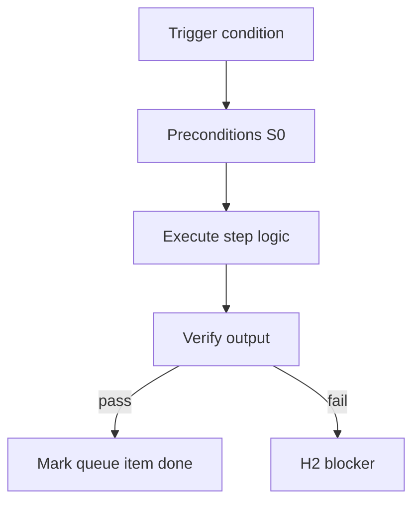

<!-- Complete pass 3 2026-06-28 E2.4 -->

# E2.4: compose plan task card Components

**Parent:** [E2-index](E2-index.md) · **Branch E** · **Vision §7** · **Release:** v2.17

## Reader narrative
<!-- prose-source: agent plane-e 2026-06-28 -->

The compose plan lands on the task card Components section: explicit catalog refs (script path, playbook id, skill name) bound before implement spawn. Components used is auditable evidence that compose-first ran—not optional prose.

Conductor or task-breakdown writes Components after [E2.3](E2.3-compose-rank-script-playbook-skill-facts.md) ranking. Workers inherit listed refs in allowed_reads ([E4.3](E4.3-context-allowed-reads-cap-max-5.md)). Missing components when catalog had matches is a conformance failure; missing catalog match pairs with [E2.5](E2.5-compose-miss-l0-enqueue-promotion.md) promotion enqueue.

## Purpose

E2.4 defines compose plan task card components for the agent-driven expert system. Knowledge & composition — catalog, compose-first, staleness.
## Scope

- Owns `E2.4` only; siblings under `E2` must not duplicate this spec.
- Aligns with minimal HITL: H1 plan, H2 blocker, H3 sign-off ([INTRO-1.2](INTRO-1.2-human-touchpoint-contract-h1-h2-h3.md)).
- Conflicts resolve in favor of [Vision §7 — Branch E — Knowledge & composition plane](../../full-automation-vision-and-hierarchy.md#7-branch-e-knowledge-composition-plane).

```
│   ├── E2.4 compose plan → task card Components section
```
## Behavior / step logic
<!-- timeline-source: agent cursor-agent 2026-06-28 -->

1. After [E2.3](E2.3-compose-rank-script-playbook-skill-facts.md) ranks catalog hits, the conductor or task-breakdown phase writes ranked script paths, playbook ids, and skill names into the task card **Components used** section before any S1+ implement worker spawns.
2. Each listed ref binds the pursuit turn—workers inherit those paths in `allowed_reads` per [E4.3](E4.3-context-allowed-reads-cap-max-5.md) so Librarian scope matches the compose plan instead of expanding in chat.
3. **Components used** is auditable evidence that compose-first ran; omitting refs when [E2.2](E2.2-compose-query-catalog-list-components.md) returned matches triggers conformance failure and blocks advancement until the conductor dual-writes corrections to journal and state.json.
4. When the catalog returned no reusable L1+ hit, compose pairs the L0 proceed path with [E2.5](E2.5-compose-miss-l0-enqueue-promotion.md) promotion enqueue rather than leaving Components empty without a recorded platform debt entry.
5. If a worker spawns without matching Components listed refs, or divergence from ranked choices is unlogged, the conductor stops at H2 per [B4.4](B4.4-divergence-log-when-not-composing.md) until dual-write reconciles the compose plan with evidence.



## JSON example

```json
{
  "node": "E2.4",
  "description": "compose plan task card components",
  "state": { "ref": "APP-B-state-json-sketch.md" },
  "implemented_in_release": "v2.14+"
}
```


## Repo artifacts (this branch)

- `docs/facts/INDEX.md`
- `docs/playbooks/INDEX.md`
- `docs/manifest/staleness.json`
- `allowed_reads`

## Edge cases

- Operator closes laptop mid-loop — state.json must resume from last good dual-write.
- Concurrent manual edit to queue JSON — conductor reloads queue each wake; last writer wins with journal note.
- Edge case `E2.4` variant 3: verify state dual-write before continuing pursuit.
- Edge case `E2.4` variant 4: verify state dual-write before continuing pursuit.
- Pass 3: add regression test or evidence path specific to `E2.4`.
- Pass 3: cross-link related nodes in same branch index.

## Failure modes

- **Silent stop:** Agent ends turn without updating queue → mitigated by /loop + check-hierarchy-queue.py EMPTY gate.
- **False complete:** Item marked done without artifact → audit-hierarchy-depth.py re-enqueues deepen pass.
- **Scope bleed:** Worker edits journal/state during planning-only expansion → forbidden in vision-expansion-prompt.
- **Stale design:** Upstream vision § changes → reconcile-stale adds deepen items for affected ids.

## Concrete implementation

1. Map `E2.4` to v2.14–v2.23 release row in SEC-15-index.md.
2. Create or extend S0 script if behavior is file-derived.
3. Add unit test under tests/unit/test_e2_4.py when script exists.
4. Validate `E2.4` against SEC-15 release checklist and parent index links.
5. Document `E2.4` in parent index with verify command and release tag.
6. Add checklist row in SEC-15 release doc for `E2.4`.

## Verification

| Check | Command |
|-------|---------|
| Completeness | `python scripts/automation/audit-hierarchy-depth.py --strict --ids E2.4` |
| Conformance | `python scripts/validate-workflow.py` |
| Task evidence | `python scripts/verify-router.py` when implement task exists |

## Dependencies

| Link | Why |
|------|-----|
| [full-automation-vision-and-hierarchy.md](../../full-automation-vision-and-hierarchy.md) §7 | Master hierarchy |
| [E2-index](E2-index.md) | Parent grouping |
| [genius-conductor-tiered-routing.md](../../genius-conductor-tiered-routing.md) | S0–S4 routing |

## Acceptance criteria

- [ ] `python scripts/automation/audit-hierarchy-depth.py --strict --ids E2.4` passes
- [ ] Named script, skill, or test path exists or is listed in SEC-15 release row
- [ ] Linked from [E2-index](E2-index.md)
- [ ] `python scripts/validate-workflow.py` passes after implement

## Cross-links

- [hierarchy-expander SKILL](../../../.cursor/skills/hierarchy-expander/SKILL.md)
