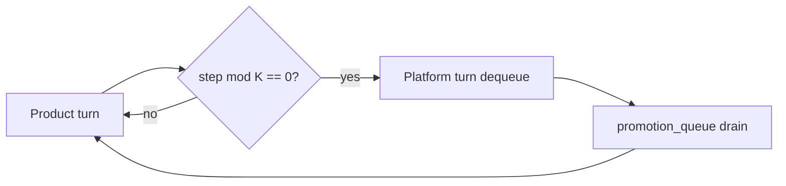

<!-- Complete pass 3 2026-06-28 E2.5 -->

# E2.5: compose miss L0 enqueue promotion

**Parent:** [E2-index](E2-index.md) · **Branch E** · **Vision §7** · **Release:** v2.17

## Reader narrative
<!-- prose-source: agent plane-e 2026-06-28 -->

When compose finds no suitable catalog component, pursuit proceeds at L0 (ephemeral reasoning) for the immediate turn—but must enqueue a promotion_queue item so Plane D can distill the pattern into script, playbook, or pack fragment later.

This closes the reuse loop: product is not blocked, platform debt is recorded. Pair with [B4.4](B4.4-divergence-log-when-not-composing.md) divergence logging and [B4.2](B4.2-platform-promotion-queue-peek-drain.md) K-step drain. Repeated L0 for the same capability signals catalog gap—prioritize promotion over repeated improvisation.

## Purpose

E2.5 defines compose miss l0 enqueue promotion for the agent-driven expert system. Knowledge & composition — catalog, compose-first, staleness.
## Scope

- Owns `E2.5` only; siblings under `E2` must not duplicate this spec.
- Aligns with minimal HITL: H1 plan, H2 blocker, H3 sign-off ([INTRO-1.2](INTRO-1.2-human-touchpoint-contract-h1-h2-h3.md)).
- Conflicts resolve in favor of [Vision §7 — Branch E — Knowledge & composition plane](../../full-automation-vision-and-hierarchy.md#7-branch-e-knowledge-composition-plane).

```
│   └── E2.5 if miss → proceed L0 + enqueue promotion
```
## Behavior / step logic
<!-- timeline-source: agent cli-composer-2.5 2026-06-28 -->

1. When the game-studio pack instantiates at company_ops, program-scoper loads [F1.2](F1.2-pack-roles---yaml.md) role definitions and binds designer, technical artist, animator, programmer, QA, build engineer, and release manager each to pipeline slice, tools, and KPIs under one pack_id.
2. The conductor activates a role from the pack template when a workstream lane becomes ready, spawning economy workers with role-specific allowed_reads and seeded task cards instead of a flat implement loop.
3. Program-scoper may defer lanes for roles the milestone does not yet need—those roles stay unspawned until manifest nodes require that discipline.
4. Cross-pack HR onboarding imports supplemental role fragments via [F5.1](F5.1-cross-pack-imports-micro-packs.md) without overwriting core game-studio bindings in the active pack.
5. If role-to-pipeline mapping is ambiguous or a handoff targets an undefined role, pursuit stops at H2 with missing owner and program-scoper guidance—not silent role collapse.



## JSON example

```json
{
  "node": "E2.5",
  "description": "compose miss l0 enqueue promotion",
  "state": { "ref": "APP-B-state-json-sketch.md" },
  "implemented_in_release": "v2.14+"
}
```


## Repo artifacts (this branch)

- `docs/facts/INDEX.md`
- `docs/playbooks/INDEX.md`
- `docs/manifest/staleness.json`
- `allowed_reads`

## Edge cases

- Operator closes laptop mid-loop — state.json must resume from last good dual-write.
- Concurrent manual edit to queue JSON — conductor reloads queue each wake; last writer wins with journal note.
- Edge case `E2.5` variant 3: verify state dual-write before continuing pursuit.
- Edge case `E2.5` variant 4: verify state dual-write before continuing pursuit.
- Pass 3: add regression test or evidence path specific to `E2.5`.
- Pass 3: cross-link related nodes in same branch index.

## Failure modes

- **Silent stop:** Agent ends turn without updating queue → mitigated by /loop + check-hierarchy-queue.py EMPTY gate.
- **False complete:** Item marked done without artifact → audit-hierarchy-depth.py re-enqueues deepen pass.
- **Scope bleed:** Worker edits journal/state during planning-only expansion → forbidden in vision-expansion-prompt.
- **Stale design:** Upstream vision § changes → reconcile-stale adds deepen items for affected ids.

## Concrete implementation

1. Map `E2.5` to v2.14–v2.23 release row in SEC-15-index.md.
2. Create or extend S0 script if behavior is file-derived.
3. Add unit test under tests/unit/test_e2_5.py when script exists.
4. Validate `E2.5` against SEC-15 release checklist and parent index links.
5. Document `E2.5` in parent index with verify command and release tag.
6. Add checklist row in SEC-15 release doc for `E2.5`.

## Verification

| Check | Command |
|-------|---------|
| Completeness | `python scripts/automation/audit-hierarchy-depth.py --strict --ids E2.5` |
| Conformance | `python scripts/validate-workflow.py` |
| Task evidence | `python scripts/verify-router.py` when implement task exists |

## Dependencies

| Link | Why |
|------|-----|
| [full-automation-vision-and-hierarchy.md](../../full-automation-vision-and-hierarchy.md) §7 | Master hierarchy |
| [E2-index](E2-index.md) | Parent grouping |
| [genius-conductor-tiered-routing.md](../../genius-conductor-tiered-routing.md) | S0–S4 routing |

## Acceptance criteria

- [ ] `python scripts/automation/audit-hierarchy-depth.py --strict --ids E2.5` passes
- [ ] Named script, skill, or test path exists or is listed in SEC-15 release row
- [ ] Linked from [E2-index](E2-index.md)
- [ ] `python scripts/validate-workflow.py` passes after implement

## Cross-links

- [hierarchy-expander SKILL](../../../.cursor/skills/hierarchy-expander/SKILL.md)
