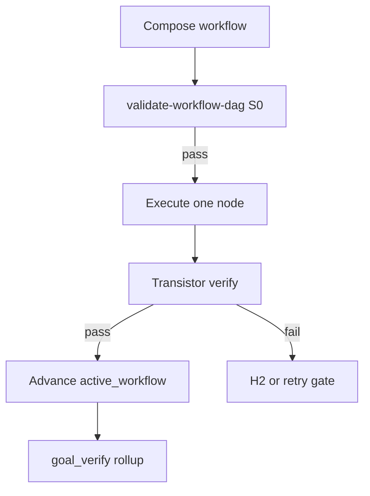

<!-- Complete pass 1 2026-06-28 E6.1 -->

# E6.1: catalog transistors manifest registry

**Parent:** [E6-index](E6-index.md) · **Branch E** · **Vision §19** · **Release:** v2.24

## Reader narrative
<!-- prose-source: agent transistor-expansion 2026-06-28 -->

docs/platform/transistors/ holds one JSON manifest per transistor; docs/platform/TRANSISTORS.md is the generated INDEX merged into E1.7 CATALOG.md umbrella.

See [Vision §7 — Branch E — Knowledge & composition plane](../../full-automation-vision-and-hierarchy.md#branch-e--knowledge--composition-plane) and [SEC-18-transistor-model-a-to-z](SEC-18-transistor-model-a-to-z.md).

## Purpose

E6.1 defines catalog transistors manifest registry for the agent-driven expert system. Transistor & generator workflow model (§19).
## Scope

- Owns `E6.1` only; siblings under `E6` must not duplicate this spec.
- Aligns with minimal HITL: H1 plan, H2 blocker, H3 sign-off ([INTRO-1.2](INTRO-1.2-human-touchpoint-contract-h1-h2-h3.md)).
- Conflicts resolve in favor of [Vision §7 — Branch E — Knowledge & composition plane](../../full-automation-vision-and-hierarchy.md#7-branch-e-knowledge-composition-plane).

```
│   └── E6.1 catalog transistors manifest registry
```
## Behavior / step logic
<!-- timeline-source: agent transistor-expansion 2026-06-28 -->

1. S0 regenerate-transistors-index.py runs on transistor JSON changes.
2. Each entry lists capability_tags, class (hard|soft|gate), maturity, pack provenance.
3. E1.7 umbrella includes transistors section with bidirectional links to scripts and playbooks.
4. Empty registry blocks workflow-compose for non-trivial goals until bootstrap transistors ship.
5. Staleness E5.4 marks workflows stale when referenced transistor version changes.



## JSON example

```json
{
  "node": "E6.1",
  "description": "catalog transistors manifest registry",
  "state": { "ref": "APP-B-state-json-sketch.md", "active_workflow": "H1.7" },
  "implemented_in_release": "v2.24+"
}
```

## Repo artifacts (this branch)

- `docs/platform/transistors/`
- `docs/platform/schemas/transistor.v1.json`
- `docs/platform/schemas/workflow-dag.v1.json`
- `docs/workflows/`
- `scripts/automation/list-transistors.py`
- `scripts/automation/validate-workflow-dag.py`

## Edge cases

- Operator closes laptop mid-loop — state.json must resume from last good dual-write including active_workflow.
- Transistor version bump mid-pursuit — E5.4 marks workflow stale; re-validate before next node.
- L0 waiver node without promotion progress — D3.3 priority boost then H2 if threshold exceeded.
- Pack overlay id collision — F5.4 semver fork per D5.3, not silent overwrite.
- Parallel branch join missing typed input — validate-workflow-dag fails at compose time.

## Failure modes

- **Fuzzy chain:** Implement without workflow_node_id when C6.1 applies → G5.8 blocks at preflight.
- **False complete:** Node marked done without transistor verify evidence → G2.5 goal_verify fails closed.
- **Stale workflow:** active_workflow.validation_hash mismatch → E5.4 reconcile before advance.
- **Duplicate transistor:** G5.6 list-transistors --check-duplicates rejects promotion.
- **Scope bleed:** Worker runs transistors outside bound node → C6.3 conformance failure.

## Concrete implementation

1. Map `E6.1` to release row in [SEC-15-index](SEC-15-index.md) (v2.24).
2. Implement behavior per [SEC-18](SEC-18-transistor-model-a-to-z.md) acceptance checklist.
3. Add or extend S0 script when behavior is file-derived.
4. Add unit test under `tests/unit/` when script exists.
5. Link from [E6-index](E6-index.md).
6. Run `python scripts/validate-workflow.py` after implement.

## Verification

| Check | Command |
|-------|---------|
| Completeness | `python scripts/automation/audit-hierarchy-depth.py --strict --ids E6.1` |
| Conformance | `python scripts/validate-workflow.py` |
| DAG validity | `python scripts/automation/validate-workflow-dag.py` when workflow exists |
| Task evidence | `python scripts/verify-router.py` when implement task exists |

## Dependencies

| Link | Why |
|------|-----|
| [SEC-18-transistor-model-a-to-z](SEC-18-transistor-model-a-to-z.md) | A–Z authority |
| [full-automation-vision-and-hierarchy.md](../../full-automation-vision-and-hierarchy.md) §19 | Master hierarchy |
| [E6-index](E6-index.md) | Parent grouping |
| [genius-conductor-tiered-routing.md](../../genius-conductor-tiered-routing.md) | S0–S4 routing |

## Acceptance criteria

- [ ] `python scripts/automation/audit-hierarchy-depth.py --strict --ids E6.1` passes
- [ ] Named script, skill, or test path exists or is listed in SEC-15 release row
- [ ] Linked from [E6-index](E6-index.md)
- [ ] Aligned with SEC-18 transistor model
- [ ] `python scripts/validate-workflow.py` passes after implement

## Cross-links

- [hierarchy-expander SKILL](../../../.cursor/skills/hierarchy-expander/SKILL.md)
- [INTRO-2-transistor-building-blocks-north-star](INTRO-2-transistor-building-blocks-north-star.md)
