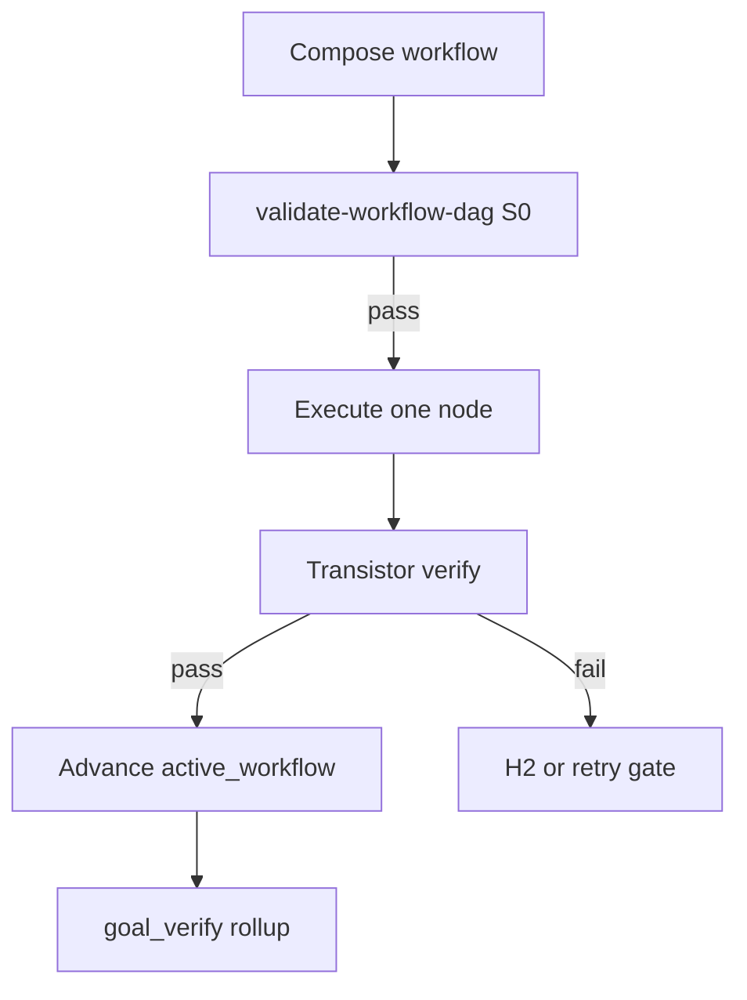

<!-- Complete pass 1 2026-06-28 E6.2 -->

# E6.2: transistor schema id version typed io

**Parent:** [E6-index](E6-index.md) · **Branch E** · **Vision §19** · **Release:** v2.24

## Reader narrative
<!-- prose-source: agent transistor-expansion 2026-06-28 -->

The transistor manifest schema is the contract that makes generator workflows machine-checkable instead of prose-only. Every block under `docs/platform/transistors/` declares `id`, semver `version`, `capability_id`, class (`hard`, `soft`, or `gate`), typed `inputs[]` and `outputs[]`, S0-evaluable `preconditions[]`, an `executor` binding, a `verify` hook, and promotion provenance back to the platform queue. Without this schema, compose-first catalog search could still return scripts and skills, but the conductor could not prove that upstream node outputs satisfy downstream inputs before implement starts.

`validate-workflow.py` and `validate-workflow-dag.py` validate manifests against `docs/platform/schemas/transistor.v1.json` on commit and at workflow-compose exit. Breaking output changes require a fork with semver bump ([D5.3](D5.3-fork-new-catalog-entry-provenance.md)), not silent overwrite. Pack overlays ([F5.4](F5.4-shared-transistors-library-template-packs--shared.md)) and bootstrap entries in [SEC-18](SEC-18-transistor-model-a-to-z-reference.md) §M must conform to the same v1 shape so list-transistors and the composer share one discovery contract.

See [Vision §19 — Transistor & generator workflow model](../../full-automation-vision-and-hierarchy.md#19-transistor--generator-workflow-model) and [E6-index](E6-index.md) for registry siblings.

## Purpose

E6.2 defines transistor schema id version typed io for the agent-driven expert system. Transistor & generator workflow model (§19).
## Scope

- Owns `E6.2` only; siblings under `E6` must not duplicate this spec.
- Aligns with minimal HITL: H1 plan, H2 blocker, H3 sign-off ([INTRO-1.2](INTRO-1.2-human-touchpoint-contract-h1-h2-h3.md)).
- Conflicts resolve in favor of [Vision §7 — Branch E — Knowledge & composition plane](../../full-automation-vision-and-hierarchy.md#7-branch-e-knowledge-composition-plane).

```
│   └── E6.2 transistor schema id version typed io
```
## Behavior / step logic
<!-- timeline-source: agent transistor-expansion 2026-06-28 -->

1. Schema file: docs/platform/schemas/transistor.v1.json; validated on commit via validate-workflow.py.
2. Inputs/outputs use typed slots: string, path, json, artifact_ref, enum with optional schema $ref.
3. preconditions are S0-checkable predicates before executor runs.
4. version semver; breaking output changes require fork (D5.3) not silent overwrite.
5. SEC-18 documents field semantics; leaf specs must not diverge.



## JSON example

```json
{
  "node": "E6.2",
  "description": "transistor schema id version typed io",
  "state": { "ref": "APP-B-state-json-sketch.md", "active_workflow": "H1.7" },
  "implemented_in_release": "v2.24+"
}
```

## Repo artifacts (this branch)

- `docs/platform/transistors/`
- `docs/platform/schemas/transistor.v1.json`
- `docs/platform/schemas/workflow-dag.v1.json`
- `docs/workflows/`
- `scripts/automation/list-transistors.py`
- `scripts/automation/validate-workflow-dag.py`

## Edge cases

- Operator closes laptop mid-loop — state.json must resume from last good dual-write including active_workflow.
- Transistor version bump mid-pursuit — E5.4 marks workflow stale; re-validate before next node.
- L0 waiver node without promotion progress — D3.3 priority boost then H2 if threshold exceeded.
- Pack overlay id collision — F5.4 semver fork per D5.3, not silent overwrite.
- Parallel branch join missing typed input — validate-workflow-dag fails at compose time.

## Failure modes

- **Fuzzy chain:** Implement without workflow_node_id when C6.1 applies → G5.8 blocks at preflight.
- **False complete:** Node marked done without transistor verify evidence → G2.5 goal_verify fails closed.
- **Stale workflow:** active_workflow.validation_hash mismatch → E5.4 reconcile before advance.
- **Duplicate transistor:** G5.6 list-transistors --check-duplicates rejects promotion.
- **Scope bleed:** Worker runs transistors outside bound node → C6.3 conformance failure.

## Concrete implementation

1. Map `E6.2` to release row in [SEC-15-index](SEC-15-index.md) (v2.24).
2. Implement behavior per [SEC-18](SEC-18-transistor-model-a-to-z.md) acceptance checklist.
3. Add or extend S0 script when behavior is file-derived.
4. Add unit test under `tests/unit/` when script exists.
5. Link from [E6-index](E6-index.md).
6. Run `python scripts/validate-workflow.py` after implement.

## Verification

| Check | Command |
|-------|---------|
| Completeness | `python scripts/automation/audit-hierarchy-depth.py --strict --ids E6.2` |
| Conformance | `python scripts/validate-workflow.py` |
| DAG validity | `python scripts/automation/validate-workflow-dag.py` when workflow exists |
| Task evidence | `python scripts/verify-router.py` when implement task exists |

## Dependencies

| Link | Why |
|------|-----|
| [SEC-18-transistor-model-a-to-z](SEC-18-transistor-model-a-to-z.md) | A–Z authority |
| [full-automation-vision-and-hierarchy.md](../../full-automation-vision-and-hierarchy.md) §19 | Master hierarchy |
| [E6-index](E6-index.md) | Parent grouping |
| [genius-conductor-tiered-routing.md](../../genius-conductor-tiered-routing.md) | S0–S4 routing |

## Acceptance criteria

- [ ] `python scripts/automation/audit-hierarchy-depth.py --strict --ids E6.2` passes
- [ ] Named script, skill, or test path exists or is listed in SEC-15 release row
- [ ] Linked from [E6-index](E6-index.md)
- [ ] Aligned with SEC-18 transistor model
- [ ] `python scripts/validate-workflow.py` passes after implement

## Cross-links

- [hierarchy-expander SKILL](../../../.cursor/skills/hierarchy-expander/SKILL.md)
- [INTRO-2-transistor-building-blocks-north-star](INTRO-2-transistor-building-blocks-north-star.md)
