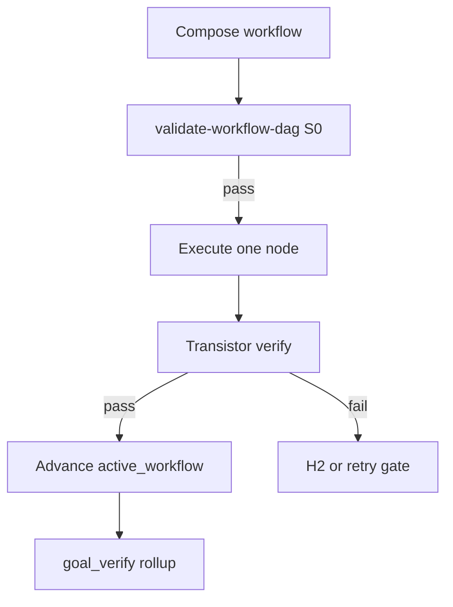

<!-- Complete pass 1 2026-06-28 E6.4 -->

# E6.4: list-transistors query io compatibility

**Parent:** [E6-index](E6-index.md) · **Branch E** · **Vision §19** · **Release:** v2.24

## Reader narrative
<!-- prose-source: agent transistor-expansion 2026-06-28 -->

`list-transistors.py` is the S0 discovery tool the workflow-composer and Librarian use before stitching generator DAGs. It queries the transistor registry by `capability_id`, optional `--produces` and `--consumes` type filters, and `--class` (`hard`, `soft`, or `gate`) so the composer can find blocks whose outputs are wire-compatible with the upstream node already placed in the workflow. This extends [E2.2](E2.2-compose-query-catalog-list-components.md) list-components: composition at workflow granularity starts with transistors, then falls back to legacy script and playbook hits per [E6.5](E6.5-compose-rank-hard-transistor-script-soft.md).

Results feed [B6.1](B6.1-workflow-composer-skill-s3-graph-planning.md) briefing and [B2.2](B2.2-librarian-allowed-reads-catalog-composition.md) suggested_components. An empty result triggers [E7.4](E7.4-workflow-miss-enqueue-transistor-promotion.md) promotion enqueue—not improvised implement. Duplicate capability coverage is rejected via `--check-duplicates` to enforce [G5.6](G5.6-mistake-duplicate-tooling-platform-queue-catalog.md). Unit tests live under `tests/unit/test_list_transistors.py` as part of the v2.24 release row.

See [Vision §19 — Transistor & generator workflow model](../../full-automation-vision-and-hierarchy.md#19-transistor--generator-workflow-model) and [SEC-18](SEC-18-transistor-model-a-to-z-reference.md) §D for query semantics.

## Purpose

E6.4 defines list-transistors query io compatibility for the agent-driven expert system. Transistor & generator workflow model (§19).
## Scope

- Owns `E6.4` only; siblings under `E6` must not duplicate this spec.
- Aligns with minimal HITL: H1 plan, H2 blocker, H3 sign-off ([INTRO-1.2](INTRO-1.2-human-touchpoint-contract-h1-h2-h3.md)).
- Conflicts resolve in favor of [Vision §7 — Branch E — Knowledge & composition plane](../../full-automation-vision-and-hierarchy.md#7-branch-e-knowledge-composition-plane).

```
│   └── E6.4 list-transistors query io compatibility
```
## Behavior / step logic
<!-- timeline-source: agent transistor-expansion 2026-06-28 -->

1. CLI: --capability, --produces, --consumes, --class hard|soft|gate.
2. Returns ranked hits compatible with upstream node outputs for DAG extension.
3. Integrates with librarian suggested_components in B2.2 briefing.
4. Empty result triggers E7.4 promotion enqueue—not improvised implement.
5. Unit tests under tests/unit/test_list_transistors.py.



## JSON example

```json
{
  "node": "E6.4",
  "description": "list-transistors query io compatibility",
  "state": { "ref": "APP-B-state-json-sketch.md", "active_workflow": "H1.7" },
  "implemented_in_release": "v2.24+"
}
```

## Repo artifacts (this branch)

- `docs/platform/transistors/`
- `docs/platform/schemas/transistor.v1.json`
- `docs/platform/schemas/workflow-dag.v1.json`
- `docs/workflows/`
- `scripts/automation/list-transistors.py`
- `scripts/automation/validate-workflow-dag.py`

## Edge cases

- Operator closes laptop mid-loop — state.json must resume from last good dual-write including active_workflow.
- Transistor version bump mid-pursuit — E5.4 marks workflow stale; re-validate before next node.
- L0 waiver node without promotion progress — D3.3 priority boost then H2 if threshold exceeded.
- Pack overlay id collision — F5.4 semver fork per D5.3, not silent overwrite.
- Parallel branch join missing typed input — validate-workflow-dag fails at compose time.

## Failure modes

- **Fuzzy chain:** Implement without workflow_node_id when C6.1 applies → G5.8 blocks at preflight.
- **False complete:** Node marked done without transistor verify evidence → G2.5 goal_verify fails closed.
- **Stale workflow:** active_workflow.validation_hash mismatch → E5.4 reconcile before advance.
- **Duplicate transistor:** G5.6 list-transistors --check-duplicates rejects promotion.
- **Scope bleed:** Worker runs transistors outside bound node → C6.3 conformance failure.

## Concrete implementation

1. Map `E6.4` to release row in [SEC-15-index](SEC-15-index.md) (v2.24).
2. Implement behavior per [SEC-18](SEC-18-transistor-model-a-to-z.md) acceptance checklist.
3. Add or extend S0 script when behavior is file-derived.
4. Add unit test under `tests/unit/` when script exists.
5. Link from [E6-index](E6-index.md).
6. Run `python scripts/validate-workflow.py` after implement.

## Verification

| Check | Command |
|-------|---------|
| Completeness | `python scripts/automation/audit-hierarchy-depth.py --strict --ids E6.4` |
| Conformance | `python scripts/validate-workflow.py` |
| DAG validity | `python scripts/automation/validate-workflow-dag.py` when workflow exists |
| Task evidence | `python scripts/verify-router.py` when implement task exists |

## Dependencies

| Link | Why |
|------|-----|
| [SEC-18-transistor-model-a-to-z](SEC-18-transistor-model-a-to-z.md) | A–Z authority |
| [full-automation-vision-and-hierarchy.md](../../full-automation-vision-and-hierarchy.md) §19 | Master hierarchy |
| [E6-index](E6-index.md) | Parent grouping |
| [genius-conductor-tiered-routing.md](../../genius-conductor-tiered-routing.md) | S0–S4 routing |

## Acceptance criteria

- [ ] `python scripts/automation/audit-hierarchy-depth.py --strict --ids E6.4` passes
- [ ] Named script, skill, or test path exists or is listed in SEC-15 release row
- [ ] Linked from [E6-index](E6-index.md)
- [ ] Aligned with SEC-18 transistor model
- [ ] `python scripts/validate-workflow.py` passes after implement

## Cross-links

- [hierarchy-expander SKILL](../../../.cursor/skills/hierarchy-expander/SKILL.md)
- [INTRO-2-transistor-building-blocks-north-star](INTRO-2-transistor-building-blocks-north-star.md)
