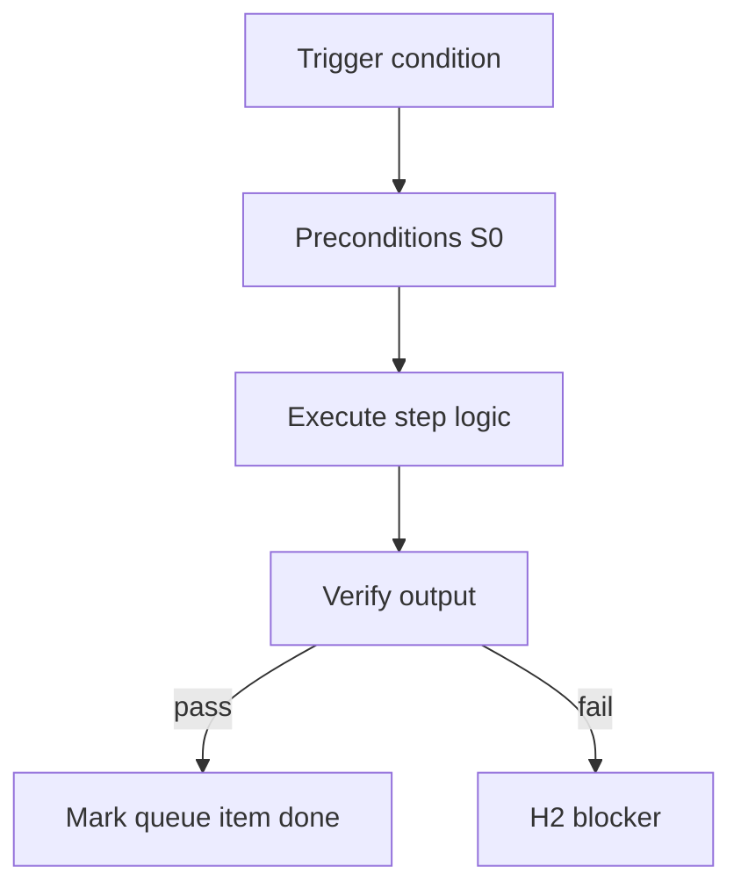

<!-- Complete pass 3 2026-06-28 F1.1 -->

# F1.1: pack company.yaml schema

**Parent:** [F1-index](F1-index.md) · **Branch F** · **Vision §8** · **Release:** v2.19

## Reader narrative
<!-- prose-source: agent plane-f 2026-06-28 -->

`company.yaml` is the root schema for every template-pack: company name, industry, department list, role references, default pipeline, and pack metadata. Instantiation copies or binds this file into pursuit state via program-scoper—`state.company.pack_id` and initial `active_role` derive from here.

The schema must compose with sibling pack artifacts ([F1.2](F1.2-pack-roles---yaml.md) roles, [F1.3](F1.3-pack-pipelines---yaml.md) pipelines, [F1.8](F1.8-pack-verify-goal-verify-suites.md) verify suites) without ad hoc fields in consumer repos. Pack authors validate against conformance scripts before publish; consumer goals reference pack version, not forked company.yaml inline. See [Vision §8 — Branch F](../../full-automation-vision-and-hierarchy.md#8-branch-f-organization-plane-template-packs-ceiling).

## Purpose

F1.1 defines pack company yaml schema for the agent-driven expert system. Organization — template-packs as whole-company ceiling.
## Scope

- Owns `F1.1` only; siblings under `F1` must not duplicate this spec.
- Aligns with minimal HITL: H1 plan, H2 blocker, H3 sign-off ([INTRO-1.2](INTRO-1.2-human-touchpoint-contract-h1-h2-h3.md)).
- Conflicts resolve in favor of [Vision §8 — Branch F — Organization plane (template-packs = ceiling)](../../full-automation-vision-and-hierarchy.md#8-branch-f-organization-plane-template-packs-ceiling).

```
│   ├── F1.1 company.yaml — name, industry, roles[], departments[]
```
## Behavior / step logic
<!-- timeline-source: agent cli-composer-2.5 2026-06-28 -->

1. Before spawning implement or explore workers, the conductor resolves per-role `allowed_reads` from pack YAML—role playbooks, lane task cards, facts entries, and declared design slices—not the full vision monolith or unrelated department lanes.
2. Librarian returns at most five paths within that cap per [B2.2](B2.2-librarian-allowed-reads-catalog-composition.md) before spawn; workers inherit the list in their contract and cannot expand scope beyond it.
3. Lane.json work orders may further narrow reads for parallel slots so concurrent lanes do not cross-read another department's playbooks or task cards.
4. When `state.company.active_role` rotates ([F6.1](F6.1-role-mapping-conductor-context-switch-active-role.md)), conductor reloads the new role's allowed_reads and explicit forbidden deny list before the next worker spawn.
5. Scope bleed (e.g., a QA worker reaching finance playbooks) or reads outside the cap fail closed at H2—conductor withholds spawn until operators reconcile permissions at H1.



## JSON example

```json
{
  "node": "F1.1",
  "description": "pack company yaml schema",
  "state": { "ref": "APP-B-state-json-sketch.md" },
  "implemented_in_release": "v2.14+"
}
```


## Repo artifacts (this branch)

- `template-packs/`
- `program/integration/manifest.md`
- `.cursor/skills/program-scoper/`

## Edge cases

- Operator closes laptop mid-loop — state.json must resume from last good dual-write.
- Concurrent manual edit to queue JSON — conductor reloads queue each wake; last writer wins with journal note.
- Pack role handoff while lane lease held — complete-work-order releases lease before role switch.
- Edge case `F1.1` variant 4: verify state dual-write before continuing pursuit.
- Pass 3: add regression test or evidence path specific to `F1.1`.
- Pass 3: cross-link related nodes in same branch index.

## Failure modes

- **Silent stop:** Agent ends turn without updating queue → mitigated by /loop + check-hierarchy-queue.py EMPTY gate.
- **False complete:** Item marked done without artifact → audit-hierarchy-depth.py re-enqueues deepen pass.
- **Scope bleed:** Worker edits journal/state during planning-only expansion → forbidden in vision-expansion-prompt.
- **Stale design:** Upstream vision § changes → reconcile-stale adds deepen items for affected ids.

## Concrete implementation

1. Add `company.yaml` + `roles/*.yaml` to template-packs schema.
2. program-scoper selects pack; sets state.company.active_role.
3. Per-role allowed_reads in lane.json work orders.
4. Validate `F1.1` against SEC-15 release checklist and parent index links.
5. Document `F1.1` in parent index with verify command and release tag.
6. Add checklist row in SEC-15 release doc for `F1.1`.

## Verification

| Check | Command |
|-------|---------|
| Completeness | `python scripts/automation/audit-hierarchy-depth.py --strict --ids F1.1` |
| Conformance | `python scripts/validate-workflow.py` |
| Task evidence | `python scripts/verify-router.py` when implement task exists |

## Dependencies

| Link | Why |
|------|-----|
| [full-automation-vision-and-hierarchy.md](../../full-automation-vision-and-hierarchy.md) §8 | Master hierarchy |
| [F1-index](F1-index.md) | Parent grouping |
| [genius-conductor-tiered-routing.md](../../genius-conductor-tiered-routing.md) | S0–S4 routing |

## Acceptance criteria

- [ ] `python scripts/automation/audit-hierarchy-depth.py --strict --ids F1.1` passes
- [ ] Named script, skill, or test path exists or is listed in SEC-15 release row
- [ ] Linked from [F1-index](F1-index.md)
- [ ] `python scripts/validate-workflow.py` passes after implement

## Cross-links

- [hierarchy-expander SKILL](../../../.cursor/skills/hierarchy-expander/SKILL.md)
