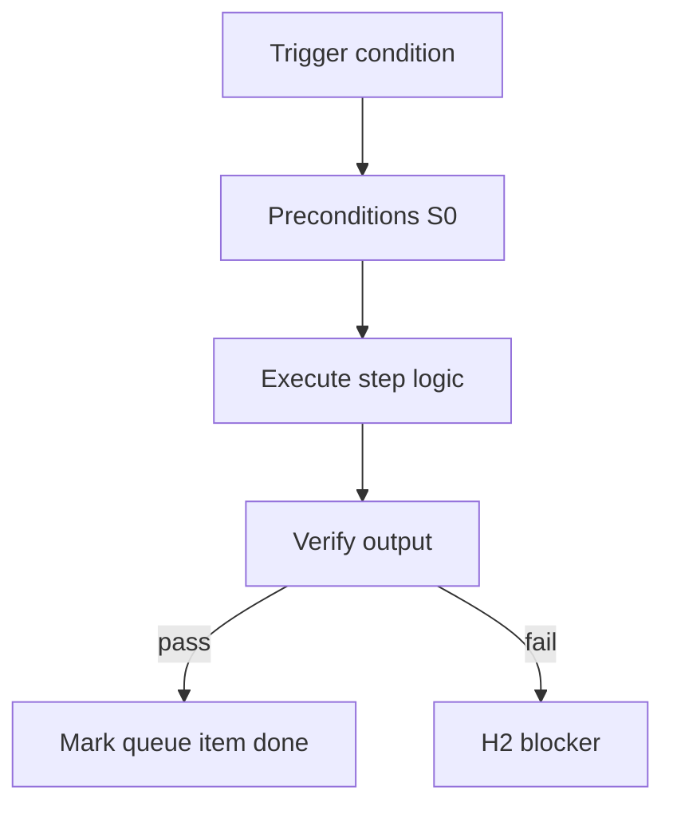

<!-- Complete pass 3 2026-06-28 F1.2 -->

# F1.2: pack roles/*.yaml

**Parent:** [F1-index](F1-index.md) · **Branch F** · **Vision §8** · **Release:** v2.19

## Reader narrative
<!-- prose-source: agent plane-f 2026-06-28 -->

`roles/*.yaml` declares each organizational role: `role_id`, bound `pipeline_id`, tool permissions, MCP allowlists, KPI hints, and handoff targets. Roles are the unit of agent persona swap—workers inherit role context from spawn contracts while the conductor identity stays fixed ([F6.1](F6.1-role-mapping-conductor-context-switch-active-role.md)).

Mis-bound pipeline_id routes implement into wrong phases ([B5.2](B5.2-role-to-pipeline-id-skills-tool-permissions.md)). Per-role `allowed_reads` and evidence rules extend in [F6.2](F6.2-role-allowed-reads-scoped-playbooks-lane-tasks.md) and [F6.4](F6.4-role-evidence-requirements-per-output-type.md). company.yaml lists role ids; this directory holds authoritative bindings.

## Purpose

F1.2 defines pack roles   yaml for the agent-driven expert system. Organization — template-packs as whole-company ceiling.
## Scope

- Owns `F1.2` only; siblings under `F1` must not duplicate this spec.
- Aligns with minimal HITL: H1 plan, H2 blocker, H3 sign-off ([INTRO-1.2](INTRO-1.2-human-touchpoint-contract-h1-h2-h3.md)).
- Conflicts resolve in favor of [Vision §8 — Branch F — Organization plane (template-packs = ceiling)](../../full-automation-vision-and-hierarchy.md#8-branch-f-organization-plane-template-packs-ceiling).

```
│   ├── F1.2 roles/*.yaml — role_id, pipeline_id, tools, permissions, KPIs
```
## Behavior / step logic
<!-- timeline-source: agent cli-composer-2.5 2026-06-28 -->

1. When program-scoper or the conductor loads a company pack, compose-first resolution ([B4.3](B4.3-compose-first-catalog-before-improvise.md)) queries the catalog ([E1.7](E1.7-catalog-platform-catalog-md-umbrella.md)) for `template-packs/_shared/` fragments before improvising role or verify content.
2. Industry packs import _shared onboarding micro-packs, security baselines, and verify hooks through [F5.1](F5.1-cross-pack-imports-micro-packs.md); the conductor binds merged artifacts to `state.company.pack_id` without duplicating shared YAML in each product repo.
3. When pursuit promotes a mature fragment from a product repo, Plane D pack fragment export ([D4.6](D4.6-platform-work-pack-fragment-export.md)) enqueues platform work; after L5 export lands in _shared, catalog regeneration must list the entry before company-autopilot resumes compose queries.
4. Edits to _shared bump staleness for all importers—extend with backwards compatibility ([D5.2](D5.2-extend-backwards-compatible-staleness-bump.md)) or fork a new catalog entry ([D5.3](D5.3-fork-new-catalog-entry-provenance.md)) rather than silently breaking dependent packs.
5. If an importer pack fails goal_verify after a _shared change without a compatibility path, pursuit stops at H2 with provenance notes until operators approve extend-or-fork at H1.



## JSON example

```json
{
  "node": "F1.2",
  "description": "pack roles   yaml",
  "state": { "ref": "APP-B-state-json-sketch.md" },
  "implemented_in_release": "v2.14+"
}
```


## Repo artifacts (this branch)

- `template-packs/`
- `program/integration/manifest.md`
- `.cursor/skills/program-scoper/`

## Edge cases

- Operator closes laptop mid-loop — state.json must resume from last good dual-write.
- Concurrent manual edit to queue JSON — conductor reloads queue each wake; last writer wins with journal note.
- Pack role handoff while lane lease held — complete-work-order releases lease before role switch.
- Edge case `F1.2` variant 4: verify state dual-write before continuing pursuit.
- Pass 3: add regression test or evidence path specific to `F1.2`.
- Pass 3: cross-link related nodes in same branch index.

## Failure modes

- **Silent stop:** Agent ends turn without updating queue → mitigated by /loop + check-hierarchy-queue.py EMPTY gate.
- **False complete:** Item marked done without artifact → audit-hierarchy-depth.py re-enqueues deepen pass.
- **Scope bleed:** Worker edits journal/state during planning-only expansion → forbidden in vision-expansion-prompt.
- **Stale design:** Upstream vision § changes → reconcile-stale adds deepen items for affected ids.

## Concrete implementation

1. Add `company.yaml` + `roles/*.yaml` to template-packs schema.
2. program-scoper selects pack; sets state.company.active_role.
3. Per-role allowed_reads in lane.json work orders.
4. Validate `F1.2` against SEC-15 release checklist and parent index links.
5. Document `F1.2` in parent index with verify command and release tag.
6. Add checklist row in SEC-15 release doc for `F1.2`.

## Verification

| Check | Command |
|-------|---------|
| Completeness | `python scripts/automation/audit-hierarchy-depth.py --strict --ids F1.2` |
| Conformance | `python scripts/validate-workflow.py` |
| Task evidence | `python scripts/verify-router.py` when implement task exists |

## Dependencies

| Link | Why |
|------|-----|
| [full-automation-vision-and-hierarchy.md](../../full-automation-vision-and-hierarchy.md) §8 | Master hierarchy |
| [F1-index](F1-index.md) | Parent grouping |
| [genius-conductor-tiered-routing.md](../../genius-conductor-tiered-routing.md) | S0–S4 routing |

## Acceptance criteria

- [ ] `python scripts/automation/audit-hierarchy-depth.py --strict --ids F1.2` passes
- [ ] Named script, skill, or test path exists or is listed in SEC-15 release row
- [ ] Linked from [F1-index](F1-index.md)
- [ ] `python scripts/validate-workflow.py` passes after implement

## Cross-links

- [hierarchy-expander SKILL](../../../.cursor/skills/hierarchy-expander/SKILL.md)
