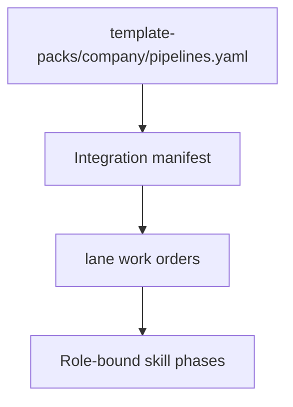

<!-- Complete pass 3 2026-06-28 F1.3 -->

# F1.3: pack pipelines/*.yaml

**Parent:** [F1-index](F1-index.md) · **Branch F** · **Vision §8** · **Release:** v2.19

## Reader narrative
<!-- prose-source: agent plane-f 2026-06-28 -->

`pipelines/*.yaml` encodes phase order, human gates, pack_keywords, and skill bindings for each pipeline_id a pack offers—greenfield, iterative_feature, program variants per company template. program-scoper and route-tier read these files to set `next_action` without improvising phase graphs.

Pipelines connect pack organization to Plane C execution ([C1.4](C1.4-pack-defined-pipelines-per-company-template.md)). Integration manifest and lane work orders reference pipeline phases for parallel spawn eligibility ([F2.2](F2.2-company-spawn-workstream-department-role-lane.md)). Schema changes mark downstream task cards stale via reconcile-stale.

## Purpose

F1.3 defines pack pipelines   yaml for the agent-driven expert system. Organization — template-packs as whole-company ceiling.
## Scope

- Owns `F1.3` only; siblings under `F1` must not duplicate this spec.
- Aligns with minimal HITL: H1 plan, H2 blocker, H3 sign-off ([INTRO-1.2](INTRO-1.2-human-touchpoint-contract-h1-h2-h3.md)).
- Conflicts resolve in favor of [Vision §8 — Branch F — Organization plane (template-packs = ceiling)](../../full-automation-vision-and-hierarchy.md#8-branch-f-organization-plane-template-packs-ceiling).

```
│   ├── F1.3 pipelines/*.yaml — phases, gates, pack_keywords
```
## Behavior / step logic
<!-- timeline-source: agent cli-composer-2.5 2026-06-28 -->

1. When program-scoper instantiates a company pursuit, S0 resolves the declared import list in company.yaml—merging roles, playbooks, and verify fragments from micro-packs into the active pack without copying foreign packs into the consumer repo.
2. Resolved imports bind to state.company.pack_id and active_role so conductor routing and [B5.2](B5.2-role-to-pipeline-id-skills-tool-permissions.md) tool permissions reflect the composed organization model on every wake.
3. Import paths must stay inside the template-packs namespace per [F5.3](F5.3-no-repo-outside-template-packs-ceiling.md); ad hoc filesystem paths are rejected before pursuit advances.
4. When an imported fragment diverges from its source micro-pack, provenance links feed [D5.3](D5.3-fork-new-catalog-entry-provenance.md) and SEC-14 gap analysis without blocking unrelated product turns.
5. If import resolution fails—missing pack id or broken path—pursuit stops at H2 with the unresolved import recorded in journal and state.json until the operator fixes the manifest at H1.



## JSON example

```json
{
  "node": "F1.3",
  "description": "pack pipelines   yaml",
  "state": { "ref": "APP-B-state-json-sketch.md" },
  "implemented_in_release": "v2.14+"
}
```


## Repo artifacts (this branch)

- `template-packs/`
- `program/integration/manifest.md`
- `.cursor/skills/program-scoper/`

## Edge cases

- Operator closes laptop mid-loop — state.json must resume from last good dual-write.
- Concurrent manual edit to queue JSON — conductor reloads queue each wake; last writer wins with journal note.
- Pack role handoff while lane lease held — complete-work-order releases lease before role switch.
- Edge case `F1.3` variant 4: verify state dual-write before continuing pursuit.
- Pass 3: add regression test or evidence path specific to `F1.3`.
- Pass 3: cross-link related nodes in same branch index.

## Failure modes

- **Silent stop:** Agent ends turn without updating queue → mitigated by /loop + check-hierarchy-queue.py EMPTY gate.
- **False complete:** Item marked done without artifact → audit-hierarchy-depth.py re-enqueues deepen pass.
- **Scope bleed:** Worker edits journal/state during planning-only expansion → forbidden in vision-expansion-prompt.
- **Stale design:** Upstream vision § changes → reconcile-stale adds deepen items for affected ids.

## Concrete implementation

1. Add `company.yaml` + `roles/*.yaml` to template-packs schema.
2. program-scoper selects pack; sets state.company.active_role.
3. Per-role allowed_reads in lane.json work orders.
4. Validate `F1.3` against SEC-15 release checklist and parent index links.
5. Document `F1.3` in parent index with verify command and release tag.
6. Add checklist row in SEC-15 release doc for `F1.3`.

## Verification

| Check | Command |
|-------|---------|
| Completeness | `python scripts/automation/audit-hierarchy-depth.py --strict --ids F1.3` |
| Conformance | `python scripts/validate-workflow.py` |
| Task evidence | `python scripts/verify-router.py` when implement task exists |

## Dependencies

| Link | Why |
|------|-----|
| [full-automation-vision-and-hierarchy.md](../../full-automation-vision-and-hierarchy.md) §8 | Master hierarchy |
| [F1-index](F1-index.md) | Parent grouping |
| [genius-conductor-tiered-routing.md](../../genius-conductor-tiered-routing.md) | S0–S4 routing |

## Acceptance criteria

- [ ] `python scripts/automation/audit-hierarchy-depth.py --strict --ids F1.3` passes
- [ ] Named script, skill, or test path exists or is listed in SEC-15 release row
- [ ] Linked from [F1-index](F1-index.md)
- [ ] `python scripts/validate-workflow.py` passes after implement

## Cross-links

- [hierarchy-expander SKILL](../../../.cursor/skills/hierarchy-expander/SKILL.md)
