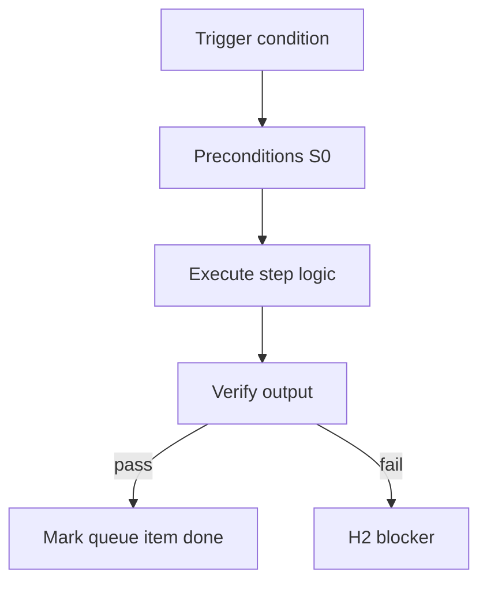

<!-- Complete pass 3 2026-06-28 F1.4 -->

# F1.4: pack manifest.md integration contracts

**Parent:** [F1-index](F1-index.md) · **Branch F** · **Vision §8** · **Release:** v2.19

## Reader narrative
<!-- prose-source: agent plane-f 2026-06-28 -->

`manifest.md` in the pack defines integration contracts—internal handoffs between roles and external boundaries (APIs, repos, third-party tools). This is the pack-authored precursor to `program/integration/manifest.md` that program-scoper materializes at instantiation ([F2.4](F2.4-company-conductor-handoffs-manifest-graph.md)).

Human gate clears parallel lanes only after manifest approval ([B5.3](B5.3-handoff-manifest-artifact-graph.md)). Contracts must name artifact types, verify commands, and blocking dependencies—not vague "coordinate with team." Cross-pack imports ([F5.1](F5.1-cross-pack-imports-micro-packs.md)) extend manifest rows when micro-packs add roles.

## Purpose

F1.4 defines pack manifest md integration contracts for the agent-driven expert system. Organization — template-packs as whole-company ceiling.
## Scope

- Owns `F1.4` only; siblings under `F1` must not duplicate this spec.
- Aligns with minimal HITL: H1 plan, H2 blocker, H3 sign-off ([INTRO-1.2](INTRO-1.2-human-touchpoint-contract-h1-h2-h3.md)).
- Conflicts resolve in favor of [Vision §8 — Branch F — Organization plane (template-packs = ceiling)](../../full-automation-vision-and-hierarchy.md#8-branch-f-organization-plane-template-packs-ceiling).

```
│   ├── F1.4 manifest.md — integration contracts (internal + external)
```
## Behavior / step logic
<!-- timeline-source: agent cli-composer-2.5 2026-06-28 -->

1. When `next_action` targets release or operate phases, the conductor routes through git-workflow, release-queue, and dashboard skills only after verify commands and rollback paths are bound in the task card and active pack per [J6](J6-release-queue.md).
2. Pack authors map APP-A-release to pipeline phases, [F1.8](F1.8-pack-verify-goal-verify-suites.md) verify suites, and playbooks so deploy preparation produces machine-checkable evidence—not subjective "shipped" chat.
3. Plane I runtime integrations ([I3.2](I3.2-runtime-headless-github-actions-validate-verify.md), [I5.1](I5.1-runtime-notify-status-dashboard-generation.md)) run validate-workflow and verify-router in headless or CI context before H3 release sign-off is requested.
4. Operator dashboards and digest notifications surface release-queue status and H2 blockers per [A6.1](A6.1-notify-dashboard-status-webhook-phase-complete.md) and [A6.2](A6.2-notify-digest-on-h2-blocker-not-every-step.md) without unblocking pursuit loops.
5. Irreversible production actions without defined verify and rollback paths fail closed at H2 under Plane G rollback policy—never set goal.state to achieved on undeployable or unrollbackable changes.



## JSON example

```json
{
  "node": "F1.4",
  "description": "pack manifest md integration contracts",
  "state": { "ref": "APP-B-state-json-sketch.md" },
  "implemented_in_release": "v2.14+"
}
```


## Repo artifacts (this branch)

- `template-packs/`
- `program/integration/manifest.md`
- `.cursor/skills/program-scoper/`

## Edge cases

- Operator closes laptop mid-loop — state.json must resume from last good dual-write.
- Concurrent manual edit to queue JSON — conductor reloads queue each wake; last writer wins with journal note.
- Pack role handoff while lane lease held — complete-work-order releases lease before role switch.
- Edge case `F1.4` variant 4: verify state dual-write before continuing pursuit.
- Pass 3: add regression test or evidence path specific to `F1.4`.
- Pass 3: cross-link related nodes in same branch index.

## Failure modes

- **Silent stop:** Agent ends turn without updating queue → mitigated by /loop + check-hierarchy-queue.py EMPTY gate.
- **False complete:** Item marked done without artifact → audit-hierarchy-depth.py re-enqueues deepen pass.
- **Scope bleed:** Worker edits journal/state during planning-only expansion → forbidden in vision-expansion-prompt.
- **Stale design:** Upstream vision § changes → reconcile-stale adds deepen items for affected ids.

## Concrete implementation

1. Add `company.yaml` + `roles/*.yaml` to template-packs schema.
2. program-scoper selects pack; sets state.company.active_role.
3. Per-role allowed_reads in lane.json work orders.
4. Validate `F1.4` against SEC-15 release checklist and parent index links.
5. Document `F1.4` in parent index with verify command and release tag.
6. Add checklist row in SEC-15 release doc for `F1.4`.

## Verification

| Check | Command |
|-------|---------|
| Completeness | `python scripts/automation/audit-hierarchy-depth.py --strict --ids F1.4` |
| Conformance | `python scripts/validate-workflow.py` |
| Task evidence | `python scripts/verify-router.py` when implement task exists |

## Dependencies

| Link | Why |
|------|-----|
| [full-automation-vision-and-hierarchy.md](../../full-automation-vision-and-hierarchy.md) §8 | Master hierarchy |
| [F1-index](F1-index.md) | Parent grouping |
| [genius-conductor-tiered-routing.md](../../genius-conductor-tiered-routing.md) | S0–S4 routing |

## Acceptance criteria

- [ ] `python scripts/automation/audit-hierarchy-depth.py --strict --ids F1.4` passes
- [ ] Named script, skill, or test path exists or is listed in SEC-15 release row
- [ ] Linked from [F1-index](F1-index.md)
- [ ] `python scripts/validate-workflow.py` passes after implement

## Cross-links

- [hierarchy-expander SKILL](../../../.cursor/skills/hierarchy-expander/SKILL.md)
