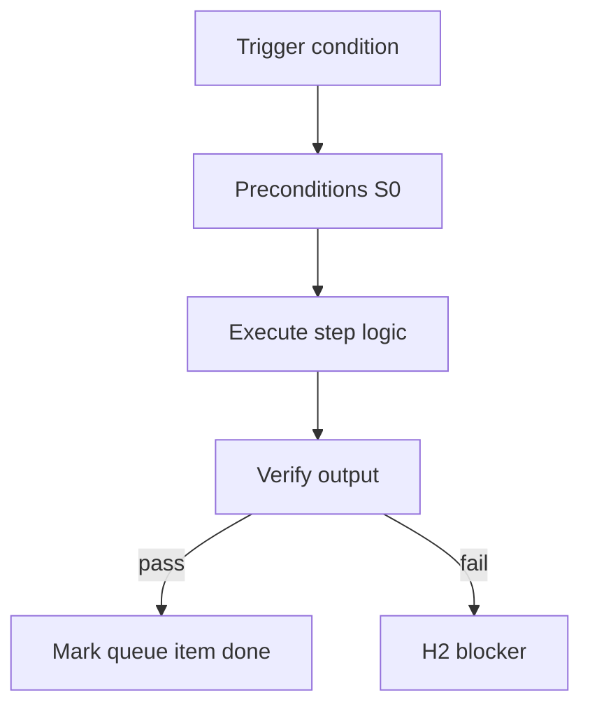

<!-- Complete pass 3 2026-06-28 F1.5 -->

# F1.5: pack artifact-graph.json cross-role

**Parent:** [F1-index](F1-index.md) · **Branch F** · **Vision §8** · **Release:** v2.19

## Reader narrative
<!-- prose-source: agent plane-f 2026-06-28 -->

`artifact-graph.json` registers cross-role dependencies inside the pack: which design nodes, task templates, and verify suites must exist before downstream roles proceed. reconcile-artifact-graph marks stale nodes when upstream pack fragments change.

The graph pairs with integration manifest ([F1.4](F1.4-pack-manifest-md-integration-contracts.md)) for program mode—manifest is human-readable contract, graph is machine reconciliation input. Missing graph edges cause silent parallel spawn before prerequisites exist. Pack authors wire nodes at publish; conductors run S0 reconcile before orchestrate-program.

## Purpose

F1.5 defines pack artifact graph json cross role for the agent-driven expert system. Organization — template-packs as whole-company ceiling.
## Scope

- Owns `F1.5` only; siblings under `F1` must not duplicate this spec.
- Aligns with minimal HITL: H1 plan, H2 blocker, H3 sign-off ([INTRO-1.2](INTRO-1.2-human-touchpoint-contract-h1-h2-h3.md)).
- Conflicts resolve in favor of [Vision §8 — Branch F — Organization plane (template-packs = ceiling)](../../full-automation-vision-and-hierarchy.md#8-branch-f-organization-plane-template-packs-ceiling).

```
│   ├── F1.5 artifact-graph.json — cross-role dependencies
```
## Behavior / step logic
<!-- timeline-source: agent cursor-agent 2026-06-28 -->

1. When program-scoper binds a template-pack, it loads `artifact-graph.json` from the pack and dual-writes cross-role dependency nodes—design artifacts, task templates, and verify suites—into state so downstream roles reference a single machine-readable graph.
2. Before orchestrate-program may spawn parallel lanes, the conductor runs S0 reconcile-artifact-graph against the pack graph to confirm prerequisite nodes exist, are current, and match the integration manifest from [F1.4](F1.4-pack-manifest-md-integration-contracts.md).
3. During program mode, lane work orders and [C4.4](C4.4-artifact-graph-per-program-and-pack.md) consult graph edges to block downstream role turns until upstream artifacts pass verification—not merely until manifest prose is approved.
4. When pack authors change pipelines, roles, or verify suites, reconcile-stale marks affected graph nodes stale so pursuit cannot advance parallel workstreams on obsolete dependency bindings.
5. If graph edges are missing, prerequisite nodes are unresolved, or reconcile finds stale upstream artifacts, pursuit stops at H2 until the pack graph is reloaded and dual-written—never spawn parallel lanes before prerequisites exist.



## JSON example

```json
{
  "node": "F1.5",
  "description": "pack artifact graph json cross role",
  "state": { "ref": "APP-B-state-json-sketch.md" },
  "implemented_in_release": "v2.14+"
}
```


## Repo artifacts (this branch)

- `template-packs/`
- `program/integration/manifest.md`
- `.cursor/skills/program-scoper/`

## Edge cases

- Operator closes laptop mid-loop — state.json must resume from last good dual-write.
- Concurrent manual edit to queue JSON — conductor reloads queue each wake; last writer wins with journal note.
- Pack role handoff while lane lease held — complete-work-order releases lease before role switch.
- Edge case `F1.5` variant 4: verify state dual-write before continuing pursuit.
- Pass 3: add regression test or evidence path specific to `F1.5`.
- Pass 3: cross-link related nodes in same branch index.

## Failure modes

- **Silent stop:** Agent ends turn without updating queue → mitigated by /loop + check-hierarchy-queue.py EMPTY gate.
- **False complete:** Item marked done without artifact → audit-hierarchy-depth.py re-enqueues deepen pass.
- **Scope bleed:** Worker edits journal/state during planning-only expansion → forbidden in vision-expansion-prompt.
- **Stale design:** Upstream vision § changes → reconcile-stale adds deepen items for affected ids.

## Concrete implementation

1. Add `company.yaml` + `roles/*.yaml` to template-packs schema.
2. program-scoper selects pack; sets state.company.active_role.
3. Per-role allowed_reads in lane.json work orders.
4. Validate `F1.5` against SEC-15 release checklist and parent index links.
5. Document `F1.5` in parent index with verify command and release tag.
6. Add checklist row in SEC-15 release doc for `F1.5`.

## Verification

| Check | Command |
|-------|---------|
| Completeness | `python scripts/automation/audit-hierarchy-depth.py --strict --ids F1.5` |
| Conformance | `python scripts/validate-workflow.py` |
| Task evidence | `python scripts/verify-router.py` when implement task exists |

## Dependencies

| Link | Why |
|------|-----|
| [full-automation-vision-and-hierarchy.md](../../full-automation-vision-and-hierarchy.md) §8 | Master hierarchy |
| [F1-index](F1-index.md) | Parent grouping |
| [genius-conductor-tiered-routing.md](../../genius-conductor-tiered-routing.md) | S0–S4 routing |

## Acceptance criteria

- [ ] `python scripts/automation/audit-hierarchy-depth.py --strict --ids F1.5` passes
- [ ] Named script, skill, or test path exists or is listed in SEC-15 release row
- [ ] Linked from [F1-index](F1-index.md)
- [ ] `python scripts/validate-workflow.py` passes after implement

## Cross-links

- [hierarchy-expander SKILL](../../../.cursor/skills/hierarchy-expander/SKILL.md)
