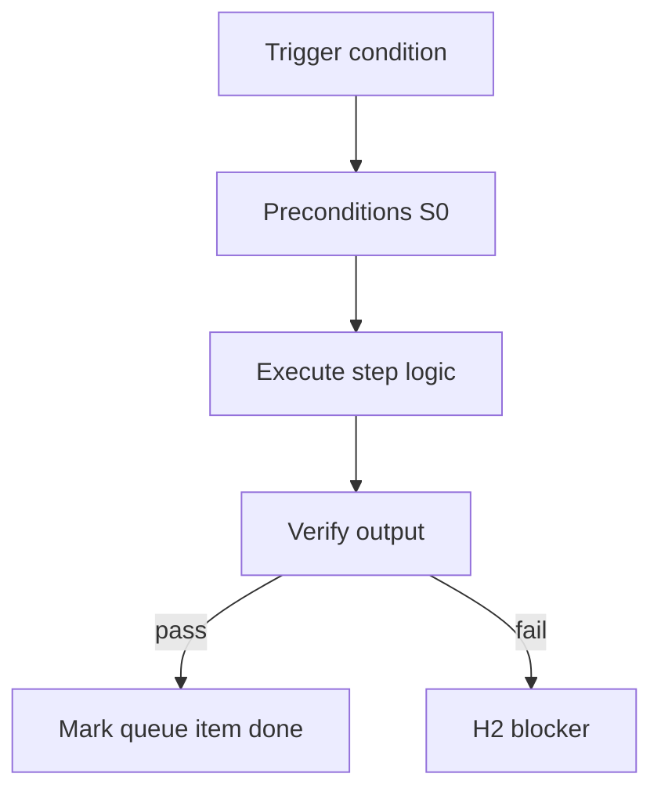

<!-- Complete pass 3 2026-06-28 F1.6 -->

# F1.6: pack playbooks role-specific

**Parent:** [F1-index](F1-index.md) · **Branch F** · **Vision §8** · **Release:** v2.19

## Reader narrative
<!-- prose-source: agent plane-f 2026-06-28 -->

Pack `playbooks/` hold role-specific procedures distilled for that industry template—game QA asset checks, data platform deploy runbooks, onboarding flows. They complement repo `docs/playbooks/` after instantiation copies or references pack fragments into the consumer catalog ([E1.2](E1.2-catalog-playbooks-index.md)).

Compose-first ([B4.3](B4.3-compose-first-catalog-before-improvise.md)) searches pack playbooks via role-scoped allowed_reads ([F6.2](F6.2-role-allowed-reads-scoped-playbooks-lane-tasks.md)). Playbook-keeper promotes repeated patterns from product pursuit back into pack fragments via Plane D promotion queue—not ad hoc edits in consumer repos ([F5.3](F5.3-no-repo-outside-template-packs-ceiling.md)).

## Purpose

F1.6 defines pack playbooks role specific for the agent-driven expert system. Organization — template-packs as whole-company ceiling.
## Scope

- Owns `F1.6` only; siblings under `F1` must not duplicate this spec.
- Aligns with minimal HITL: H1 plan, H2 blocker, H3 sign-off ([INTRO-1.2](INTRO-1.2-human-touchpoint-contract-h1-h2-h3.md)).
- Conflicts resolve in favor of [Vision §8 — Branch F — Organization plane (template-packs = ceiling)](../../full-automation-vision-and-hierarchy.md#8-branch-f-organization-plane-template-packs-ceiling).

```
│   ├── F1.6 playbooks/ — role-specific procedures
```
## Behavior / step logic
<!-- timeline-source: agent cli-composer-2.5 2026-06-28 -->

1. When `next_action` enters design phases (`run hld-writer`, `run dd-writer`, `diagram-generator`), the conductor classifies work under the APP-A design taxonomy—UX/UI, API and data models, integration boundaries, and security/compliance—and routes each slice through the matching S2 skill instead of prose-only decisions.
2. Each design turn must emit machine-checkable artifacts—diagram files, schemas, structured review triggers—in `docs/design/` and `docs/diagrams/` so [A1.2](A1.2-success-criteria-machine-checkable.md) criteria and verifiers can judge completion without subjective review.
3. After every design write, the conductor links artifacts forward to forthcoming task cards and backward to catalog components via [B4.3](B4.3-compose-first-catalog-before-improvise.md), then dual-writes journal and state.json before advancing `next_action`.
4. HLD and DD gates per [INTRO-1.2](INTRO-1.2-human-touchpoint-contract-h1-h2-h3.md) block implement until H1 approval or explicit waiver—[A5.2](A5.2-continue-not-approval-self-gate-h1-h3-only.md) prevents Continue from clearing design approval on its own.
5. If diagrams, schemas, catalog backlinks, or staleness registration are missing, pursuit stops at H2 until the design skill re-runs and reconcile-stale clears dependent nodes.



## JSON example

```json
{
  "node": "F1.6",
  "description": "pack playbooks role specific",
  "state": { "ref": "APP-B-state-json-sketch.md" },
  "implemented_in_release": "v2.14+"
}
```


## Repo artifacts (this branch)

- `template-packs/`
- `program/integration/manifest.md`
- `.cursor/skills/program-scoper/`

## Edge cases

- Operator closes laptop mid-loop — state.json must resume from last good dual-write.
- Concurrent manual edit to queue JSON — conductor reloads queue each wake; last writer wins with journal note.
- Pack role handoff while lane lease held — complete-work-order releases lease before role switch.
- Edge case `F1.6` variant 4: verify state dual-write before continuing pursuit.
- Pass 3: add regression test or evidence path specific to `F1.6`.
- Pass 3: cross-link related nodes in same branch index.

## Failure modes

- **Silent stop:** Agent ends turn without updating queue → mitigated by /loop + check-hierarchy-queue.py EMPTY gate.
- **False complete:** Item marked done without artifact → audit-hierarchy-depth.py re-enqueues deepen pass.
- **Scope bleed:** Worker edits journal/state during planning-only expansion → forbidden in vision-expansion-prompt.
- **Stale design:** Upstream vision § changes → reconcile-stale adds deepen items for affected ids.

## Concrete implementation

1. Add `company.yaml` + `roles/*.yaml` to template-packs schema.
2. program-scoper selects pack; sets state.company.active_role.
3. Per-role allowed_reads in lane.json work orders.
4. Validate `F1.6` against SEC-15 release checklist and parent index links.
5. Document `F1.6` in parent index with verify command and release tag.
6. Add checklist row in SEC-15 release doc for `F1.6`.

## Verification

| Check | Command |
|-------|---------|
| Completeness | `python scripts/automation/audit-hierarchy-depth.py --strict --ids F1.6` |
| Conformance | `python scripts/validate-workflow.py` |
| Task evidence | `python scripts/verify-router.py` when implement task exists |

## Dependencies

| Link | Why |
|------|-----|
| [full-automation-vision-and-hierarchy.md](../../full-automation-vision-and-hierarchy.md) §8 | Master hierarchy |
| [F1-index](F1-index.md) | Parent grouping |
| [genius-conductor-tiered-routing.md](../../genius-conductor-tiered-routing.md) | S0–S4 routing |

## Acceptance criteria

- [ ] `python scripts/automation/audit-hierarchy-depth.py --strict --ids F1.6` passes
- [ ] Named script, skill, or test path exists or is listed in SEC-15 release row
- [ ] Linked from [F1-index](F1-index.md)
- [ ] `python scripts/validate-workflow.py` passes after implement

## Cross-links

- [hierarchy-expander SKILL](../../../.cursor/skills/hierarchy-expander/SKILL.md)
