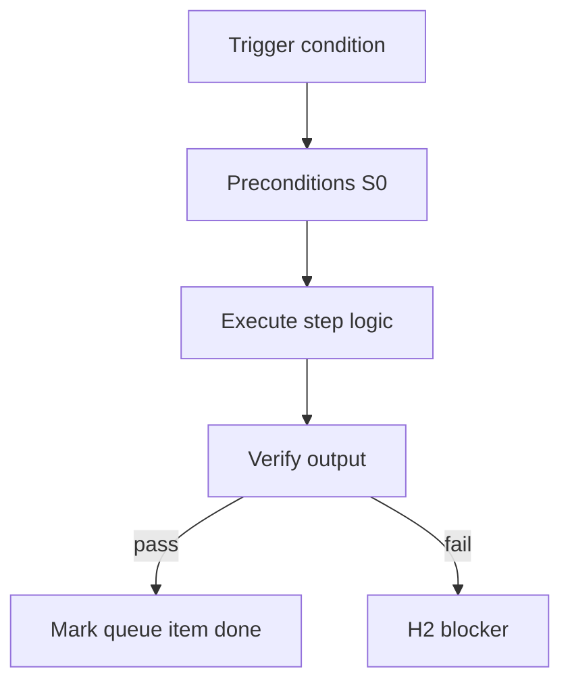

<!-- Complete pass 3 2026-06-28 F1.7 -->

# F1.7: pack template tasks seed cards

**Parent:** [F1-index](F1-index.md) · **Branch F** · **Vision §8** · **Release:** v2.19

## Reader narrative
<!-- prose-source: agent plane-f 2026-06-28 -->

`template tasks/` seeds task cards per role—pre-written Components, Test commands, evidence types, and promotion_note stubs so instantiation does not start from empty TODOS. program-scoper or task-breakdown copies seeds into `docs/features/` or program lanes with pack_id provenance.

Seed cards bind pack verify suites ([F1.8](F1.8-pack-verify-goal-verify-suites.md)) and role evidence rules ([F6.4](F6.4-role-evidence-requirements-per-output-type.md)) at first implement turn. Seeds are templates, not completed work—evidence gates still apply. Platform promotion ([D6.3](D6.3-platform-done-task-card-references.md)) requires task cards reference promoted artifacts after they have been promoted from the improvement queue into lasting catalog entries.

## Purpose

F1.7 defines pack template tasks seed cards for the agent-driven expert system. Organization — template-packs as whole-company ceiling.
## Scope

- Owns `F1.7` only; siblings under `F1` must not duplicate this spec.
- Aligns with minimal HITL: H1 plan, H2 blocker, H3 sign-off ([INTRO-1.2](INTRO-1.2-human-touchpoint-contract-h1-h2-h3.md)).
- Conflicts resolve in favor of [Vision §8 — Branch F — Organization plane (template-packs = ceiling)](../../full-automation-vision-and-hierarchy.md#8-branch-f-organization-plane-template-packs-ceiling).

```
│   ├── F1.7 template tasks/ — seed task cards per role
```
## Behavior / step logic
<!-- timeline-source: agent cli-composer-2.5 2026-06-28 -->

1. During pursuit, `state.pursuit` records mode (continue, goal_autopilot, company_autopilot), steps_total, capability_class, last_verify, evidence_files, and gates_pending—the live control surface S0 preflight reads before each turn.
2. Autopilot modes increment steps_total each iteration until check-pipeline-blocked, budget exhaustion, or a hard stop from Plane A fires per [A3.1](A3.1-session-autopilot-max-steps-per-session.md) and [A3.2](A3.2-goal-autopilot-until-goal-verify-or-hard-block.md).
3. When evidence_required is true, the conductor must hold `last_verify: passed` and list evidence paths before advancing past implement tasks—workers cannot clear verification state themselves.
4. gates_pending retains HLD, DD, and feature-design waits; [A5.2](A5.2-continue-not-approval-self-gate-h1-h3-only.md) ensures Continue does not waive them without explicit H1 approval or waiver text in the journal.
5. After dual-write, route-tier.py applies model tier and spawn_workers when next_action shifts; pursuit counters that drift from the journal mirror trigger an integrity stop at H2.



## JSON example

```json
{
  "node": "F1.7",
  "description": "pack template tasks seed cards",
  "state": { "ref": "APP-B-state-json-sketch.md" },
  "implemented_in_release": "v2.14+"
}
```


## Repo artifacts (this branch)

- `template-packs/`
- `program/integration/manifest.md`
- `.cursor/skills/program-scoper/`

## Edge cases

- Operator closes laptop mid-loop — state.json must resume from last good dual-write.
- Concurrent manual edit to queue JSON — conductor reloads queue each wake; last writer wins with journal note.
- Pack role handoff while lane lease held — complete-work-order releases lease before role switch.
- Edge case `F1.7` variant 4: verify state dual-write before continuing pursuit.
- Pass 3: add regression test or evidence path specific to `F1.7`.
- Pass 3: cross-link related nodes in same branch index.

## Failure modes

- **Silent stop:** Agent ends turn without updating queue → mitigated by /loop + check-hierarchy-queue.py EMPTY gate.
- **False complete:** Item marked done without artifact → audit-hierarchy-depth.py re-enqueues deepen pass.
- **Scope bleed:** Worker edits journal/state during planning-only expansion → forbidden in vision-expansion-prompt.
- **Stale design:** Upstream vision § changes → reconcile-stale adds deepen items for affected ids.

## Concrete implementation

1. Add `company.yaml` + `roles/*.yaml` to template-packs schema.
2. program-scoper selects pack; sets state.company.active_role.
3. Per-role allowed_reads in lane.json work orders.
4. Validate `F1.7` against SEC-15 release checklist and parent index links.
5. Document `F1.7` in parent index with verify command and release tag.
6. Add checklist row in SEC-15 release doc for `F1.7`.

## Verification

| Check | Command |
|-------|---------|
| Completeness | `python scripts/automation/audit-hierarchy-depth.py --strict --ids F1.7` |
| Conformance | `python scripts/validate-workflow.py` |
| Task evidence | `python scripts/verify-router.py` when implement task exists |

## Dependencies

| Link | Why |
|------|-----|
| [full-automation-vision-and-hierarchy.md](../../full-automation-vision-and-hierarchy.md) §8 | Master hierarchy |
| [F1-index](F1-index.md) | Parent grouping |
| [genius-conductor-tiered-routing.md](../../genius-conductor-tiered-routing.md) | S0–S4 routing |

## Acceptance criteria

- [ ] `python scripts/automation/audit-hierarchy-depth.py --strict --ids F1.7` passes
- [ ] Named script, skill, or test path exists or is listed in SEC-15 release row
- [ ] Linked from [F1-index](F1-index.md)
- [ ] `python scripts/validate-workflow.py` passes after implement

## Cross-links

- [hierarchy-expander SKILL](../../../.cursor/skills/hierarchy-expander/SKILL.md)
