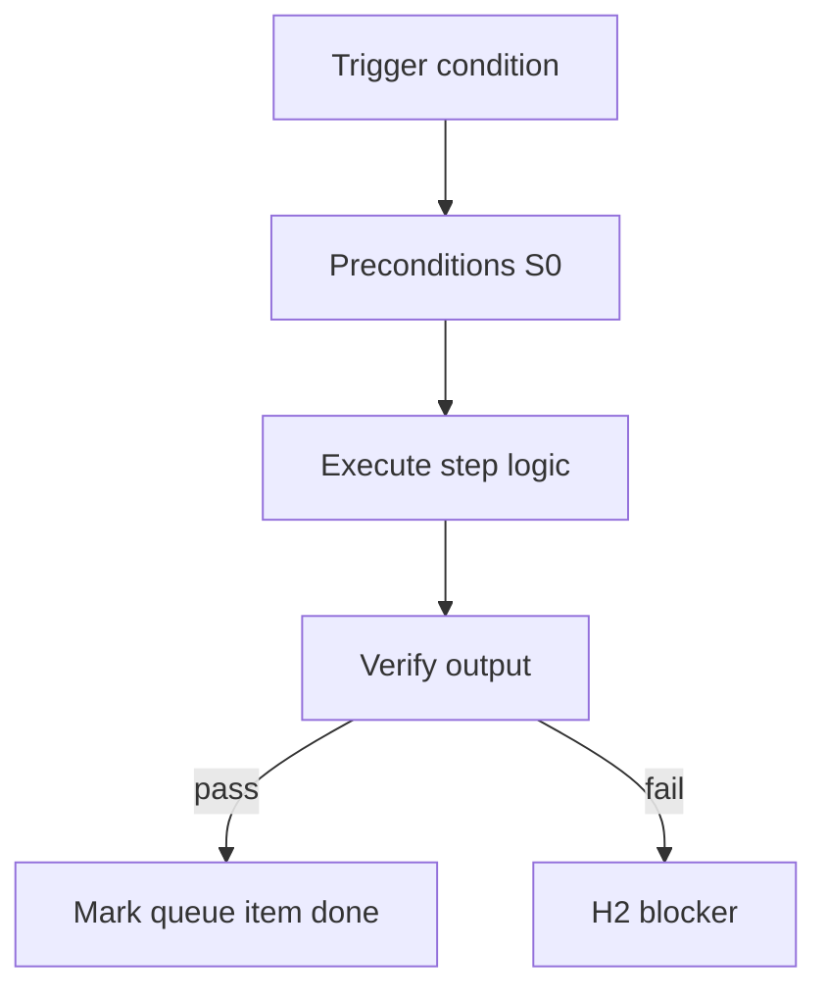

<!-- Complete pass 3 2026-06-28 F1.8 -->

# F1.8: pack verify goal_verify suites

**Parent:** [F1-index](F1-index.md) · **Branch F** · **Vision §8** · **Release:** v2.19

## Reader narrative
<!-- prose-source: agent plane-f 2026-06-28 -->

Pack `verify/` defines goal_verify suites per deliverable type—aggregated pytest profiles, validate-workflow hooks, checksum tools, and meta-tests that prove pack intent beyond per-task evidence. When implement batch completes, conductor resolves `goal.verify_command` from state or active pack suite before H3 ([A2.4](A2.4-goal-scope-complete-run-goal-verify.md)).

Fail closed: missing task evidence blocks goal_verify; goal_verify failure blocks H3 auto-clear ([A2.5](A2.5-goal-verify-pass-transition-h3-pending.md)). Domain packs specialize suites—game studio asset/engine checks ([F3.4](F3.4-game-studio-goal-verify-asset-engine-tests-perf.md))—without weakening the generic suite contract here.

## Purpose

F1.8 defines pack verify goal verify suites for the agent-driven expert system. Organization — template-packs as whole-company ceiling.
## Scope

- Owns `F1.8` only; siblings under `F1` must not duplicate this spec.
- Aligns with minimal HITL: H1 plan, H2 blocker, H3 sign-off ([INTRO-1.2](INTRO-1.2-human-touchpoint-contract-h1-h2-h3.md)).
- Conflicts resolve in favor of [Vision §8 — Branch F — Organization plane (template-packs = ceiling)](../../full-automation-vision-and-hierarchy.md#8-branch-f-organization-plane-template-packs-ceiling).

```
│   └── F1.8 verify/ — goal_verify suites per deliverable type
```
## Behavior / step logic
<!-- timeline-source: agent cli-composer-2.5 2026-06-28 -->

1. When platform scheduling dequeues a promotion item typed playbook-keeper, conductor spawns an economy platform worker bound to the queue item id with scoped `allowed_reads`—no permission to edit consumer feature scope or dual-write product pursuit state.
2. The worker distills repeated reasoning, divergence log entries, or task post-mortems into `docs/playbooks/<slug>.md`, following [B4.3](B4.3-compose-first-catalog-before-improvise.md) compose-first by extending existing INDEX playbooks before creating new slugs.
3. Completion dual-writes the playbook path into the promotion queue item, passes word-quality bar checks, and plans INDEX registration for the new or extended entry.
4. When steps in the playbook stabilize as L2 candidates, the worker enqueues downstream [D4.2](D4.2-platform-work-script-extraction.md) promotion rather than marking the queue item done prematurely.
5. If the worker edits journal or consumer state.json, produces prose below the quality bar, or marks done without a playbook path, pursuit fails closed at H2 and the promotion item reopens.



## JSON example

```json
{
  "node": "F1.8",
  "description": "pack verify goal verify suites",
  "state": { "ref": "APP-B-state-json-sketch.md" },
  "implemented_in_release": "v2.14+"
}
```


## Repo artifacts (this branch)

- `template-packs/`
- `program/integration/manifest.md`
- `.cursor/skills/program-scoper/`

## Edge cases

- Operator closes laptop mid-loop — state.json must resume from last good dual-write.
- Concurrent manual edit to queue JSON — conductor reloads queue each wake; last writer wins with journal note.
- Pack role handoff while lane lease held — complete-work-order releases lease before role switch.
- Edge case `F1.8` variant 4: verify state dual-write before continuing pursuit.
- Pass 3: add regression test or evidence path specific to `F1.8`.
- Pass 3: cross-link related nodes in same branch index.

## Failure modes

- **Silent stop:** Agent ends turn without updating queue → mitigated by /loop + check-hierarchy-queue.py EMPTY gate.
- **False complete:** Item marked done without artifact → audit-hierarchy-depth.py re-enqueues deepen pass.
- **Scope bleed:** Worker edits journal/state during planning-only expansion → forbidden in vision-expansion-prompt.
- **Stale design:** Upstream vision § changes → reconcile-stale adds deepen items for affected ids.

## Concrete implementation

1. Add `company.yaml` + `roles/*.yaml` to template-packs schema.
2. program-scoper selects pack; sets state.company.active_role.
3. Per-role allowed_reads in lane.json work orders.
4. Validate `F1.8` against SEC-15 release checklist and parent index links.
5. Document `F1.8` in parent index with verify command and release tag.
6. Add checklist row in SEC-15 release doc for `F1.8`.

## Verification

| Check | Command |
|-------|---------|
| Completeness | `python scripts/automation/audit-hierarchy-depth.py --strict --ids F1.8` |
| Conformance | `python scripts/validate-workflow.py` |
| Task evidence | `python scripts/verify-router.py` when implement task exists |

## Dependencies

| Link | Why |
|------|-----|
| [full-automation-vision-and-hierarchy.md](../../full-automation-vision-and-hierarchy.md) §8 | Master hierarchy |
| [F1-index](F1-index.md) | Parent grouping |
| [genius-conductor-tiered-routing.md](../../genius-conductor-tiered-routing.md) | S0–S4 routing |

## Acceptance criteria

- [ ] `python scripts/automation/audit-hierarchy-depth.py --strict --ids F1.8` passes
- [ ] Named script, skill, or test path exists or is listed in SEC-15 release row
- [ ] Linked from [F1-index](F1-index.md)
- [ ] `python scripts/validate-workflow.py` passes after implement

## Cross-links

- [hierarchy-expander SKILL](../../../.cursor/skills/hierarchy-expander/SKILL.md)
