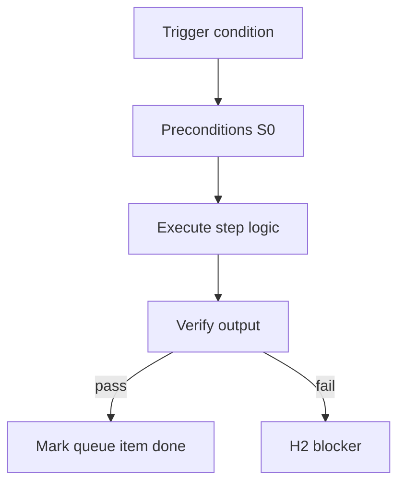

<!-- Complete pass 3 2026-06-28 F2.1 -->

# F2.1: company instantiate program-scoper pack select

**Parent:** [F2-index](F2-index.md) · **Branch F** · **Vision §8** · **Release:** v2.19

## Reader narrative
<!-- prose-source: agent plane-f 2026-06-28 -->

Company instantiation begins when program-scoper reads the mega-spec, scores pack_keywords against available template-packs, and selects `pack_id`. Selection sets `state.company.pack_id`, default `active_role`, and initial program structure—workstreams, blocking questions, milestone gates.

Wrong pack selection is high-risk: roles, pipelines, and verify suites all derive from the choice. Scoper records rationale in journal Q&A; H1 plan approval covers pack choice when policy requires. Pack ceiling ([F5.3](F5.3-no-repo-outside-template-packs-ceiling.md)) means organization changes flow through pack updates or imports ([F5.1](F5.1-cross-pack-imports-micro-packs.md)), not silent consumer-repo forks.

## Purpose

F2.1 defines company instantiate program scoper pack select for the agent-driven expert system. Organization — template-packs as whole-company ceiling.
## Scope

- Owns `F2.1` only; siblings under `F2` must not duplicate this spec.
- Aligns with minimal HITL: H1 plan, H2 blocker, H3 sign-off ([INTRO-1.2](INTRO-1.2-human-touchpoint-contract-h1-h2-h3.md)).
- Conflicts resolve in favor of [Vision §8 — Branch F — Organization plane (template-packs = ceiling)](../../full-automation-vision-and-hierarchy.md#8-branch-f-organization-plane-template-packs-ceiling).

```
│   ├── F2.1 program-scoper reads mega-spec + selects pack
```
## Behavior / step logic
<!-- timeline-source: agent cli-composer-2.5 2026-06-28 -->

1. Selection sets state.company.pack_id, default active_role, and initial program structure—workstreams, blocking questions, milestone gates
2. Wrong pack selection is high-risk: roles, pipelines, and verify suites all derive from the choice
3. Define pack artifact for `F2.1` under `template-packs/<pack-id>/`.
4. Schema must be composable: company.yaml references roles, pipelines, verify suites.
5. program-scoper binds pack; sets `state.company.pack_id` and `active_role`.



## JSON example

```json
{
  "node": "F2.1",
  "description": "company instantiate program scoper pack select",
  "state": { "ref": "APP-B-state-json-sketch.md" },
  "implemented_in_release": "v2.14+"
}
```


## Repo artifacts (this branch)

- `template-packs/`
- `program/integration/manifest.md`
- `.cursor/skills/program-scoper/`

## Edge cases

- Operator closes laptop mid-loop — state.json must resume from last good dual-write.
- Concurrent manual edit to queue JSON — conductor reloads queue each wake; last writer wins with journal note.
- Pack role handoff while lane lease held — complete-work-order releases lease before role switch.
- Edge case `F2.1` variant 4: verify state dual-write before continuing pursuit.
- Pass 3: add regression test or evidence path specific to `F2.1`.
- Pass 3: cross-link related nodes in same branch index.

## Failure modes

- **Silent stop:** Agent ends turn without updating queue → mitigated by /loop + check-hierarchy-queue.py EMPTY gate.
- **False complete:** Item marked done without artifact → audit-hierarchy-depth.py re-enqueues deepen pass.
- **Scope bleed:** Worker edits journal/state during planning-only expansion → forbidden in vision-expansion-prompt.
- **Stale design:** Upstream vision § changes → reconcile-stale adds deepen items for affected ids.

## Concrete implementation

1. Add `company.yaml` + `roles/*.yaml` to template-packs schema.
2. program-scoper selects pack; sets state.company.active_role.
3. Per-role allowed_reads in lane.json work orders.
4. Validate `F2.1` against SEC-15 release checklist and parent index links.
5. Document `F2.1` in parent index with verify command and release tag.
6. Add checklist row in SEC-15 release doc for `F2.1`.

## Verification

| Check | Command |
|-------|---------|
| Completeness | `python scripts/automation/audit-hierarchy-depth.py --strict --ids F2.1` |
| Conformance | `python scripts/validate-workflow.py` |
| Task evidence | `python scripts/verify-router.py` when implement task exists |

## Dependencies

| Link | Why |
|------|-----|
| [full-automation-vision-and-hierarchy.md](../../full-automation-vision-and-hierarchy.md) §8 | Master hierarchy |
| [F2-index](F2-index.md) | Parent grouping |
| [genius-conductor-tiered-routing.md](../../genius-conductor-tiered-routing.md) | S0–S4 routing |

## Acceptance criteria

- [ ] `python scripts/automation/audit-hierarchy-depth.py --strict --ids F2.1` passes
- [ ] Named script, skill, or test path exists or is listed in SEC-15 release row
- [ ] Linked from [F2-index](F2-index.md)
- [ ] `python scripts/validate-workflow.py` passes after implement

## Cross-links

- [hierarchy-expander SKILL](../../../.cursor/skills/hierarchy-expander/SKILL.md)
