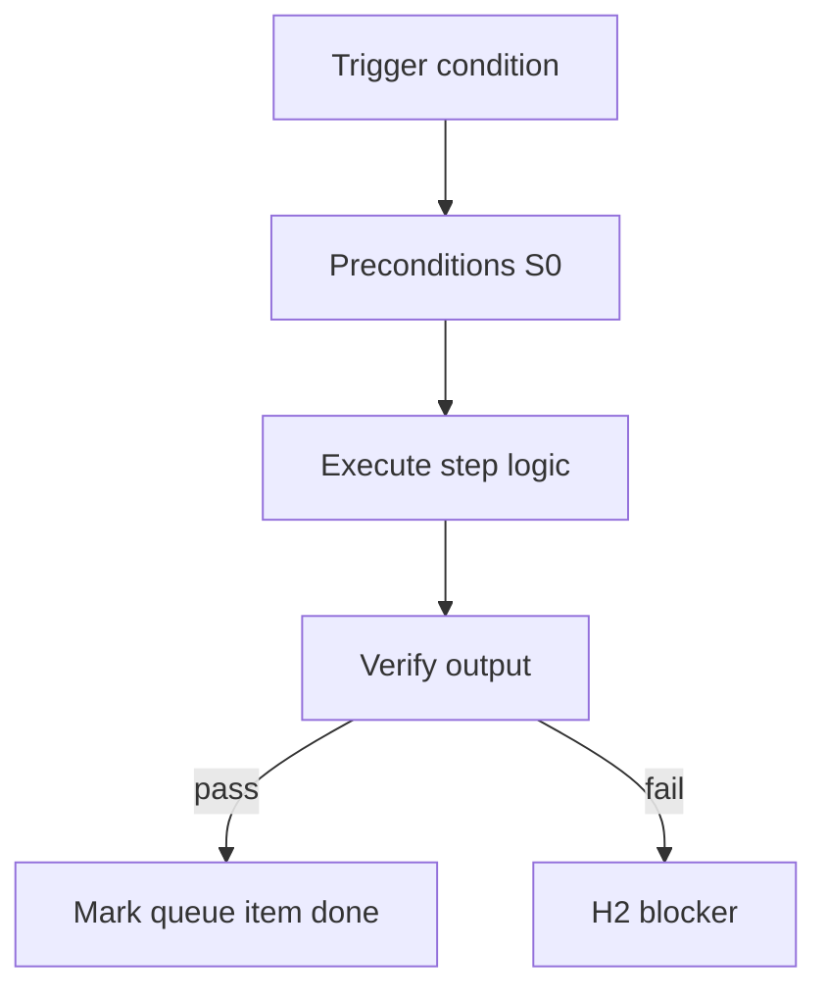

<!-- Complete pass 3 2026-06-28 F5.1 -->

# F5.1: cross-pack imports micro-packs

**Parent:** [F5-index](F5-index.md) · **Branch F** · **Vision §8** · **Release:** v2.22

## Reader narrative
<!-- prose-source: agent plane-f 2026-06-28 -->

Cross-pack imports let a company pack compose micro-packs—studio pack imports generic HR/onboarding, data pack imports security baseline—via declared import list in company.yaml or manifest. Imports merge roles, playbooks, and verify fragments without copying entire foreign packs into consumer repos.

Import resolution is S0 at instantiation; broken import path is H2 with missing pack id. Imports must respect ceiling ([F5.3](F5.3-no-repo-outside-template-packs-ceiling.md))—only template-packs namespace, not ad hoc paths. Provenance links support SEC-14 gap analysis and [D5.3](D5.3-fork-new-catalog-entry-provenance.md) when imported fragment diverges.

## Purpose

F5.1 defines cross pack imports micro packs for the agent-driven expert system. Organization — template-packs as whole-company ceiling.
## Scope

- Owns `F5.1` only; siblings under `F5` must not duplicate this spec.
- Aligns with minimal HITL: H1 plan, H2 blocker, H3 sign-off ([INTRO-1.2](INTRO-1.2-human-touchpoint-contract-h1-h2-h3.md)).
- Conflicts resolve in favor of [Vision §8 — Branch F — Organization plane (template-packs = ceiling)](../../full-automation-vision-and-hierarchy.md#8-branch-f-organization-plane-template-packs-ceiling).

```
│   ├── F5.1 pack imports (studio pack imports generic HR/onboarding micro-pack)
```
## Behavior / step logic
<!-- timeline-source: agent cursor-agent 2026-06-28 -->

1. When program-scoper instantiates a company pursuit, S0 resolves the declared import list in company.yaml—merging roles, playbooks, and verify fragments from micro-packs into the active pack without copying foreign packs into the consumer repo.
2. Resolved imports bind to state.company.pack_id and active_role so conductor routing and [B5.2](B5.2-role-to-pipeline-id-skills-tool-permissions.md) tool permissions reflect the composed organization model on every wake.
3. Import paths must stay inside the template-packs namespace per [F5.3](F5.3-no-repo-outside-template-packs-ceiling.md); ad hoc filesystem paths are rejected before pursuit advances.
4. When an imported fragment diverges from its source micro-pack, provenance links feed [D5.3](D5.3-fork-new-catalog-entry-provenance.md) and SEC-14 gap analysis without blocking unrelated product turns.
5. If import resolution fails—missing pack id or broken path—pursuit stops at H2 with the unresolved import recorded in journal and state.json until the operator fixes the manifest at H1.



## JSON example

```json
{
  "node": "F5.1",
  "description": "cross pack imports micro packs",
  "state": { "ref": "APP-B-state-json-sketch.md" },
  "implemented_in_release": "v2.14+"
}
```


## Repo artifacts (this branch)

- `template-packs/`
- `program/integration/manifest.md`
- `.cursor/skills/program-scoper/`

## Edge cases

- Operator closes laptop mid-loop — state.json must resume from last good dual-write.
- Concurrent manual edit to queue JSON — conductor reloads queue each wake; last writer wins with journal note.
- Pack role handoff while lane lease held — complete-work-order releases lease before role switch.
- Edge case `F5.1` variant 4: verify state dual-write before continuing pursuit.
- Pass 3: add regression test or evidence path specific to `F5.1`.
- Pass 3: cross-link related nodes in same branch index.

## Failure modes

- **Silent stop:** Agent ends turn without updating queue → mitigated by /loop + check-hierarchy-queue.py EMPTY gate.
- **False complete:** Item marked done without artifact → audit-hierarchy-depth.py re-enqueues deepen pass.
- **Scope bleed:** Worker edits journal/state during planning-only expansion → forbidden in vision-expansion-prompt.
- **Stale design:** Upstream vision § changes → reconcile-stale adds deepen items for affected ids.

## Concrete implementation

1. Add `company.yaml` + `roles/*.yaml` to template-packs schema.
2. program-scoper selects pack; sets state.company.active_role.
3. Per-role allowed_reads in lane.json work orders.
4. Validate `F5.1` against SEC-15 release checklist and parent index links.
5. Document `F5.1` in parent index with verify command and release tag.
6. Add checklist row in SEC-15 release doc for `F5.1`.

## Verification

| Check | Command |
|-------|---------|
| Completeness | `python scripts/automation/audit-hierarchy-depth.py --strict --ids F5.1` |
| Conformance | `python scripts/validate-workflow.py` |
| Task evidence | `python scripts/verify-router.py` when implement task exists |

## Dependencies

| Link | Why |
|------|-----|
| [full-automation-vision-and-hierarchy.md](../../full-automation-vision-and-hierarchy.md) §8 | Master hierarchy |
| [F5-index](F5-index.md) | Parent grouping |
| [genius-conductor-tiered-routing.md](../../genius-conductor-tiered-routing.md) | S0–S4 routing |

## Acceptance criteria

- [ ] `python scripts/automation/audit-hierarchy-depth.py --strict --ids F5.1` passes
- [ ] Named script, skill, or test path exists or is listed in SEC-15 release row
- [ ] Linked from [F5-index](F5-index.md)
- [ ] `python scripts/validate-workflow.py` passes after implement

## Cross-links

- [hierarchy-expander SKILL](../../../.cursor/skills/hierarchy-expander/SKILL.md)
