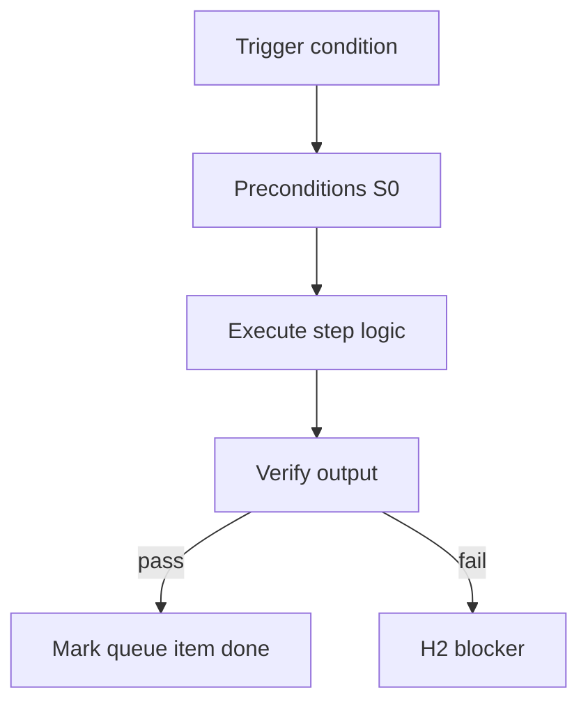

<!-- Complete pass 3 2026-06-28 F5.2 -->

# F5.2: template-packs _shared library

**Parent:** [F5-index](F5-index.md) · **Branch F** · **Vision §8** · **Release:** v2.22

## Reader narrative
<!-- prose-source: agent plane-f 2026-06-28 -->

`template-packs/_shared/` is the generic library: onboarding micro-packs, security baselines, common verify hooks, and reusable role fragments consumed by industry packs via [F5.1](F5.1-cross-pack-imports-micro-packs.md). Shared content versions independently from game studio or data platform packs.

Authors promote mature fragments from product repos into _shared via Plane D pack fragment export ([D4.6](D4.6-platform-work-pack-fragment-export.md)). INDEX and catalog regeneration ([E1.7](E1.7-catalog-platform-catalog-md-umbrella.md)) must list _shared entries for compose-first discovery. Editing _shared affects all importers—extend with backwards compatibility ([D5.2](D5.2-extend-backwards-compatible-staleness-bump.md)) or fork ([D5.3](D5.3-fork-new-catalog-entry-provenance.md)).

## Purpose

F5.2 defines template packs  shared library for the agent-driven expert system. Organization — template-packs as whole-company ceiling.
## Scope

- Owns `F5.2` only; siblings under `F5` must not duplicate this spec.
- Aligns with minimal HITL: H1 plan, H2 blocker, H3 sign-off ([INTRO-1.2](INTRO-1.2-human-touchpoint-contract-h1-h2-h3.md)).
- Conflicts resolve in favor of [Vision §8 — Branch F — Organization plane (template-packs = ceiling)](../../full-automation-vision-and-hierarchy.md#8-branch-f-organization-plane-template-packs-ceiling).

```
│   ├── F5.2 shared generic packs library under template-packs/_shared/
```
## Behavior / step logic
<!-- timeline-source: agent cli-composer-2.5 2026-06-28 -->

1. `scripts/automation/run-local-pipeline.py` is the SDK/local daemon entry for `goal_autopilot`—repeated Continue-equivalent steps without manual `/continue`, using the same journal/state contract as IDE pursuit per [A3.4](A3.4-sdk-daemon-run-local-pipeline-24-7.md).
2. Before each iteration the daemon runs S0 `check-pipeline-blocked.py` and halts on human gates, budget exhaustion, or integrity failures from Plane A stop rules.
3. The daemon spawns Cursor agents or SDK equivalents per `docs/operator/model-policy.json`; unattended 24/7 operation still respects H2 blockers and H3 sign-off—no silent gate waiver.
4. Each completed iteration expects conductor-style dual-write to journal and state.json; daemon logs pair with [H5](H5-worker-runs.md) for audit when agent turns fail or time out.
5. If `state.json` is corrupt or autopilot would advance past `evidence_required` without `last_verify: passed`, the daemon exits non-zero and leaves pursuit blocked at H2 rather than looping blindly.



## JSON example

```json
{
  "node": "F5.2",
  "description": "template packs  shared library",
  "state": { "ref": "APP-B-state-json-sketch.md" },
  "implemented_in_release": "v2.14+"
}
```


## Repo artifacts (this branch)

- `template-packs/`
- `program/integration/manifest.md`
- `.cursor/skills/program-scoper/`

## Edge cases

- Operator closes laptop mid-loop — state.json must resume from last good dual-write.
- Concurrent manual edit to queue JSON — conductor reloads queue each wake; last writer wins with journal note.
- Pack role handoff while lane lease held — complete-work-order releases lease before role switch.
- Edge case `F5.2` variant 4: verify state dual-write before continuing pursuit.
- Pass 3: add regression test or evidence path specific to `F5.2`.
- Pass 3: cross-link related nodes in same branch index.

## Failure modes

- **Silent stop:** Agent ends turn without updating queue → mitigated by /loop + check-hierarchy-queue.py EMPTY gate.
- **False complete:** Item marked done without artifact → audit-hierarchy-depth.py re-enqueues deepen pass.
- **Scope bleed:** Worker edits journal/state during planning-only expansion → forbidden in vision-expansion-prompt.
- **Stale design:** Upstream vision § changes → reconcile-stale adds deepen items for affected ids.

## Concrete implementation

1. Add `company.yaml` + `roles/*.yaml` to template-packs schema.
2. program-scoper selects pack; sets state.company.active_role.
3. Per-role allowed_reads in lane.json work orders.
4. Validate `F5.2` against SEC-15 release checklist and parent index links.
5. Document `F5.2` in parent index with verify command and release tag.
6. Add checklist row in SEC-15 release doc for `F5.2`.

## Verification

| Check | Command |
|-------|---------|
| Completeness | `python scripts/automation/audit-hierarchy-depth.py --strict --ids F5.2` |
| Conformance | `python scripts/validate-workflow.py` |
| Task evidence | `python scripts/verify-router.py` when implement task exists |

## Dependencies

| Link | Why |
|------|-----|
| [full-automation-vision-and-hierarchy.md](../../full-automation-vision-and-hierarchy.md) §8 | Master hierarchy |
| [F5-index](F5-index.md) | Parent grouping |
| [genius-conductor-tiered-routing.md](../../genius-conductor-tiered-routing.md) | S0–S4 routing |

## Acceptance criteria

- [ ] `python scripts/automation/audit-hierarchy-depth.py --strict --ids F5.2` passes
- [ ] Named script, skill, or test path exists or is listed in SEC-15 release row
- [ ] Linked from [F5-index](F5-index.md)
- [ ] `python scripts/validate-workflow.py` passes after implement

## Cross-links

- [hierarchy-expander SKILL](../../../.cursor/skills/hierarchy-expander/SKILL.md)
