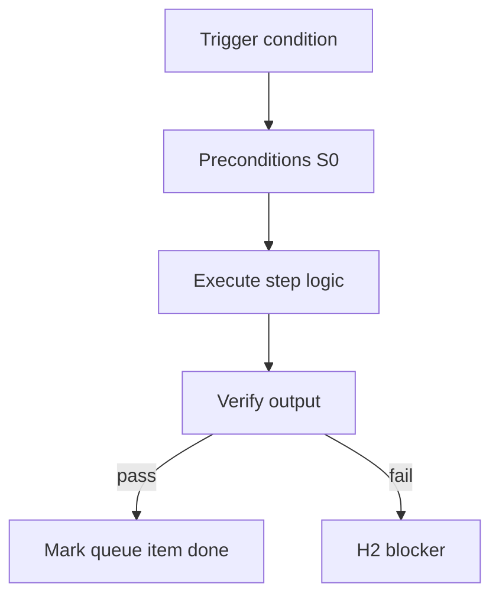

<!-- Complete pass 3 2026-06-28 F5.3 -->

# F5.3: no repo outside template-packs ceiling

**Parent:** [F5-index](F5-index.md) · **Branch F** · **Vision §8** · **Release:** v2.22

## Reader narrative
<!-- prose-source: agent plane-f 2026-06-28 -->

The template-packs ceiling rule: no organizational authority lives outside `template-packs/` for pack-defined roles, pipelines, governance, and verify suites. Consumer repos instantiate packs; they do not silently fork company.yaml, roles, or pipelines into undocumented paths—this capability enforces auditability.

Urgent hotfixes flow through pack version bump, import, or operator policy override recorded in journal—not permanent shadow copies. Platform promotion targets pack fragments ([D4.6](D4.6-platform-work-pack-fragment-export.md)); consumer-only patterns fail maturity claims. Vision §8 treats template-packs as whole-company organizational ceiling.

## Purpose

F5.3 defines no repo outside template packs ceiling for the agent-driven expert system. Organization — template-packs as whole-company ceiling.
## Scope

- Owns `F5.3` only; siblings under `F5` must not duplicate this spec.
- Aligns with minimal HITL: H1 plan, H2 blocker, H3 sign-off ([INTRO-1.2](INTRO-1.2-human-touchpoint-contract-h1-h2-h3.md)).
- Conflicts resolve in favor of [Vision §8 — Branch F — Organization plane (template-packs = ceiling)](../../full-automation-vision-and-hierarchy.md#8-branch-f-organization-plane-template-packs-ceiling).

```
│   └── F5.3 no repo outside template-packs ceiling
```
## Behavior / step logic
<!-- timeline-source: agent cli-composer-2.5 2026-06-28 -->

1. `state.hitl` records `pending` as H1 plan approval, H2 blocker, H3 sign-off, or null when pursuit is unblocked, plus `since` and a payload with structured reason, goal_id, missing artifact, and suggested operator action per [INTRO-1.2](INTRO-1.2-human-touchpoint-contract-h1-h2-h3.md).
2. S0 preflight and check-pipeline-blocked read `hitl.pending` each wake; any non-null touchpoint halts autopilot until the conductor dual-writes clearance or the operator supplies an explicit approval or waiver phrase in the journal.
3. Under [J3](J3-strict-hitl.md) strict mode every H1/H2/H3 requires explicit operator clearance; default self-gate allows evidence-backed middle gates without treating Continue as approval ([A5.2](A5.2-continue-not-approval-self-gate-h1-h3-only.md)).
4. Operators may observe pursuit status without clearing `hitl.pending` ([A6.3](A6.3-operator-observe-without-unblocking-loop.md)); outbound notifications fire on H2/H3 only via [I5.2](I5.2-runtime-notify-webhook-email-h2-h3-only.md), not on every pursuit step.
5. If `hitl.pending` is H2 but the payload lacks required fields, the loop fail-closes and keeps goal.state blocked until dual-write restores a valid touchpoint record.



## JSON example

```json
{
  "node": "F5.3",
  "description": "no repo outside template packs ceiling",
  "state": { "ref": "APP-B-state-json-sketch.md" },
  "implemented_in_release": "v2.14+"
}
```


## Repo artifacts (this branch)

- `template-packs/`
- `program/integration/manifest.md`
- `.cursor/skills/program-scoper/`

## Edge cases

- Operator closes laptop mid-loop — state.json must resume from last good dual-write.
- Concurrent manual edit to queue JSON — conductor reloads queue each wake; last writer wins with journal note.
- Pack role handoff while lane lease held — complete-work-order releases lease before role switch.
- Edge case `F5.3` variant 4: verify state dual-write before continuing pursuit.
- Pass 3: add regression test or evidence path specific to `F5.3`.
- Pass 3: cross-link related nodes in same branch index.

## Failure modes

- **Silent stop:** Agent ends turn without updating queue → mitigated by /loop + check-hierarchy-queue.py EMPTY gate.
- **False complete:** Item marked done without artifact → audit-hierarchy-depth.py re-enqueues deepen pass.
- **Scope bleed:** Worker edits journal/state during planning-only expansion → forbidden in vision-expansion-prompt.
- **Stale design:** Upstream vision § changes → reconcile-stale adds deepen items for affected ids.

## Concrete implementation

1. Add `company.yaml` + `roles/*.yaml` to template-packs schema.
2. program-scoper selects pack; sets state.company.active_role.
3. Per-role allowed_reads in lane.json work orders.
4. Validate `F5.3` against SEC-15 release checklist and parent index links.
5. Document `F5.3` in parent index with verify command and release tag.
6. Add checklist row in SEC-15 release doc for `F5.3`.

## Verification

| Check | Command |
|-------|---------|
| Completeness | `python scripts/automation/audit-hierarchy-depth.py --strict --ids F5.3` |
| Conformance | `python scripts/validate-workflow.py` |
| Task evidence | `python scripts/verify-router.py` when implement task exists |

## Dependencies

| Link | Why |
|------|-----|
| [full-automation-vision-and-hierarchy.md](../../full-automation-vision-and-hierarchy.md) §8 | Master hierarchy |
| [F5-index](F5-index.md) | Parent grouping |
| [genius-conductor-tiered-routing.md](../../genius-conductor-tiered-routing.md) | S0–S4 routing |

## Acceptance criteria

- [ ] `python scripts/automation/audit-hierarchy-depth.py --strict --ids F5.3` passes
- [ ] Named script, skill, or test path exists or is listed in SEC-15 release row
- [ ] Linked from [F5-index](F5-index.md)
- [ ] `python scripts/validate-workflow.py` passes after implement

## Cross-links

- [hierarchy-expander SKILL](../../../.cursor/skills/hierarchy-expander/SKILL.md)
