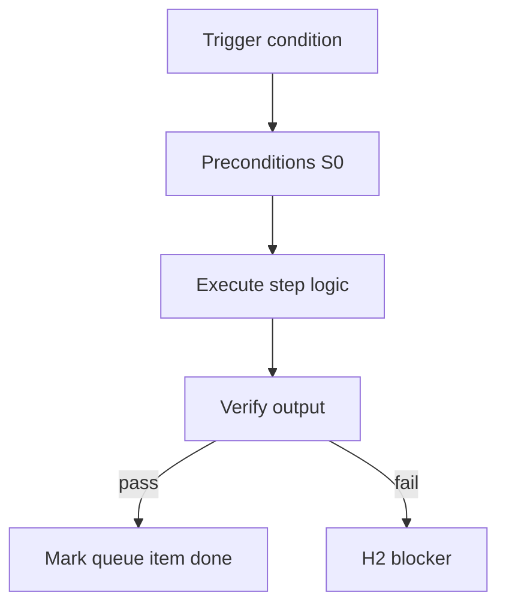

<!-- Complete pass 3 2026-06-28 G1.1 -->

# G1.1: task verify-router verifier

**Parent:** [G1-index](G1-index.md) · **Branch G** · **Vision §9** · **Release:** exists

## Reader narrative
<!-- prose-source: agent plane-g 2026-06-28 -->

Task-level verification runs through `scripts/verify-router.py` and the verifier skill: the conductor or shell worker executes the literal Test or Tool command from the task card, writes `evidence/task-NNN-test.log`, and sets `last_verify` in state.json before any implement task advances.

This is the bottom evidence gate—no narrative “tests pass” substitutes for a log file. Non-pytest evidence types follow `docs/operator/evidence-types.md`. Pair with [G1.2](G1.2-evidence-required-state.md) and [B2.4](B2.4-verifier-tool-operator-evidence.md). See [Vision §9 — Branch G](../../full-automation-vision-and-hierarchy.md#9-branch-g-verification-quality-plane-anti-mistake).

## Purpose

G1.1 defines task verify router verifier for the agent-driven expert system. Verification & quality — evidence, goal_verify, anti-mistake.
## Scope

- Owns `G1.1` only; siblings under `G1` must not duplicate this spec.
- Aligns with minimal HITL: H1 plan, H2 blocker, H3 sign-off ([INTRO-1.2](INTRO-1.2-human-touchpoint-contract-h1-h2-h3.md)).
- Conflicts resolve in favor of [Vision §9 — Branch G — Verification & quality plane (anti-mistake)](../../full-automation-vision-and-hierarchy.md#9-branch-g-verification-quality-plane-anti-mistake).

```
│   ├── G1.1 task-level verify-router / verifier
```
## Behavior / step logic
<!-- timeline-source: agent cli-composer-2.5 2026-06-28 -->

1. When an implement task has `evidence_required: true`, the verifier skill or `verify-router.py` runs the task card Test/Tool command and writes an immutable log under `evidence/` before the conductor sets `last_verify` to passed.
2. The conductor records each evidence path in journal **Evidence files** and `state.json` `evidence_files` so audits and goal_verify can aggregate proof across tasks ([G1.1](G1.1-task-verify-router-verifier.md), [C3.3](C3.3-evidence-per-task.md)).
3. Non-pytest evidence types—tool logs, checksums, screenshots—follow `docs/operator/evidence-types.md` per [I4.3](I4.3-runtime-external-evidence-types-non-pytest.md); failed verify runs retain logs for escalation instead of silent discard ([B3.3](B3.3-escalation-loop-on-verify-fail.md)).
4. Pursuit does not advance past the current implement task while `evidence_required` is true and required logs are missing from disk—`check-pipeline-blocked` returns a hard stop.
5. git-workflow and push require `last_verify: passed` or a documented journal exception; if evidence paths drift between disk, journal, and state.json, pursuit fail-closes at H2 until reconciliation.



## JSON example

```json
{
  "goal": {
    "verify_command": "python scripts/goal-verify.py",
    "state": "verifying"
  },
  "last_verify": "passed",
  "evidence_required": true
}
```


## Repo artifacts (this branch)

- `scripts/verify-router.py`
- `scripts/validate-workflow.py`
- `evidence/`
- `.cursor/skills/verifier/`

## Edge cases

- Operator closes laptop mid-loop — state.json must resume from last good dual-write.
- Concurrent manual edit to queue JSON — conductor reloads queue each wake; last writer wins with journal note.
- Flaky test — escalation S4 once, then H2 with evidence log; no silent retry loop.
- Edge case `G1.1` variant 4: verify state dual-write before continuing pursuit.
- Pass 3: add regression test or evidence path specific to `G1.1`.
- Pass 3: cross-link related nodes in same branch index.

## Failure modes

- **Silent stop:** Agent ends turn without updating queue → mitigated by /loop + check-hierarchy-queue.py EMPTY gate.
- **False complete:** Item marked done without artifact → audit-hierarchy-depth.py re-enqueues deepen pass.
- **Scope bleed:** Worker edits journal/state during planning-only expansion → forbidden in vision-expansion-prompt.
- **Stale design:** Upstream vision § changes → reconcile-stale adds deepen items for affected ids.

## Concrete implementation

1. Extend verify-router for goal-level suite invocation.
2. Wire CI: validate-workflow checks goal block when pursuit.mode=goal_autopilot.
3. Document evidence type in docs/operator/evidence-types.md.
4. Validate `G1.1` against SEC-15 release checklist and parent index links.
5. Document `G1.1` in parent index with verify command and release tag.
6. Add checklist row in SEC-15 release doc for `G1.1`.

## Verification

| Check | Command |
|-------|---------|
| Completeness | `python scripts/automation/audit-hierarchy-depth.py --strict --ids G1.1` |
| Conformance | `python scripts/validate-workflow.py` |
| Task evidence | `python scripts/verify-router.py` when implement task exists |

## Dependencies

| Link | Why |
|------|-----|
| [full-automation-vision-and-hierarchy.md](../../full-automation-vision-and-hierarchy.md) §9 | Master hierarchy |
| [G1-index](G1-index.md) | Parent grouping |
| [genius-conductor-tiered-routing.md](../../genius-conductor-tiered-routing.md) | S0–S4 routing |

## Acceptance criteria

- [ ] `python scripts/automation/audit-hierarchy-depth.py --strict --ids G1.1` passes
- [ ] Named script, skill, or test path exists or is listed in SEC-15 release row
- [ ] Linked from [G1-index](G1-index.md)
- [ ] `python scripts/validate-workflow.py` passes after implement

## Cross-links

- [hierarchy-expander SKILL](../../../.cursor/skills/hierarchy-expander/SKILL.md)
