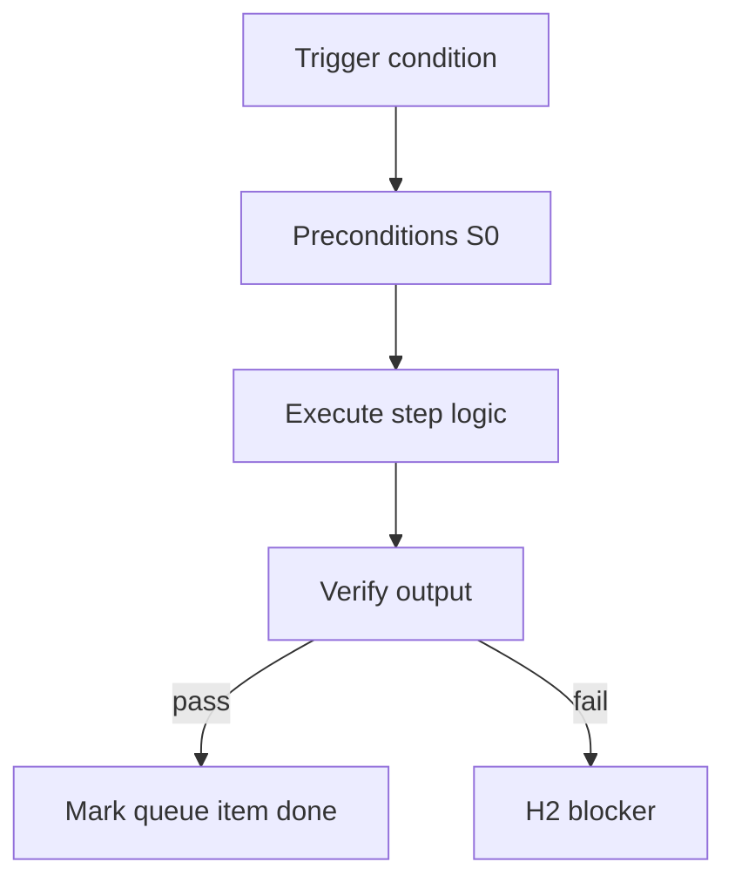

<!-- Complete pass 3 2026-06-28 G1.2 -->

# G1.2: evidence_required state

**Parent:** [G1-index](G1-index.md) · **Branch G** · **Vision §9** · **Release:** exists

## Reader narrative
<!-- prose-source: agent plane-g 2026-06-28 -->

When `evidence_required: true` in state.json, the pursuit loop must not advance past the current implement task until `evidence_files` exist and `last_verify` is `passed`. The conductor and workers treat this flag as fail-closed policy, not a journal suggestion.

Git-workflow push is blocked while evidence is missing or verify failed—documented exceptions belong in the journal with operator approval. This capability encodes the evidence-required workspace rule for every pack that ships with verification discipline.

## Purpose

G1.2 defines evidence required state for the agent-driven expert system. Verification & quality — evidence, goal_verify, anti-mistake.
## Scope

- Owns `G1.2` only; siblings under `G1` must not duplicate this spec.
- Aligns with minimal HITL: H1 plan, H2 blocker, H3 sign-off ([INTRO-1.2](INTRO-1.2-human-touchpoint-contract-h1-h2-h3.md)).
- Conflicts resolve in favor of [Vision §9 — Branch G — Verification & quality plane (anti-mistake)](../../full-automation-vision-and-hierarchy.md#9-branch-g-verification-quality-plane-anti-mistake).

```
│   ├── G1.2 evidence_required in state
```
## Behavior / step logic
<!-- timeline-source: agent cli-composer-2.5 2026-06-28 -->

1. When evidence_required: true in state.json, the pursuit loop must not advance past the current implement task until evidence_files exist and last_verify is passed
2. Git-workflow push is blocked while evidence is missing or verify failed—documented exceptions belong in the journal with operator approval
3. Run verify-router for task-level commands; persist log under `evidence/`.
4. Set `last_verify=passed|failed` in state before advancing implement tasks.
5. Block git-workflow push when evidence_required and verify not passed.



## JSON example

```json
{
  "goal": {
    "verify_command": "python scripts/goal-verify.py",
    "state": "verifying"
  },
  "last_verify": "passed",
  "evidence_required": true
}
```


## Repo artifacts (this branch)

- `scripts/verify-router.py`
- `scripts/validate-workflow.py`
- `evidence/`
- `.cursor/skills/verifier/`

## Edge cases

- Operator closes laptop mid-loop — state.json must resume from last good dual-write.
- Concurrent manual edit to queue JSON — conductor reloads queue each wake; last writer wins with journal note.
- Flaky test — escalation S4 once, then H2 with evidence log; no silent retry loop.
- Edge case `G1.2` variant 4: verify state dual-write before continuing pursuit.
- Pass 3: add regression test or evidence path specific to `G1.2`.
- Pass 3: cross-link related nodes in same branch index.

## Failure modes

- **Silent stop:** Agent ends turn without updating queue → mitigated by /loop + check-hierarchy-queue.py EMPTY gate.
- **False complete:** Item marked done without artifact → audit-hierarchy-depth.py re-enqueues deepen pass.
- **Scope bleed:** Worker edits journal/state during planning-only expansion → forbidden in vision-expansion-prompt.
- **Stale design:** Upstream vision § changes → reconcile-stale adds deepen items for affected ids.

## Concrete implementation

1. Extend verify-router for goal-level suite invocation.
2. Wire CI: validate-workflow checks goal block when pursuit.mode=goal_autopilot.
3. Document evidence type in docs/operator/evidence-types.md.
4. Validate `G1.2` against SEC-15 release checklist and parent index links.
5. Document `G1.2` in parent index with verify command and release tag.
6. Add checklist row in SEC-15 release doc for `G1.2`.

## Verification

| Check | Command |
|-------|---------|
| Completeness | `python scripts/automation/audit-hierarchy-depth.py --strict --ids G1.2` |
| Conformance | `python scripts/validate-workflow.py` |
| Task evidence | `python scripts/verify-router.py` when implement task exists |

## Dependencies

| Link | Why |
|------|-----|
| [full-automation-vision-and-hierarchy.md](../../full-automation-vision-and-hierarchy.md) §9 | Master hierarchy |
| [G1-index](G1-index.md) | Parent grouping |
| [genius-conductor-tiered-routing.md](../../genius-conductor-tiered-routing.md) | S0–S4 routing |

## Acceptance criteria

- [ ] `python scripts/automation/audit-hierarchy-depth.py --strict --ids G1.2` passes
- [ ] Named script, skill, or test path exists or is listed in SEC-15 release row
- [ ] Linked from [G1-index](G1-index.md)
- [ ] `python scripts/validate-workflow.py` passes after implement

## Cross-links

- [hierarchy-expander SKILL](../../../.cursor/skills/hierarchy-expander/SKILL.md)
