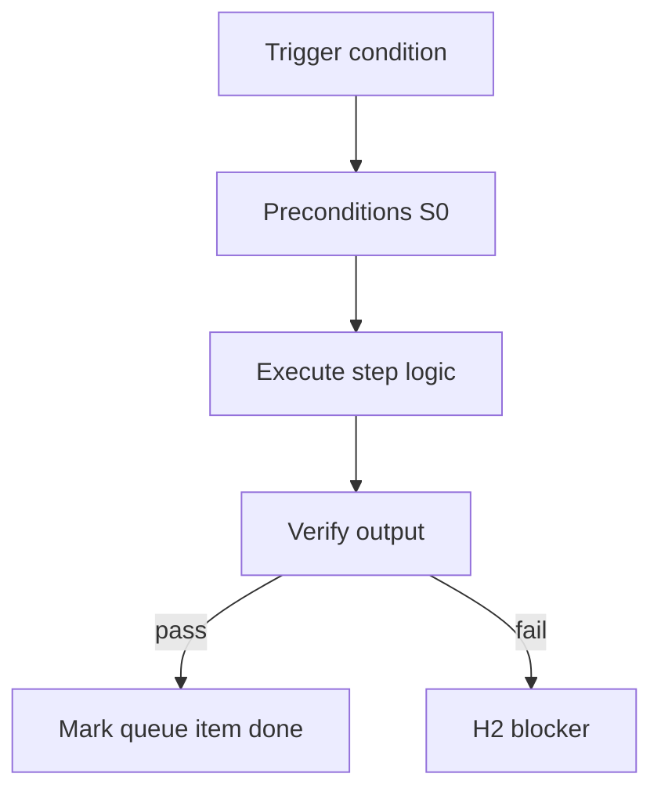

<!-- Complete pass 3 2026-06-28 G2.2 -->

# G2.2: goal_verify aggregates unit integration e2e tool

**Parent:** [G2-index](G2-index.md) · **Branch G** · **Vision §9** · **Release:** v2.14

## Reader narrative
<!-- prose-source: agent plane-g 2026-06-28 -->

Goal verify aggregates evidence from every task tier: unit tests under `tests/unit/`, integration under `tests/integration/`, e2e/UI under `tests/e2e/` when the app has a UI, plus tool-command logs referenced on task cards. verify-router task passes must all be `passed` before goal verify runs.

Fail closed if any required evidence path is absent from state—even when the latest task alone passed. This prevents partial batches from reaching H3 while earlier tasks lack logs. Regression scope follows pack policy and [C5.1](C5.1-src-tests-e2e-delivery.md) delivery layout.

## Purpose

G2.2 defines goal verify aggregates unit integration e2e tool for the agent-driven expert system. Verification & quality — evidence, goal_verify, anti-mistake.
## Scope

- Owns `G2.2` only; siblings under `G2` must not duplicate this spec.
- Aligns with minimal HITL: H1 plan, H2 blocker, H3 sign-off ([INTRO-1.2](INTRO-1.2-human-touchpoint-contract-h1-h2-h3.md)).
- Conflicts resolve in favor of [Vision §9 — Branch G — Verification & quality plane (anti-mistake)](../../full-automation-vision-and-hierarchy.md#9-branch-g-verification-quality-plane-anti-mistake).

```
│   ├── G2.2 aggregates unit + integration + e2e + tool outputs
```
## Behavior / step logic
<!-- timeline-source: agent cursor-agent 2026-06-28 -->

1. When goal scope completes per [A2.4](A2.4-goal-scope-complete-run-goal-verify.md), pursuit invokes goal_verify only after every task-card evidence path in state shows `last_verify=passed` from [G1.1](G1.1-task-verify-router-verifier.md) across unit, integration, e2e, and tool tiers per [C5.1](C5.1-src-tests-e2e-delivery.md).
2. The resolved `goal.verify_command` from [G2.1](G2.1-goal-verify-command-state-pack.md) aggregates required evidence files—unit under `tests/unit/`, integration under `tests/integration/`, e2e/UI under `tests/e2e/` when the app has a UI, plus tool-command logs referenced on task cards.
3. If any required evidence path is absent from state or `last_verify` is not `passed`—even when the latest implement task alone succeeded—goal_verify exits non-zero and pursuit halts at H2 rather than advancing toward H3.
4. Regression scope follows active pack policy and delivery layout so partial implement batches cannot reach H3 while earlier tasks lack logs.
5. On pass, `goal.state` transitions through verifying toward H3 pending per [G2.3](G2.3-goal-verify-blocks-h3-until-pass.md); on aggregation failure pursuit stays fail-closed until evidence is reconciled.



## JSON example

```json
{
  "goal": {
    "verify_command": "python scripts/goal-verify.py",
    "state": "verifying"
  },
  "last_verify": "passed",
  "evidence_required": true
}
```


## Repo artifacts (this branch)

- `scripts/verify-router.py`
- `scripts/validate-workflow.py`
- `evidence/`
- `.cursor/skills/verifier/`

## Edge cases

- Operator closes laptop mid-loop — state.json must resume from last good dual-write.
- Concurrent manual edit to queue JSON — conductor reloads queue each wake; last writer wins with journal note.
- Flaky test — escalation S4 once, then H2 with evidence log; no silent retry loop.
- Edge case `G2.2` variant 4: verify state dual-write before continuing pursuit.
- Pass 3: add regression test or evidence path specific to `G2.2`.
- Pass 3: cross-link related nodes in same branch index.

## Failure modes

- **Silent stop:** Agent ends turn without updating queue → mitigated by /loop + check-hierarchy-queue.py EMPTY gate.
- **False complete:** Item marked done without artifact → audit-hierarchy-depth.py re-enqueues deepen pass.
- **Scope bleed:** Worker edits journal/state during planning-only expansion → forbidden in vision-expansion-prompt.
- **Stale design:** Upstream vision § changes → reconcile-stale adds deepen items for affected ids.

## Concrete implementation

1. Extend verify-router for goal-level suite invocation.
2. Wire CI: validate-workflow checks goal block when pursuit.mode=goal_autopilot.
3. Document evidence type in docs/operator/evidence-types.md.
4. Validate `G2.2` against SEC-15 release checklist and parent index links.
5. Document `G2.2` in parent index with verify command and release tag.
6. Add checklist row in SEC-15 release doc for `G2.2`.

## Verification

| Check | Command |
|-------|---------|
| Completeness | `python scripts/automation/audit-hierarchy-depth.py --strict --ids G2.2` |
| Conformance | `python scripts/validate-workflow.py` |
| Task evidence | `python scripts/verify-router.py` when implement task exists |

## Dependencies

| Link | Why |
|------|-----|
| [full-automation-vision-and-hierarchy.md](../../full-automation-vision-and-hierarchy.md) §9 | Master hierarchy |
| [G2-index](G2-index.md) | Parent grouping |
| [genius-conductor-tiered-routing.md](../../genius-conductor-tiered-routing.md) | S0–S4 routing |

## Acceptance criteria

- [ ] `python scripts/automation/audit-hierarchy-depth.py --strict --ids G2.2` passes
- [ ] Named script, skill, or test path exists or is listed in SEC-15 release row
- [ ] Linked from [G2-index](G2-index.md)
- [ ] `python scripts/validate-workflow.py` passes after implement

## Cross-links

- [hierarchy-expander SKILL](../../../.cursor/skills/hierarchy-expander/SKILL.md)
