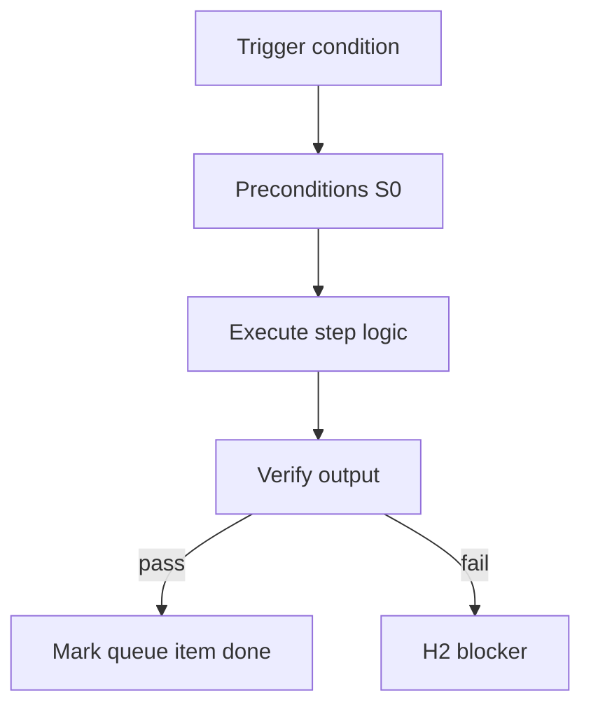

<!-- Complete pass 3 2026-06-28 G2.3 -->

# G2.3: goal_verify blocks H3 until pass

**Parent:** [G2-index](G2-index.md) · **Branch G** · **Vision §9** · **Release:** v2.14

## Reader narrative
<!-- prose-source: agent plane-g 2026-06-28 -->

Human H3 sign-off stays blocked until `goal.verify_command` exits zero. Passing task-level evidence alone does not set `hitl.pending=H3`; goal verify success transitions `goal.state` through verifying and only then surfaces H3 for operator acceptance.

Automatic H3 clearance on implement completion is forbidden—operators sign verified outcomes, not assumed ones ([INTRO-1.2](INTRO-1.2-human-touchpoint-contract-h1-h2-h3.md)). Failed goal verify packages structured H2 with aggregated log paths; pursuit resumes only after fix and re-run.

## Purpose

G2.3 defines goal verify blocks h3 until pass for the agent-driven expert system. Verification & quality — evidence, goal_verify, anti-mistake.
## Scope

- Owns `G2.3` only; siblings under `G2` must not duplicate this spec.
- Aligns with minimal HITL: H1 plan, H2 blocker, H3 sign-off ([INTRO-1.2](INTRO-1.2-human-touchpoint-contract-h1-h2-h3.md)).
- Conflicts resolve in favor of [Vision §9 — Branch G — Verification & quality plane (anti-mistake)](../../full-automation-vision-and-hierarchy.md#9-branch-g-verification-quality-plane-anti-mistake).

```
│   ├── G2.3 blocks H3 until pass
```
## Behavior / step logic
<!-- timeline-source: agent cursor-agent 2026-06-28 -->

1. When scope completes, pursuit runs `goal.verify_command` per [G2.1](G2.1-goal-verify-command-state-pack.md) and sets `goal.state` to verifying before any H3 prompt is surfaced.
2. Task-level `last_verify: passed` from [G1.1](G1.1-task-verify-router-verifier.md) alone does not set `hitl.pending=H3`—goal verify exit zero is required per [A2.5](A2.5-goal-verify-pass-transition-h3-pending.md).
3. On goal verify pass, the conductor dual-writes verifying → H3 pending and waits for explicit operator sign-off per [INTRO-1.2](INTRO-1.2-human-touchpoint-contract-h1-h2-h3.md)—automatic H3 clearance on implement completion is forbidden.
4. Failed goal verify aggregates unit, integration, e2e, and tool logs per [G2.2](G2.2-goal-verify-aggregates-unit-integration-e2e-tool.md) into structured H2 notes; pursuit resumes only after fix and re-run.
5. If goal verify is bypassed, evidence is stale, or H3 is requested before verify passes, pursuit stops at H2 fail-closed rather than marking the goal achieved.



## JSON example

```json
{
  "goal": {
    "verify_command": "python scripts/goal-verify.py",
    "state": "verifying"
  },
  "last_verify": "passed",
  "evidence_required": true
}
```


## Repo artifacts (this branch)

- `scripts/verify-router.py`
- `scripts/validate-workflow.py`
- `evidence/`
- `.cursor/skills/verifier/`

## Edge cases

- Operator closes laptop mid-loop — state.json must resume from last good dual-write.
- Concurrent manual edit to queue JSON — conductor reloads queue each wake; last writer wins with journal note.
- Flaky test — escalation S4 once, then H2 with evidence log; no silent retry loop.
- Edge case `G2.3` variant 4: verify state dual-write before continuing pursuit.
- Pass 3: add regression test or evidence path specific to `G2.3`.
- Pass 3: cross-link related nodes in same branch index.

## Failure modes

- **Silent stop:** Agent ends turn without updating queue → mitigated by /loop + check-hierarchy-queue.py EMPTY gate.
- **False complete:** Item marked done without artifact → audit-hierarchy-depth.py re-enqueues deepen pass.
- **Scope bleed:** Worker edits journal/state during planning-only expansion → forbidden in vision-expansion-prompt.
- **Stale design:** Upstream vision § changes → reconcile-stale adds deepen items for affected ids.

## Concrete implementation

1. Extend verify-router for goal-level suite invocation.
2. Wire CI: validate-workflow checks goal block when pursuit.mode=goal_autopilot.
3. Document evidence type in docs/operator/evidence-types.md.
4. Validate `G2.3` against SEC-15 release checklist and parent index links.
5. Document `G2.3` in parent index with verify command and release tag.
6. Add checklist row in SEC-15 release doc for `G2.3`.

## Verification

| Check | Command |
|-------|---------|
| Completeness | `python scripts/automation/audit-hierarchy-depth.py --strict --ids G2.3` |
| Conformance | `python scripts/validate-workflow.py` |
| Task evidence | `python scripts/verify-router.py` when implement task exists |

## Dependencies

| Link | Why |
|------|-----|
| [full-automation-vision-and-hierarchy.md](../../full-automation-vision-and-hierarchy.md) §9 | Master hierarchy |
| [G2-index](G2-index.md) | Parent grouping |
| [genius-conductor-tiered-routing.md](../../genius-conductor-tiered-routing.md) | S0–S4 routing |

## Acceptance criteria

- [ ] `python scripts/automation/audit-hierarchy-depth.py --strict --ids G2.3` passes
- [ ] Named script, skill, or test path exists or is listed in SEC-15 release row
- [ ] Linked from [G2-index](G2-index.md)
- [ ] `python scripts/validate-workflow.py` passes after implement

## Cross-links

- [hierarchy-expander SKILL](../../../.cursor/skills/hierarchy-expander/SKILL.md)
