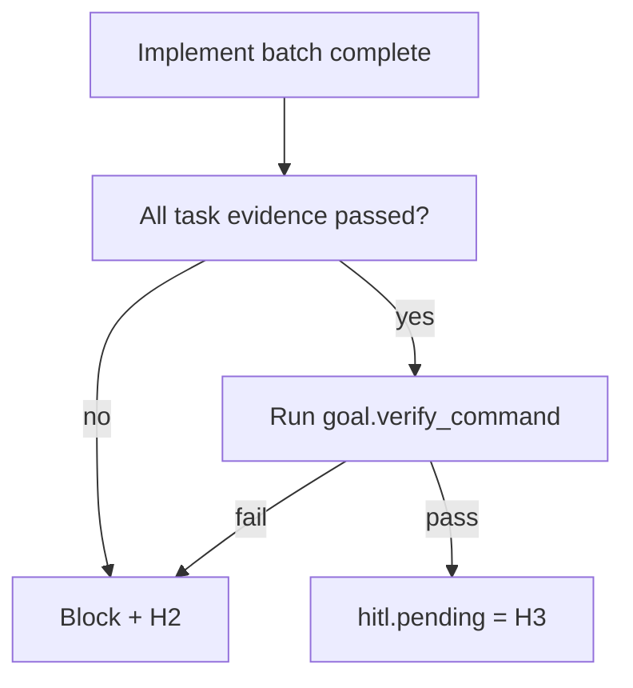

<!-- Complete pass 3 2026-06-28 G2.4 -->

# G2.4: goal_verify regression every implement batch

**Parent:** [G2-index](G2-index.md) · **Branch G** · **Vision §9** · **Release:** v2.14

## Reader narrative
<!-- prose-source: agent plane-g 2026-06-28 -->

Every implement batch ends with regression coverage: after the batch’s task evidence passes, run goal verify (or an intermediate regression slice when pack policy requires) so prior features stay proven before new tasks start. This implements test-before-push at goal cadence, not only at git-workflow time.

Autopilot loops honor the same batch boundary—no stacking implement tasks across batches without regression when `evidence_required` is true. Flaky failures escalate once per [G4.3](G4.3-review-escalation-s4-repeated-verify-fail.md), then H2 with logs attached.

## Purpose

G2.4 defines goal verify regression every implement batch for the agent-driven expert system. Verification & quality — evidence, goal_verify, anti-mistake.
## Scope

- Owns `G2.4` only; siblings under `G2` must not duplicate this spec.
- Aligns with minimal HITL: H1 plan, H2 blocker, H3 sign-off ([INTRO-1.2](INTRO-1.2-human-touchpoint-contract-h1-h2-h3.md)).
- Conflicts resolve in favor of [Vision §9 — Branch G — Verification & quality plane (anti-mistake)](../../full-automation-vision-and-hierarchy.md#9-branch-g-verification-quality-plane-anti-mistake).

```
│   └── G2.4 regression suite on every implement batch
```
## Behavior / step logic
<!-- timeline-source: agent cli-composer-2.5 2026-06-28 -->

1. Every implement batch ends with regression coverage: after the batch’s task evidence passes, run goal verify (or an intermediate regression slice when pack policy requires) so prior features stay proven before new tasks start
2. Autopilot loops honor the same batch boundary—no stacking implement tasks across batches without regression when evidence_required is true
3. Resolve `goal.verify_command` from `state.goal` or active pack `F1.8` verify suite.
4. Aggregate task evidence paths; fail closed if any required evidence missing.
5. On exit 0: set `goal.state=verifying` then `hitl.pending=H3` when scope complete.



## JSON example

```json
{
  "goal": {
    "verify_command": "python scripts/goal-verify.py",
    "state": "verifying"
  },
  "last_verify": "passed",
  "evidence_required": true
}
```


## Repo artifacts (this branch)

- `scripts/verify-router.py`
- `scripts/validate-workflow.py`
- `evidence/`
- `.cursor/skills/verifier/`

## Edge cases

- Operator closes laptop mid-loop — state.json must resume from last good dual-write.
- Concurrent manual edit to queue JSON — conductor reloads queue each wake; last writer wins with journal note.
- Flaky test — escalation S4 once, then H2 with evidence log; no silent retry loop.
- Edge case `G2.4` variant 4: verify state dual-write before continuing pursuit.
- Pass 3: add regression test or evidence path specific to `G2.4`.
- Pass 3: cross-link related nodes in same branch index.

## Failure modes

- **Silent stop:** Agent ends turn without updating queue → mitigated by /loop + check-hierarchy-queue.py EMPTY gate.
- **False complete:** Item marked done without artifact → audit-hierarchy-depth.py re-enqueues deepen pass.
- **Scope bleed:** Worker edits journal/state during planning-only expansion → forbidden in vision-expansion-prompt.
- **Stale design:** Upstream vision § changes → reconcile-stale adds deepen items for affected ids.

## Concrete implementation

1. Extend verify-router for goal-level suite invocation.
2. Wire CI: validate-workflow checks goal block when pursuit.mode=goal_autopilot.
3. Document evidence type in docs/operator/evidence-types.md.
4. Validate `G2.4` against SEC-15 release checklist and parent index links.
5. Document `G2.4` in parent index with verify command and release tag.
6. Add checklist row in SEC-15 release doc for `G2.4`.

## Verification

| Check | Command |
|-------|---------|
| Completeness | `python scripts/automation/audit-hierarchy-depth.py --strict --ids G2.4` |
| Conformance | `python scripts/validate-workflow.py` |
| Task evidence | `python scripts/verify-router.py` when implement task exists |

## Dependencies

| Link | Why |
|------|-----|
| [full-automation-vision-and-hierarchy.md](../../full-automation-vision-and-hierarchy.md) §9 | Master hierarchy |
| [G2-index](G2-index.md) | Parent grouping |
| [genius-conductor-tiered-routing.md](../../genius-conductor-tiered-routing.md) | S0–S4 routing |

## Acceptance criteria

- [ ] `python scripts/automation/audit-hierarchy-depth.py --strict --ids G2.4` passes
- [ ] Named script, skill, or test path exists or is listed in SEC-15 release row
- [ ] Linked from [G2-index](G2-index.md)
- [ ] `python scripts/validate-workflow.py` passes after implement

## Cross-links

- [hierarchy-expander SKILL](../../../.cursor/skills/hierarchy-expander/SKILL.md)
