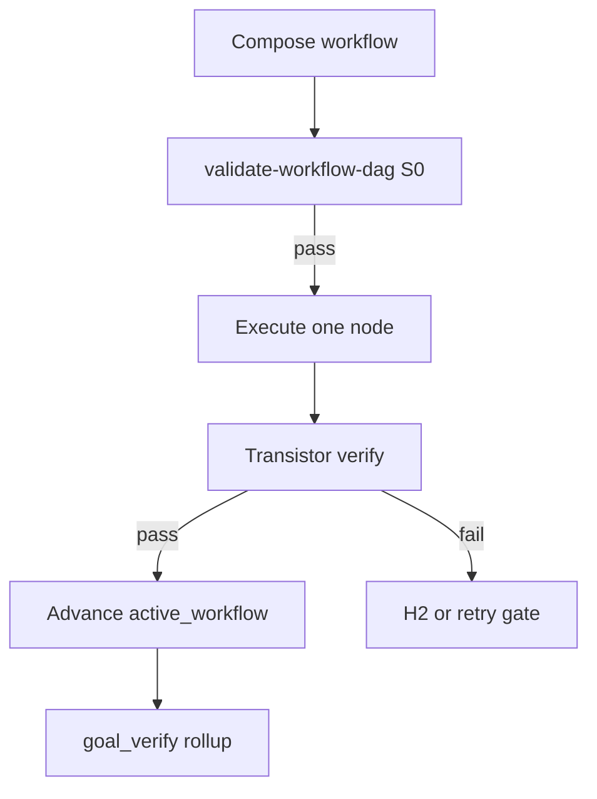

<!-- Complete pass 1 2026-06-28 G2.5 -->

# G2.5: per-node evidence rollup goal_verify

**Parent:** [G2-index](G2-index.md) · **Branch G** · **Vision §19** · **Release:** v2.26

## Reader narrative
<!-- prose-source: agent transistor-expansion 2026-06-28 -->

Goal-level verification must reflect **workflow execution**, not only legacy task-card checkboxes. This capability extends [G2.2](G2.2-goal-verify-aggregates-unit-integration-e2e-tool.md): when `state.pursuit.active_workflow` is bound, `goal-verify.py` accepts a manifest of evidence paths collected from each entry in `completed_nodes[]`—each path produced by that node's transistor `verify` command or `evidence_path_template`. Missing node evidence fails rollup even if an implement task was marked done in chat, closing the [G5.1](G5.1-mistake-hallucinated-done-evidence-gate.md) hallucinated-done class at workflow granularity.

Tool and MCP outputs use evidence types from [I4.3](I4.3-runtime-external-evidence-types-non-pytest.md) when transistors invoke external executors ([I4.4](I4.4-transistor-executors-mcp-tool-script-boundary.md)). [G2.4](G2.4-goal-verify-regression-every-implement-batch.md) regression batches may run a subset of transistor verify suites after each implement batch. Rollup success is prerequisite for [G2.3](G2.3-goal-verify-blocks-h3-until-pass.md) H3 transition per [INTRO-1.3](INTRO-1.3-goal-completion-criterion.md). Immutable logs remain under [H4](H4-evidence.md).

See [Vision §19 — Transistor & generator workflow model](../../full-automation-vision-and-hierarchy.md#19-transistor--generator-workflow-model) and [C6.5](C6.5-workflow-node-rollup-to-goal-verify.md) for terminal-node completion rules.

## Purpose

G2.5 defines per-node evidence rollup goal_verify for the agent-driven expert system. Transistor & generator workflow model (§19).
## Scope

- Owns `G2.5` only; siblings under `G2` must not duplicate this spec.
- Aligns with minimal HITL: H1 plan, H2 blocker, H3 sign-off ([INTRO-1.2](INTRO-1.2-human-touchpoint-contract-h1-h2-h3.md)).
- Conflicts resolve in favor of [Vision §9 — Branch G — Verification & quality plane (anti-mistake)](../../full-automation-vision-and-hierarchy.md#9-branch-g-verification-quality-plane-anti-mistake).

```
│   └── G2.5 per-node evidence rollup goal_verify
```
## Behavior / step logic
<!-- timeline-source: agent transistor-expansion 2026-06-28 -->

1. goal-verify.py accepts --workflow-evidence manifest from active_workflow.completed_nodes.
2. Missing node evidence fails rollup even if legacy task cards marked done.
3. Tool/MCP evidence types per I4.3 included in manifest when transistors use tool executors.
4. Regression batch G2.4 runs transistor verify suite subset on implement batches.
5. Evidence immutability H4 applies per node path.



## JSON example

```json
{
  "node": "G2.5",
  "description": "per-node evidence rollup goal_verify",
  "state": { "ref": "APP-B-state-json-sketch.md", "active_workflow": "H1.7" },
  "implemented_in_release": "v2.26+"
}
```

## Repo artifacts (this branch)

- `docs/platform/transistors/`
- `docs/platform/schemas/transistor.v1.json`
- `docs/platform/schemas/workflow-dag.v1.json`
- `docs/workflows/`
- `scripts/automation/list-transistors.py`
- `scripts/automation/validate-workflow-dag.py`

## Edge cases

- Operator closes laptop mid-loop — state.json must resume from last good dual-write including active_workflow.
- Transistor version bump mid-pursuit — E5.4 marks workflow stale; re-validate before next node.
- L0 waiver node without promotion progress — D3.3 priority boost then H2 if threshold exceeded.
- Pack overlay id collision — F5.4 semver fork per D5.3, not silent overwrite.
- Parallel branch join missing typed input — validate-workflow-dag fails at compose time.

## Failure modes

- **Fuzzy chain:** Implement without workflow_node_id when C6.1 applies → G5.8 blocks at preflight.
- **False complete:** Node marked done without transistor verify evidence → G2.5 goal_verify fails closed.
- **Stale workflow:** active_workflow.validation_hash mismatch → E5.4 reconcile before advance.
- **Duplicate transistor:** G5.6 list-transistors --check-duplicates rejects promotion.
- **Scope bleed:** Worker runs transistors outside bound node → C6.3 conformance failure.

## Concrete implementation

1. Map `G2.5` to release row in [SEC-15-index](SEC-15-index.md) (v2.26).
2. Implement behavior per [SEC-18](SEC-18-transistor-model-a-to-z.md) acceptance checklist.
3. Add or extend S0 script when behavior is file-derived.
4. Add unit test under `tests/unit/` when script exists.
5. Link from [G2-index](G2-index.md).
6. Run `python scripts/validate-workflow.py` after implement.

## Verification

| Check | Command |
|-------|---------|
| Completeness | `python scripts/automation/audit-hierarchy-depth.py --strict --ids G2.5` |
| Conformance | `python scripts/validate-workflow.py` |
| DAG validity | `python scripts/automation/validate-workflow-dag.py` when workflow exists |
| Task evidence | `python scripts/verify-router.py` when implement task exists |

## Dependencies

| Link | Why |
|------|-----|
| [SEC-18-transistor-model-a-to-z](SEC-18-transistor-model-a-to-z.md) | A–Z authority |
| [full-automation-vision-and-hierarchy.md](../../full-automation-vision-and-hierarchy.md) §19 | Master hierarchy |
| [G2-index](G2-index.md) | Parent grouping |
| [genius-conductor-tiered-routing.md](../../genius-conductor-tiered-routing.md) | S0–S4 routing |

## Acceptance criteria

- [ ] `python scripts/automation/audit-hierarchy-depth.py --strict --ids G2.5` passes
- [ ] Named script, skill, or test path exists or is listed in SEC-15 release row
- [ ] Linked from [G2-index](G2-index.md)
- [ ] Aligned with SEC-18 transistor model
- [ ] `python scripts/validate-workflow.py` passes after implement

## Cross-links

- [hierarchy-expander SKILL](../../../.cursor/skills/hierarchy-expander/SKILL.md)
- [INTRO-2-transistor-building-blocks-north-star](INTRO-2-transistor-building-blocks-north-star.md)
