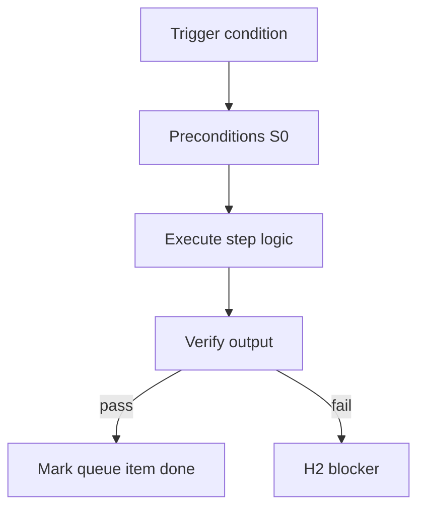

<!-- Complete pass 3 2026-06-28 G4.3 -->

# G4.3: review escalation S4 repeated verify fail

**Parent:** [G4-index](G4-index.md) · **Branch G** · **Vision §9** · **Release:** v2.23

## Reader narrative
<!-- prose-source: agent plane-g 2026-06-28 -->

Repeated verify failure on the same task card escalates to S4 H2 packaging: attach evidence logs, failure class, retry count, and suggested operator action—never silent retry loops ([B3.3](B3.3-escalation-loop-on-verify-fail.md)). One structured escalation per task before human assist is mandatory.

This review trigger prevents autopilot from burning budget on flaky or mis-specified tests. Conductor records escalation in journal Last failure for rollback and audit ([G6.2](G6.2-rollback-journal-last-failure-structured-h2.md)).

## Purpose

G4.3 defines review escalation s4 repeated verify fail for the agent-driven expert system. Verification & quality — evidence, goal_verify, anti-mistake.
## Scope

- Owns `G4.3` only; siblings under `G4` must not duplicate this spec.
- Aligns with minimal HITL: H1 plan, H2 blocker, H3 sign-off ([INTRO-1.2](INTRO-1.2-human-touchpoint-contract-h1-h2-h3.md)).
- Conflicts resolve in favor of [Vision §9 — Branch G — Verification & quality plane (anti-mistake)](../../full-automation-vision-and-hierarchy.md#9-branch-g-verification-quality-plane-anti-mistake).

```
│   ├── G4.3 escalation S4 on repeated verify fail
```
## Behavior / step logic
<!-- timeline-source: agent cli-composer-2.5 2026-06-28 -->

1. At H1, the operator supplies a spec or company charter; after plan approval the conductor dual-writes the approved plan to journal and state.json and pursuit may enter goal_autopilot—this touchpoint occurs once per project, program, or pack instantiation.
2. On each wake, preflight and `check-pipeline-blocked.py` distinguish H2 blockers (missing dependency, preflight failure, goal_verify fail) from routable work; H2 pauses pursuit, sends digest notification per [A6.2](A6.2-notify-digest-on-h2-blocker-not-every-step.md), and resumes only when the operator clears the blocker.
3. HLD, DD, and manifest review run as agent self-gates with evidence paths unless `strict_hitl` is enabled in state—Continue does not substitute for H1/H2/H3 approval per [A5.2](A5.2-continue-not-approval-self-gate-h1-h3-only.md).
4. After [goal_verify](A1.3-goal-verify-command-meta-test.md) passes, the conductor requests H3 sign-off; acceptance closes the goal while rejection dual-writes notes and returns goal.state to pursuing.
5. If an agent treats Continue as approval, skips notify on H2, or advances to H3 before goal_verify passes, pursuit halts fail-closed until the touchpoint contract is restored in journal and state.json.



## JSON example

```json
{
  "node": "G4.3",
  "description": "review escalation s4 repeated verify fail",
  "state": { "ref": "APP-B-state-json-sketch.md" },
  "implemented_in_release": "v2.14+"
}
```


## Repo artifacts (this branch)

- `scripts/verify-router.py`
- `scripts/validate-workflow.py`
- `evidence/`
- `.cursor/skills/verifier/`

## Edge cases

- Operator closes laptop mid-loop — state.json must resume from last good dual-write.
- Concurrent manual edit to queue JSON — conductor reloads queue each wake; last writer wins with journal note.
- Flaky test — escalation S4 once, then H2 with evidence log; no silent retry loop.
- Edge case `G4.3` variant 4: verify state dual-write before continuing pursuit.
- Pass 3: add regression test or evidence path specific to `G4.3`.
- Pass 3: cross-link related nodes in same branch index.

## Failure modes

- **Silent stop:** Agent ends turn without updating queue → mitigated by /loop + check-hierarchy-queue.py EMPTY gate.
- **False complete:** Item marked done without artifact → audit-hierarchy-depth.py re-enqueues deepen pass.
- **Scope bleed:** Worker edits journal/state during planning-only expansion → forbidden in vision-expansion-prompt.
- **Stale design:** Upstream vision § changes → reconcile-stale adds deepen items for affected ids.

## Concrete implementation

1. Extend verify-router for goal-level suite invocation.
2. Wire CI: validate-workflow checks goal block when pursuit.mode=goal_autopilot.
3. Document evidence type in docs/operator/evidence-types.md.
4. Validate `G4.3` against SEC-15 release checklist and parent index links.
5. Document `G4.3` in parent index with verify command and release tag.
6. Add checklist row in SEC-15 release doc for `G4.3`.

## Verification

| Check | Command |
|-------|---------|
| Completeness | `python scripts/automation/audit-hierarchy-depth.py --strict --ids G4.3` |
| Conformance | `python scripts/validate-workflow.py` |
| Task evidence | `python scripts/verify-router.py` when implement task exists |

## Dependencies

| Link | Why |
|------|-----|
| [full-automation-vision-and-hierarchy.md](../../full-automation-vision-and-hierarchy.md) §9 | Master hierarchy |
| [G4-index](G4-index.md) | Parent grouping |
| [genius-conductor-tiered-routing.md](../../genius-conductor-tiered-routing.md) | S0–S4 routing |

## Acceptance criteria

- [ ] `python scripts/automation/audit-hierarchy-depth.py --strict --ids G4.3` passes
- [ ] Named script, skill, or test path exists or is listed in SEC-15 release row
- [ ] Linked from [G4-index](G4-index.md)
- [ ] `python scripts/validate-workflow.py` passes after implement

## Cross-links

- [hierarchy-expander SKILL](../../../.cursor/skills/hierarchy-expander/SKILL.md)
