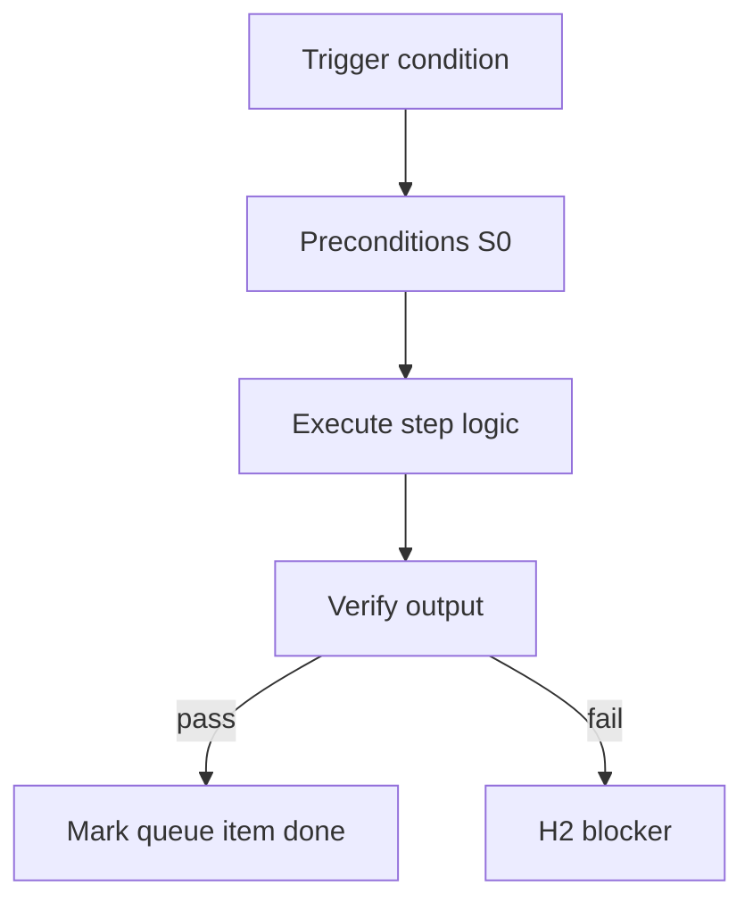

<!-- Complete pass 3 2026-06-28 G5.3 -->

# G5.3: mistake wrong architecture self-gate goal_verify

**Parent:** [G5-index](G5-index.md) · **Branch G** · **Vision §9** · **Release:** exists

## Reader narrative
<!-- prose-source: agent plane-g 2026-06-28 -->

Wrong architecture is merging large structural choices without design gate or goal verify coverage—implementing S3 trade-offs as S1 edits. Controls: HLD/DD/feature gates ([A4.1](A4.1-stop-human-h1-h2-h3.md)), self-gate only where policy allows, and goal verify regression that fails when tests or architecture invariants break.

When ambiguity is architectural, stop for S3 conductor decision recorded in journal Q&A or ADR—not economy worker improvisation. Goal verify failure after architectural drift blocks H3 until design and code realign.

## Purpose

G5.3 defines mistake wrong architecture self gate goal verify for the agent-driven expert system. Verification & quality — evidence, goal_verify, anti-mistake.
## Scope

- Owns `G5.3` only; siblings under `G5` must not duplicate this spec.
- Aligns with minimal HITL: H1 plan, H2 blocker, H3 sign-off ([INTRO-1.2](INTRO-1.2-human-touchpoint-contract-h1-h2-h3.md)).
- Conflicts resolve in favor of [Vision §9 — Branch G — Verification & quality plane (anti-mistake)](../../full-automation-vision-and-hierarchy.md#9-branch-g-verification-quality-plane-anti-mistake).

```
│   ├── G5.3 wrong architecture → self-gate checklist + goal_verify
```
## Behavior / step logic
<!-- timeline-source: agent cli-composer-2.5 2026-06-28 -->

1. Before orchestrate-program spawns parallel lanes, the conductor loads the artifact graph from state.json and the integration manifest so each downstream node declares dependencies on upstream design, task-card, and pack artifacts ([B5.3](B5.3-handoff-manifest-artifact-graph.md), [C4.4](C4.4-artifact-graph-per-program-and-pack.md)).
2. When an upstream spec or design file changes, reconcile-artifact-graph marks affected graph nodes stale in docs/manifest/staleness.json and the state.json program block so pursuit cannot treat dependents as current ([E5.1](E5.1-staleness-design-graph-staleness-json.md)).
3. If reconcile-stale finds stale manifest nodes, the conductor halts ready lane spawn until it plans the prescribed re-run or records an operator-approved waiver—workers fail closed on stale graph entries.
4. Graph edges tie design nodes, task cards, pack fragments, and manifest rows together so handoff and integration checks can verify cross-stream contracts before parallel execution proceeds.
5. On missing dependency metadata, unresolved stale nodes, or graph drift between staleness.json and state.json, pursuit stops at H2 until reconcile completes and preflight passes again.



## JSON example

```json
{
  "node": "G5.3",
  "description": "mistake wrong architecture self gate goal verify",
  "state": { "ref": "APP-B-state-json-sketch.md" },
  "implemented_in_release": "v2.14+"
}
```


## Repo artifacts (this branch)

- `scripts/verify-router.py`
- `scripts/validate-workflow.py`
- `evidence/`
- `.cursor/skills/verifier/`

## Edge cases

- Operator closes laptop mid-loop — state.json must resume from last good dual-write.
- Concurrent manual edit to queue JSON — conductor reloads queue each wake; last writer wins with journal note.
- Flaky test — escalation S4 once, then H2 with evidence log; no silent retry loop.
- Edge case `G5.3` variant 4: verify state dual-write before continuing pursuit.
- Pass 3: add regression test or evidence path specific to `G5.3`.
- Pass 3: cross-link related nodes in same branch index.

## Failure modes

- **Silent stop:** Agent ends turn without updating queue → mitigated by /loop + check-hierarchy-queue.py EMPTY gate.
- **False complete:** Item marked done without artifact → audit-hierarchy-depth.py re-enqueues deepen pass.
- **Scope bleed:** Worker edits journal/state during planning-only expansion → forbidden in vision-expansion-prompt.
- **Stale design:** Upstream vision § changes → reconcile-stale adds deepen items for affected ids.

## Concrete implementation

1. Extend verify-router for goal-level suite invocation.
2. Wire CI: validate-workflow checks goal block when pursuit.mode=goal_autopilot.
3. Document evidence type in docs/operator/evidence-types.md.
4. Validate `G5.3` against SEC-15 release checklist and parent index links.
5. Document `G5.3` in parent index with verify command and release tag.
6. Add checklist row in SEC-15 release doc for `G5.3`.

## Verification

| Check | Command |
|-------|---------|
| Completeness | `python scripts/automation/audit-hierarchy-depth.py --strict --ids G5.3` |
| Conformance | `python scripts/validate-workflow.py` |
| Task evidence | `python scripts/verify-router.py` when implement task exists |

## Dependencies

| Link | Why |
|------|-----|
| [full-automation-vision-and-hierarchy.md](../../full-automation-vision-and-hierarchy.md) §9 | Master hierarchy |
| [G5-index](G5-index.md) | Parent grouping |
| [genius-conductor-tiered-routing.md](../../genius-conductor-tiered-routing.md) | S0–S4 routing |

## Acceptance criteria

- [ ] `python scripts/automation/audit-hierarchy-depth.py --strict --ids G5.3` passes
- [ ] Named script, skill, or test path exists or is listed in SEC-15 release row
- [ ] Linked from [G5-index](G5-index.md)
- [ ] `python scripts/validate-workflow.py` passes after implement

## Cross-links

- [hierarchy-expander SKILL](../../../.cursor/skills/hierarchy-expander/SKILL.md)
