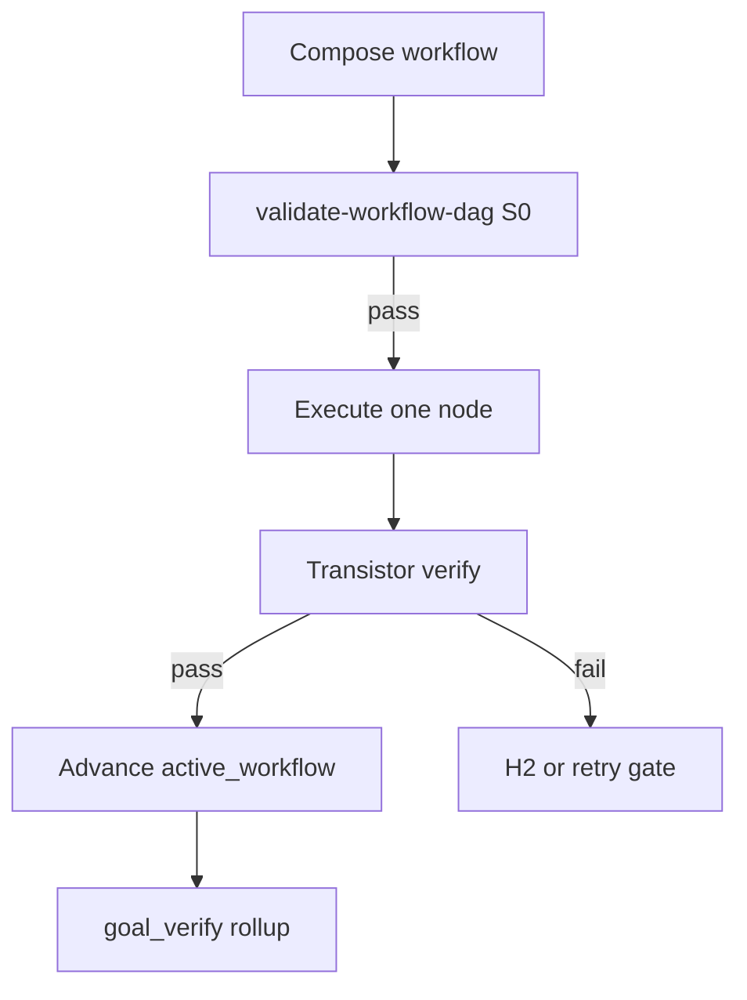

<!-- Complete pass 1 2026-06-28 H1.7 -->

# H1.7: state active_workflow block

**Parent:** [H1-index](H1-index.md) · **Branch H** · **Vision §19** · **Release:** v2.26

## Reader narrative
<!-- prose-source: agent transistor-expansion 2026-06-28 -->

The `state.pursuit.active_workflow` block is how the harness **remembers where it is in a generator DAG** across autopilot turns, laptop closes, and preCompact snapshots. Additive fields include `workflow_id`, path to `docs/workflows/<goal-id>.json`, `current_node_id`, `completed_nodes[]` (each with evidence paths and transistor version), `failed_node_id`, per-node `retry_counts`, optional `branches[]` for parallel lanes ([C6.4](C6.4-parallel-workflow-branches-via-work-orders.md)), `validation_hash` from the last `validate-workflow-dag.py` pass, and `terminal_nodes[]` for rollup checks ([C6.5](C6.5-workflow-node-rollup-to-goal-verify.md)).

Product workers read this block; only the conductor dual-writes advances after node verify. `validate-workflow.py` schema-validates the shape on load. `sync-state.py` repairs partial writes from the journal Workflow section after crash. Null `active_workflow` is allowed only before [C6.1](C6.1-phase-workflow-compose-mandatory-before-implement.md) binds a graph or for taxonomy-exempt goals. Headless SDK consumers read the same block per [J5](J5-export-contract.md) export contract.

See [Vision §19 — Transistor & generator workflow model](../../full-automation-vision-and-hierarchy.md#19-transistor--generator-workflow-model) and [APP-B-state-json-sketch](APP-B-state-json-sketch.md) for the full additive state map.

## Purpose

H1.7 defines state active_workflow block for the agent-driven expert system. Transistor & generator workflow model (§19).
## Scope

- Owns `H1.7` only; siblings under `H1` must not duplicate this spec.
- Aligns with minimal HITL: H1 plan, H2 blocker, H3 sign-off ([INTRO-1.2](INTRO-1.2-human-touchpoint-contract-h1-h2-h3.md)).
- Conflicts resolve in favor of [Vision §10 — Branch H — Persistence & state plane](../../full-automation-vision-and-hierarchy.md#10-branch-h-persistence-state-plane).

```
│   └── H1.7 state active_workflow block
```
## Behavior / step logic
<!-- timeline-source: agent transistor-expansion 2026-06-28 -->

1. validate-workflow.py schema-validates active_workflow when present.
2. Dual-write on every node completion; product workers read-only except conductor merge.
3. Null active_workflow allowed only before C6.1 or for taxonomy-exempt goals.
4. sync-state.py repairs partial writes from journal Workflow section.
5. Export contract I5/J5 documents active_workflow for headless SDK consumers.



## JSON example

```json
{
  "node": "H1.7",
  "description": "state active_workflow block",
  "state": { "ref": "APP-B-state-json-sketch.md", "active_workflow": "H1.7" },
  "implemented_in_release": "v2.26+"
}
```

## Repo artifacts (this branch)

- `docs/platform/transistors/`
- `docs/platform/schemas/transistor.v1.json`
- `docs/platform/schemas/workflow-dag.v1.json`
- `docs/workflows/`
- `scripts/automation/list-transistors.py`
- `scripts/automation/validate-workflow-dag.py`

## Edge cases

- Operator closes laptop mid-loop — state.json must resume from last good dual-write including active_workflow.
- Transistor version bump mid-pursuit — E5.4 marks workflow stale; re-validate before next node.
- L0 waiver node without promotion progress — D3.3 priority boost then H2 if threshold exceeded.
- Pack overlay id collision — F5.4 semver fork per D5.3, not silent overwrite.
- Parallel branch join missing typed input — validate-workflow-dag fails at compose time.

## Failure modes

- **Fuzzy chain:** Implement without workflow_node_id when C6.1 applies → G5.8 blocks at preflight.
- **False complete:** Node marked done without transistor verify evidence → G2.5 goal_verify fails closed.
- **Stale workflow:** active_workflow.validation_hash mismatch → E5.4 reconcile before advance.
- **Duplicate transistor:** G5.6 list-transistors --check-duplicates rejects promotion.
- **Scope bleed:** Worker runs transistors outside bound node → C6.3 conformance failure.

## Concrete implementation

1. Map `H1.7` to release row in [SEC-15-index](SEC-15-index.md) (v2.26).
2. Implement behavior per [SEC-18](SEC-18-transistor-model-a-to-z.md) acceptance checklist.
3. Add or extend S0 script when behavior is file-derived.
4. Add unit test under `tests/unit/` when script exists.
5. Link from [H1-index](H1-index.md).
6. Run `python scripts/validate-workflow.py` after implement.

## Verification

| Check | Command |
|-------|---------|
| Completeness | `python scripts/automation/audit-hierarchy-depth.py --strict --ids H1.7` |
| Conformance | `python scripts/validate-workflow.py` |
| DAG validity | `python scripts/automation/validate-workflow-dag.py` when workflow exists |
| Task evidence | `python scripts/verify-router.py` when implement task exists |

## Dependencies

| Link | Why |
|------|-----|
| [SEC-18-transistor-model-a-to-z](SEC-18-transistor-model-a-to-z.md) | A–Z authority |
| [full-automation-vision-and-hierarchy.md](../../full-automation-vision-and-hierarchy.md) §19 | Master hierarchy |
| [H1-index](H1-index.md) | Parent grouping |
| [genius-conductor-tiered-routing.md](../../genius-conductor-tiered-routing.md) | S0–S4 routing |

## Acceptance criteria

- [ ] `python scripts/automation/audit-hierarchy-depth.py --strict --ids H1.7` passes
- [ ] Named script, skill, or test path exists or is listed in SEC-15 release row
- [ ] Linked from [H1-index](H1-index.md)
- [ ] Aligned with SEC-18 transistor model
- [ ] `python scripts/validate-workflow.py` passes after implement

## Cross-links

- [hierarchy-expander SKILL](../../../.cursor/skills/hierarchy-expander/SKILL.md)
- [INTRO-2-transistor-building-blocks-north-star](INTRO-2-transistor-building-blocks-north-star.md)
