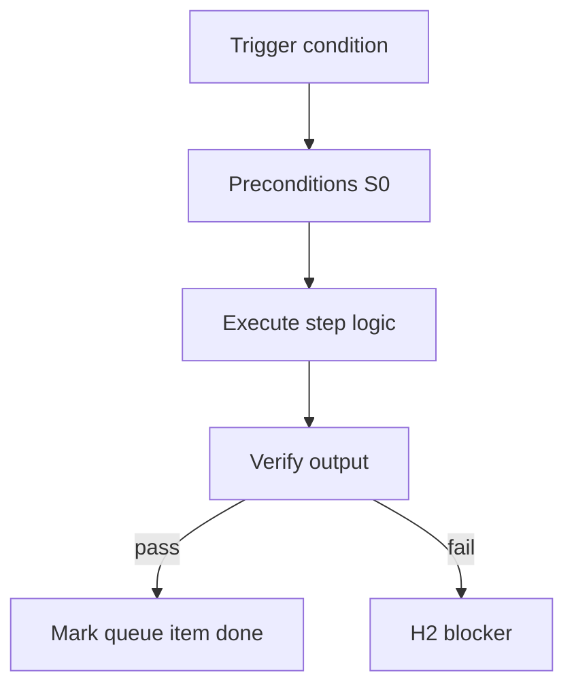

<!-- Complete pass 3 2026-06-28 INTRO-0 -->

# INTRO-0: Executive summary (§0)

**Parent:** — · **Branch INTRO** · **Vision §11** · **Release:** meta

## Reader narrative
<!-- prose-source: agent meta 2026-06-28 -->

Today's harness (v2.0–v2.13) is a verified delivery system: conductor, state machine, evidence, and autopilot-until-blocked. It still stops for Continue, treats many design gates as permanent human checkpoints, and treats platform evolution as required side work.

The target is an **ultimate AI worker**: organizational reliability with AI failure modes neutralized by deterministic verification, catalog composition, **transistor generator workflows**, and parallel platform evolution—orchestrated at company scale through template-packs. **Four structural shifts** drive the design: a pursuit loop that runs until goals verify (not until a token burst ends); parallel product and self-improvement work; template-packs as reusable blueprints for a whole company slice; and **compose-then-execute workflows** built from registered transistors instead of long prose-only implement chains ([INTRO-2](INTRO-2-transistor-building-blocks-north-star.md), [SEC-18](SEC-18-transistor-model-a-to-z-reference.md)).

This executive summary orients every later chapter. Read it once to understand why the ten planes exist and why human involvement collapses to three touchpoints. See [Vision §0 — Executive summary](../../full-automation-vision-and-hierarchy.md#0-executive-summary) for the authoritative wording.

## Purpose

INTRO-0 defines executive summary   0 for the agent-driven expert system. North star, scope, minimal HITL (H1/H2/H3).
## Scope

- Owns `INTRO-0` only; siblings under `—` must not duplicate this spec.
- Aligns with minimal HITL: H1 plan, H2 blocker, H3 sign-off ([INTRO-1.2](INTRO-1.2-human-touchpoint-contract-h1-h2-h3.md)).
- Conflicts resolve in favor of [Vision §11 — Branch I — Runtime & integration plane](../../full-automation-vision-and-hierarchy.md#11-branch-i-runtime-integration-plane).

```
INTRO-0 executive summary   0
```
## Behavior / step logic
<!-- timeline-source: agent cli-composer-2.5 2026-06-28 -->

1. After H1 approves the plan, pursuit enters [A3.2](A3.2-goal-autopilot-until-goal-verify-or-hard-block.md) and the conductor executes SDLC work—implement, test, refactor, integrate, deploy prep—without per-step human nudges except at [INTRO-1.2](INTRO-1.2-human-touchpoint-contract-h1-h2-h3.md) touchpoints.
2. Multi-role company workflows run through template-packs ([F1.1](F1.1-pack-company-yaml-schema.md)); active role, pipeline_id, and allowed_reads bound each turn so autonomous pursuit stays inside pack-defined scope.
3. Blocker detection raises structured H2 pauses with clear unblock criteria when preflight fails, goal_verify fails, or external dependencies are missing—never silent stalls or gate waivers.
4. Harness self-improvement enqueues on the Plane D platform queue and drains on scheduled platform turns when promotion criteria are met, keeping catalog and skills current without manual meta-work each session.
5. Out-of-scope requests—irreversible production without verify/rollback, silent safety-gate waivers, or subjective aesthetic approval—stop at H2 until encoded in machine-checkable success criteria or explicitly resolved at H3.



## JSON example

```json
{
  "node": "INTRO-0",
  "description": "executive summary   0",
  "state": { "ref": "APP-B-state-json-sketch.md" },
  "implemented_in_release": "v2.14+"
}
```


## Repo artifacts (this branch)


## Edge cases

- Operator closes laptop mid-loop — state.json must resume from last good dual-write.
- Concurrent manual edit to queue JSON — conductor reloads queue each wake; last writer wins with journal note.
- Edge case `INTRO-0` variant 3: verify state dual-write before continuing pursuit.
- Edge case `INTRO-0` variant 4: verify state dual-write before continuing pursuit.
- Pass 3: add regression test or evidence path specific to `INTRO-0`.
- Pass 3: cross-link related nodes in same branch index.

## Failure modes

- **Silent stop:** Agent ends turn without updating queue → mitigated by /loop + check-hierarchy-queue.py EMPTY gate.
- **False complete:** Item marked done without artifact → audit-hierarchy-depth.py re-enqueues deepen pass.
- **Scope bleed:** Worker edits journal/state during planning-only expansion → forbidden in vision-expansion-prompt.
- **Stale design:** Upstream vision § changes → reconcile-stale adds deepen items for affected ids.

## Concrete implementation

1. Map `INTRO-0` to v2.14–v2.23 release row in SEC-15-index.md.
2. Create or extend S0 script if behavior is file-derived.
3. Add unit test under tests/unit/test_intro-0.py when script exists.
4. Validate `INTRO-0` against SEC-15 release checklist and parent index links.
5. Document `INTRO-0` in parent index with verify command and release tag.
6. Add checklist row in SEC-15 release doc for `INTRO-0`.

## Verification

| Check | Command |
|-------|---------|
| Completeness | `python scripts/automation/audit-hierarchy-depth.py --strict --ids INTRO-0` |
| Conformance | `python scripts/validate-workflow.py` |
| Task evidence | `python scripts/verify-router.py` when implement task exists |

## Dependencies

| Link | Why |
|------|-----|
| [full-automation-vision-and-hierarchy.md](../../full-automation-vision-and-hierarchy.md) §11 | Master hierarchy |
| [—-index](—-index.md) | Parent grouping |
| [genius-conductor-tiered-routing.md](../../genius-conductor-tiered-routing.md) | S0–S4 routing |

## Acceptance criteria

- [ ] `python scripts/automation/audit-hierarchy-depth.py --strict --ids INTRO-0` passes
- [ ] Named script, skill, or test path exists or is listed in SEC-15 release row
- [ ] Linked from [—-index](—-index.md)
- [ ] `python scripts/validate-workflow.py` passes after implement

## Cross-links

- [hierarchy-expander SKILL](../../../.cursor/skills/hierarchy-expander/SKILL.md)
